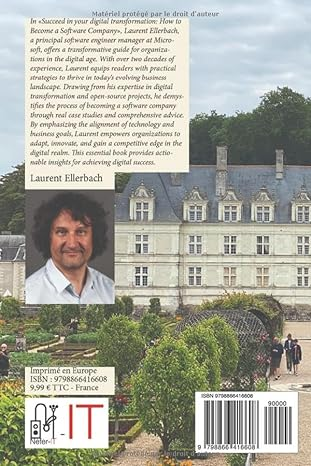
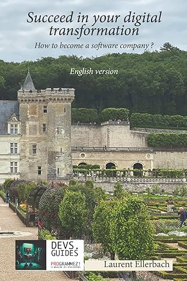

# About Laurent Ellerbach

[Laurent Ellerbach](https://www.linkedin.com/in/laurelle)

Principal Sofware Engineer Manager

Industry Software Engineering

This blog regroup technical articles which I have published over time. This blog is a migration of an existing blog up to 2018. I kept only the technical articles and removed the non technical ones. So please note that some links may be broken. Please don't hesitate to report them to me.

And I kept only articles with high traffic (more than couple of thousands of page views and more than few hundreds of page view per month).

It is surprising to see that some (very) old articles still have decent traffic.

The 2021+ articles are new ones!

You can find more code and articles on my [GitHub.com/Ellerbach](https://github.com/Ellerbach)

I'm also the author of "Succeed in your Digital Transformation: How to Become a Software Company?". You can buy this book on [Amazon.com](https://www.amazon.com/dp/B0CMKF2PNJ/).

This book will definitely help you in any transformation. The main target are developers, project/product managers. There is no blabla and everything is very concrete and to the point.

Don't hesitate to send me a [mail](mailto:laurelle@microsoft.com) if you have any question.
