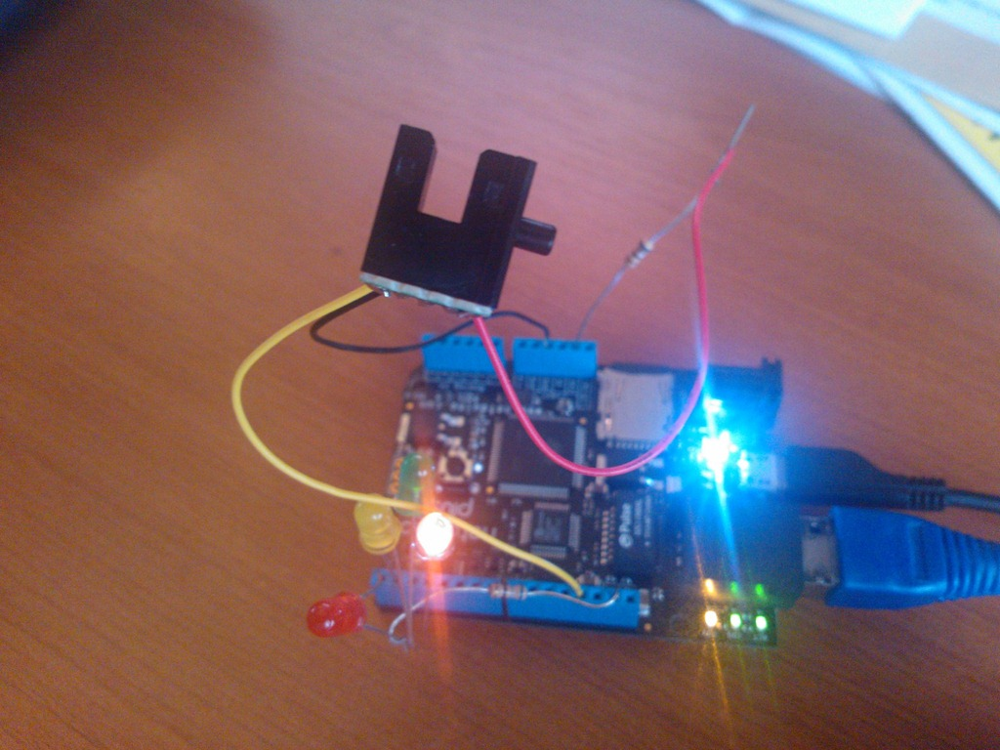
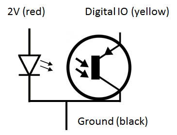

# 2012-01-21 Using a light transistor sensor and a led to create a detector

I will give a session in French during the next French TechDays on .NET Microframework. And I'm preparing couple of demos that almost anyone with limited knowledge in electronic and limited knowledge in programming. The idea is to show cool stuff you can do at home or a kid can do. Interested in coming to my session and more? You can register [there](https://www.microsoft.com/france/mstechdays/programmes/parcours.aspx#SessionID=f9a8f69e-723a-40d1-8dc0-c306f4cddfb5).

This session will be about doing demos and showing how you can very easily do hardware with a [netduino](./2011-09-09-netduino-board-geek-tool-for-.NET-Microframework.md) board and .NET Microframework. It's quite cool as you are very close to the hardware and no OS to do things you don't want to be done .

The coolest thing is that I get old electronic component from old PC. I get a light sensor from a very old hard drive and I will use it in my demo of course. This light sensor was used to count the number of turn the hard drive was doing and assert the speed to make sure it will go on the right speed. This simple sensor is one led and on transistor. And it looks like this:

[](../assets/6557.WP_000188_2.jpg)

It's this small black thing. Looking at the schematic, it look like this:

[](../assets/0172.image_2.png)

So we have a common ground and the transistor is used like an switch. If it gets light, it will be open, if not, it will be closed. So we basically have to light the led and plug the transistor into a digital input to look at the state of the pin.

As the led is working with about 2V and current should be about 0,02A, I will have to use a resistor. I remember an old rule: U = RxI. Where U is the voltage (in Volt), R is the resistor (in Ohm) and I is the current (in Amperes). I have 3.3V and 5V alimentation present on the board. I choose to use the 3.3V. So to get the resistor needed, I need to apply a simple math: R = (3,3 - 2)/0,02 = 65 Ohms

Looking at couple of resistors I have, I found a 67 Ohms which will work. It's anyway not really precise. So I plug the resistor into the 3.3V, add the 67 Ohms resistor, then the Led. The black cable on the ground. And I plugged the yellow one into the Digital IO 12 on my board.

To have something cool, I'm using a led which I plugged also into a Digital IO, the number 0. And the same formula apply to calculate the resistor and the same resistor has to be used, the pin are 3.3V (5V tolerant).

Now, the very simple code to see something happening is here:

```csharp
public static void Main() { 
    InputPort Button; OutputPort LED; 
    LED = new OutputPort(Pins.GPIO_PIN_D0, true); 
    Button = new InputPort(Pins.GPIO_PIN_D12, false, Port.ResistorMode.PullUp); 
    while (true) { 
        LED.Write(Button.Read()); 
        Thread.Sleep(10); 
    } 
}
```

I create a Led as an OutputPort. And an InputPort for the transistor. And I do an infinite loop to check the status. And the led will reflect the status of the transistor.

As I'm using the transistor as a switch with a high state (Port.ResistorMode.PullUp), I will have the value of True when the transistor won't receive any light. So it mean that when I will have an object between the led (the one in front of the transistor) and the transistor, the value of the pin will be 1 and when the transistor will receive the light, it will be 0.

Result is quite cool, I've done a detector with old component  Back to my Lego city lighting project, I can use this to determine if a train is coming and blink a led for couple of seconds for example. And of course, I will not use the code as it is otherwise, it will only do this and nothing else! I'll use interrupt ports to get the change of status of the port. But that's for another post .

More cool code and demos during my session in TechDays. And as always, don't hesitate to give me your feedback. This time as it's hardware, I was not able to do this into a plane. I had to do it with the board at home. Good news is I woke up early this morning so I had time to do it.
