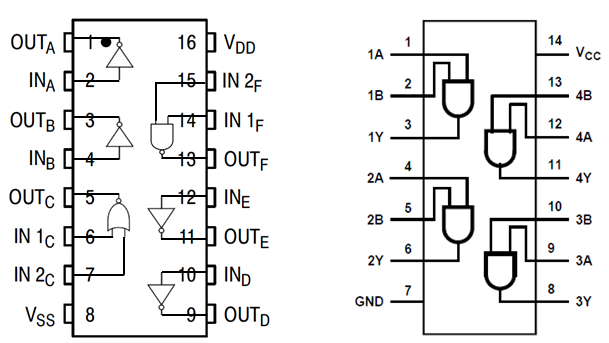
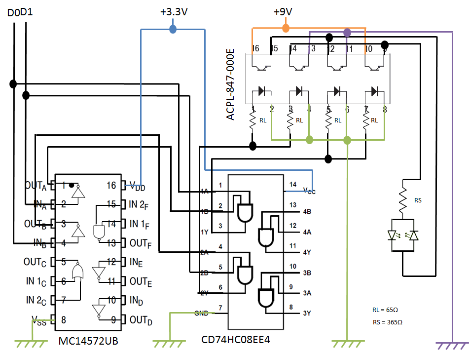
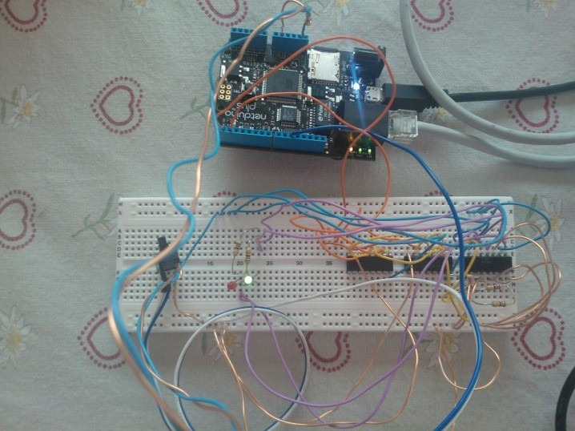

# 2012-02-20 Some hard to pilot a Sprinkler with .NET Microframework

In previous post, I've explained I want to pilot my sprinklers with a [netduino](./2011-09-09-netduino-board-geek-tool-for-.NET-Microframework.md) board. I've already write couple of articles around it, including how to create a [HTTP web server](./2011-09-12-Implementing-a-simple-HTTP-server-in-.NET-Microframework.md), [set up the date and time](./2011-09-13-Setup-a-time-and-date-using-.NET-Microframework.md), manage parameters, [launch timers](./2011-10-06-Creating-and-launching-timer-in-.NET-Microframework.md), [pilot basic IO](./2012-02-17-Using-basic-IO-with-.NET-Microframework.md). I've also shown couple of examples including this Sprinkler solution during the French TechDays. The video is [available](https://www.microsoft.com/france/mstechdays/programmes/parcours.aspx?SessionID=f9a8f69e-723a-40d1-8dc0-c306f4cddfb5#&fbid=7BiS6WzaS_o). I just love .NET Microframework (NETMF)  so good to have no OS such as Linux or Windows, just a managed .NET environment!

During the TechDays, I get questions on the electronic part of this demo. So in this post, I'll explain how I did it and show code example to make it happen. Back to my Sprinklers, the brand is Gardena. The electro valves I have to pilot are bi valves. They need a positive 9V pulse to open and a 9V negative one to close. Gardena do not publish any information regarding there valves but that is what I found with couple of tests.

The netduino board have a 3.3V and a 5V alimentation and the intensity is limited if alimented with the USB port. So not really usable to generate a 9V pulse. Plus I don't want to mix the netduino electric part and the valve one. So I will use simple photosensitive octocouplers. The way it's working is simple, you have a led and a photosensitive transistor, when lighted, the transistor open. The great advantage is you have a very fast switching totally isolated circuit.

I pick a cheap circuit with 4 octocouplers (ACPL-847-000E) as I will need 4 per valves.

[](../assets/3225.image_2.png)

The basic idea is to be able to be able to send some current in one way to open the valve and in the other to close it. And to pilot it, I will use the digital IO from the netduino. I will need 2 IO per vavle. One to pilot the *Open* and one to pilot the *Close*. I just can't use only one IO as I will need to send short pulses to open and short pulses to close. I want to make sure I'll close the valve as well as opening it. and not only one single pulse. One IO won't be enough as I need to have 3 states: open, close and *do nothing*.

When I will have the first IO open (let call it D0) at 1, I will open the valve. When the second one (D1) will be set at 1, I will close the valve. And of course when both will be at 0, nothing will happen as well as when both will be at 1\. So I will need a bit of logic with the following table:

|D0|D1|Pin On|Pin Off|
|---|---|---|---|
|0|0|0|0|
|0|1|0|1|
|1|0|1|0|
|1|1|0|0|

So with a bit of logic, you get quickly that Pin On = D0 && !D1 and Pin Off = !D0 && D1 (I'm using a programming convention here). So I will need couple of inverters and AND logical gates. I've also choose simple and cheap ones (MC14572UB and CD74HC08EE4). They costs couple of euro cents. Those components have all what I need.

[](../assets/0508.image_4.png)

For the purpose of this demo, I will use 2 inverted led (one green and one red) and will not send pulse but a permanent current. So it will be more demonstrative in this cold winter where I just can't test all this for real with the sprinklers! I'll need a new post during spring 

Now, when I put everything, here is the logical schema:

[](../assets/6765.image_8.png)

I will have to do this for each of my sprinklers. I have 3 sprinklers in total. And here is a picture of a real realization:

[](../assets/5873.WP_000160_2.jpg)

You can also see a push button in this picture (on the left with white and blue wires). I'm using it to do a manual open and close of the sprinklers. I'm using here the IO D10\. When I'll push the switch, it will close the valve if it is open and open it if it is closed.

I'm done with the hardware part! Let see the code to pilot all this. The overall code for the Sprinkler class looks like this:

```csharp
public class Sprinkler {
    private bool MySpringlerisOpen = false;
    private int MySprinklerNumber;
    private bool MyManual = false;
    private OutputPort MySprOpen;
    private OutputPort MySprClose;
    private Timer MyTimerCallBack;
    private InterruptPort MyInterPort;
    private long MyTicksWait;

    public Sprinkler(int SprNum)
    {
        MySprinklerNumber = SprNum;
        MyTicksWait = DateTime.Now.Ticks;
        switch (SprNum)
        {
            case 0:
                MySprOpen = new OutputPort(Pins.GPIO_PIN_D0, false);
                MySprClose = new OutputPort(Pins.GPIO_PIN_D1, true);
                MyInterPort = new InterruptPort(Pins.GPIO_PIN_D10,  
 false, Port.ResistorMode.PullUp, Port.InterruptMode.InterruptEdgeHigh);
                break;
            case 1:
                MySprOpen = new OutputPort(Pins.GPIO_PIN_D2, false);
                MySprClose = new OutputPort(Pins.GPIO_PIN_D3, true);
                MyInterPort = new InterruptPort(Pins.GPIO_PIN_D11,   
false, Port.ResistorMode.PullUp, Port.InterruptMode.InterruptEdgeHigh);
                break;
            case 2:
                MySprOpen = new OutputPort(Pins.GPIO_PIN_D4, false);
                MySprClose = new OutputPort(Pins.GPIO_PIN_D5, true);
                MyInterPort = new InterruptPort(Pins.GPIO_PIN_D12,   
false, Port.ResistorMode.PullUp, Port.InterruptMode.InterruptEdgeHigh);
                break;
        }
        if (MyInterPort != null)
            MyInterPort.OnInterrupt += new NativeEventHandler(IntButton_OnInterrupt);
    }

    // manual opening based on an interupt port // this function is called when a button is pressed static void IntButton_OnInterrupt(uint port, uint state, DateTime time)
    {
        int a = -1;
        switch (port)
        { 
            case (uint)Pins.GPIO_PIN_D10:
                a = 0;
                break;
            case (uint)Pins.GPIO_PIN_D11:
                a = 1;
                break;
            case (uint)Pins.GPIO_PIN_D12:
                a = 2;
                break;
        }
        if (a >= 0)
        {
            //wait at least 2s before doing anything if ((time.Ticks - MyHttpServer.Springlers[a].MyTicksWait) > 20000000)
            {
                if (!MyHttpServer.Springlers[a].MySpringlerisOpen)
                {
                    MyHttpServer.Springlers[a].Manual = true;
                    MyHttpServer.Springlers[a].Open = true;
                }
                else {
                    MyHttpServer.Springlers[a].Open = false;
                }
                MyHttpServer.Springlers[a].MyTicksWait = DateTime.Now.Ticks;
            }
        }
    }    

    // open or close a sprinkler public bool Open
    {
        get { return MySpringlerisOpen; }
        set {
            MySpringlerisOpen = value;
            //do harware here if (MySpringlerisOpen)
            {
                MySprOpen.Write(true);
                MySprClose.Write(false);
            }
            else {
                MySprOpen.Write(false);
                MySprClose.Write(true);
                MyManual = false;
            }
        }
    }
    public bool Manual
    {   get { return MyManual; }
        set { MyManual = value; }
    }

    //read only property public int SprinklerNumber
    {
        get { return MySprinklerNumber; }
    }

    public Timer TimerCallBack
    {
        get { return MyTimerCallBack; }
        set { MyTimerCallBack = value; }
    }
}
```

Have a look at the [previous posts](./2011-09-12-Implementing-a-simple-HTTP-server-in-.NET-Microframework.md) to understand how to use it thru a web server. This part, is only the class to pilot the sprinklers. I know I only have 3 sprinklers so there are many things hardcoded. It's embedded and no one else will use this code. It's more efficient like this. The size of the program has to be less than 64K (yes K and not M or G!). The netduino board has only 64K available to store the program.

The initialization of the class will create 2 OutputPort per valve. As explain in the hardware part, one to open and one to close the valve. It will also create one InterruptPort to be able to manually open and close the valve. In order to understand how those ports are working, please refer to [this post](./2012-02-17-Using-basic-IO-with-.NET-Microframework.md).The initialization will setup to port with default values. False for the pin D0 which pilot the *open* valve and True for the pin D1 which pilot the *close* valve.

The IntButton_OnInterrupt function will be called when a switch will be pressed. Depending on the pin, it will close or open the valve linked to the specific pin.

The Open property will open or close the valve. In my project, I'll use pulse to open the valve, for this demo, I'm using continued output so the led will be either red (close) or green (open). The 2 leds are mounted in an opposite way so when the current is in one way it will be red and in the other it will be green.

The TimerCallBack function is used when a Sprinkler need to be switch off. The associated code is:

```csharp
static void ClockTimer_Tick(object sender)
{
    DateTime now = DateTime.Now;
    Debug.Print(now.ToString("MM/dd/yyyy hh:mm:ss"));
    //do we have a Sprinkler to open? long initialtick = now.Ticks;
    long actualtick;
    for (int i = 0; i < SprinklerPrograms.Count; i++)
    { 
        SprinklerProgram MySpr = (SprinklerProgram)SprinklerPrograms[i];
        actualtick = MySpr.DateTimeStart.Ticks;
        if (initialtick>=actualtick)
        { 
            // this is the time to open a sprinkle
            Debug.Print("Sprinkling " + i + " date time " + now.ToString("MM/dd/yyyy hh:mm:ss"));
            Springlers[MySpr.SprinklerNumber].Manual = false;
            Springlers[MySpr.SprinklerNumber].Open = true;
            // it will close all sprinkler in the desired time of sprinkling. Timer will be called only once. 
            //10000 ticks in 1 milisecond 
            Springlers[MySpr.SprinklerNumber].TimerCallBack = new Timer(new TimerCallback(ClockStopSprinkler), null, (int)MySpr.Duration.Ticks/10000, 0);
            SprinklerPrograms.RemoveAt(i);
        }
    }
```

The ClockTimer_Tick function is called every 60 seconds. It check if a sprinkler need to be switch one. If yes, a timer is created and associated with the TimerCallBack timer. And this timer will be called after the amount of time programmed to be open.

```csharp
static void ClockStopSprinkler(object sender)
{
    Debug.Print("Stop sprinkling " + DateTime.Now.ToString("MM/dd/yyyy hh:mm:ss"));
    //close all sprinklers if automatic mode 
    for (int i = 0; i < NUMBER_SPRINKLERS; i++)
    {
        if (Springlers[i].Manual == false)
        {
            Springlers[i].Open = false;
            Springlers[i].TimerCallBack.Dispose();
        }
    }
}
```

The function is quite simple, it just call the Open property to close all the spinklers. I've decided to do this as in any case, I don't have enough pressure to have all them open. Of course, to be complete, all timers will be close. The Manual check will not close the sprinkler.

So that's it for this post. I hope you'll enjoy it! And this time, I'm not in a plane to write this post, I'm on vacation 
