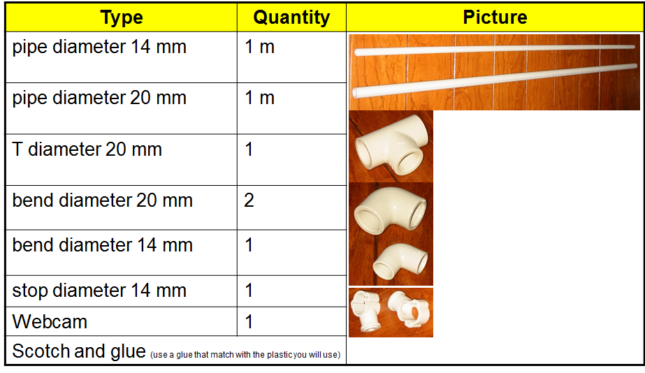
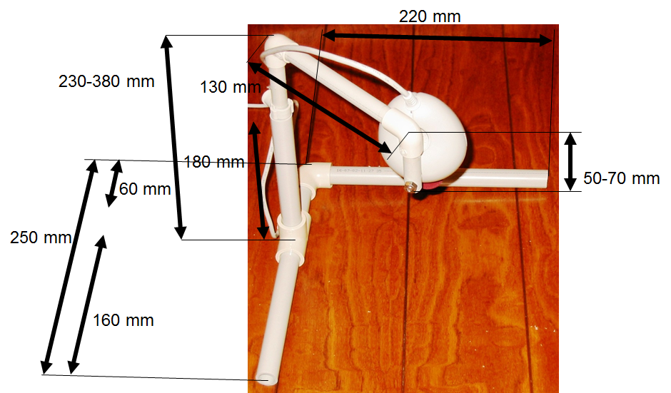

# 2012-03-03 Create your own mobile video recorder or animation stand

Long time ago, when I was doing lots of demos and used to have to display mobile phone like smartphone of Windows Embedded devices, I needed a mobile video recorder to be able to display them. Of course, I though using a webcam but the webcam alone does not allow you to demo the device. And I figure out that those kind of animation stand costs lots of money and were not easy to transport and very costly to rent. So I decided to build my own. And I recently use it again as I had to demo my Windows Phone 7 device and also .NET Microframework device like [netduino](./2011-09-09-netduino-board-geek-tool-for-.NET-Microframework.md).

 The main features I needed were:

* easy to transport  
* very cheap  
* using my PC if needed like using a webcam   So I came to the following solution:

 

 Everything can be unplugged and transported easily. It is using a webcam and simple plastic pipes. It costs only couple of euros ($ for our non European friends ) to build. On the software side, I used a DirectX sample which I customize to create my own application.

 And I sued this solution very recently during the French TechDays where I did a demo of .NET Microframework. The equipment in place was not working and I was glad to have my own mobile video recorder with me  So, I use it as you'll be able to see when the video will be available.

 so let start with the hardware part. what you'll need:

 

 Now to build it, you'll need to cut the following parts:

* Cut a length of 160 mm in the Ø 20 pipe  
* Cut a length of 60 mm in the Ø 20 pipe  
* Cut a length of 200 mm in the Ø 20 pipe  
* Cut a length of 150 mm in the Ø 20 pipe  
* Cut a length of 200 mm in the Ø 14 pipe  
* Cut a length of 130 mm in the Ø 14 pipe   And here is the technical schema (forget about the webcam yet):

 

 With this you can basically adapt any camera. You may recognize on this picture an old Philips webcam and on the one I pick recently a nice Microsoft LifeCam Cinema. A perfect HD camera with some good feature to tune the brightness. Also, it is very easy to install the camera on the pipes.

 

 Step 1: glue assembly

* Glue the 160 mm Ø 20 pipe and glue the 60 mm Ø 20 pipe with the T  
* Glue the bend Ø 20 pipe at the end of the 30 mm Ø 20 pipe  
* Be sure the T top is vertical  
* Be sure the bend is horizontal   

 Step 2: soft assemblies

* Place scotch in the length around the 200 mm Ø 14 pipe on 150 mm. Place scotch until the 200 mm Ø 14 pipe go well and block when placed in the 150 mm Ø 20 pipe. This will allow to move up and down the webcam.  
* You can glue or use scotch to place the bend Ø 14 and the end of the 200 mm Ø 14 pipe. Glue or scotch it at the other end you place the scotch from the previous step   

* To finalize this part, place the stop diameter Ø 14 pipe on the 200 mm Ø 14 pipe and place this pipe in the 150 mm Ø 20 pipe   On the software side, I'm using a simplified version of the DirectX SDK AMCAP example. You can easily select the webcam you want (if you have an integrated webcam and the external one, make it easy to choose) and setup the settings in the capture filter like the autofocus, the resolution, etc.

 

 If you want this software let me know and write me at [laurelle@microsoft.com](mailto:laurelle@microsoft.com).

 I hope you've enjoy this tutorial to create hardware which is not electronic this time 
