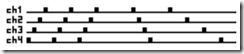

# 2012-04-17 Using netduino and .NET Microframework to pilot any Lego Power Function thru Infrared (part 2)

[In a previous post](./2012-04-07-Using-netduino-and-.NET-Microframework-to-pilot-any-Lego-Power-Function-thru-Infrared-(part-1).md), I've started to describe the Lego Power Function protocol and how I've implemented it on a netduino board using .NET Microframework. My work is based on [ideas and implementation Mario explain in his blog.](https://highfieldtales.wordpress.com/2012/02/07/infrared-transmitter-driver-for-netduino/) We've exchange couple of emails to make both our projects work 

To continue where I stopped, The message_pause function is like this:

```csharp
private void message_pause(uint channel, uint count)
{

    int a = 0;
    // delay for first message
    // (4 - Ch) * Tm 
    if (count == 0)
        a = 4 - (int)channel + 1;
    // next 2 messages
    // 5 * Tm 
    else if (count == 1 || count == 2)
        a = 5;
    // last 2 messages
    // (6+2*Ch) * Tm 
    else if (count == 3 || count == 4)
        a = 5 + ((int)channel + 1) * 2;

    // Tm = 16 ms (in theory 13.7 ms) 
    System.Threading.Thread.Sleep(a * 16);
}
```

It is a bit more comprehensive if you look at this picture. Each dot represent a signal sent. and each space the time you have to wait.



The Lego protocol says you have to wait 16 ms minimum between 2 messages as it is the max size of a message. How did they arrive to this magic number?

Back to our protocol, we know that the frequency is 38KHz, that the structure of a message starts and stop with a start/stop bit which is composed by 6 pulses IR and 39 pauses. A low bit is a 6 IR pulse and 10 pauses, a high bit a 6 IR pulse and 21 pauses. So we can do a ^simple table like this to have the length in µ seconds and the length in ushort:

|Type|Total|
|---|---|
|start µs|1 184|
|start ushort|45|
|stop µs|1 184|
|stop ushort|45|
|low µs|421|
|low ushort|16|
|hight µs|711|
|hight ushort|27|

And we can also have the view of the full size of a message. The minimum size (if all bits are low) and the maximum one (if all bits are high):

|Total|Start|Toggle|Escape|C|C|a|M|M|M|D|D|D|D|L|L|L|L|stop|
|---|---|---|---|---|---|---|---|---|---|---|---|---|---|---|---|---|---|
|Min size µs|9104|1184|421|421|421|421|421|421|421|421|421|421|421|421|421|421|421|421|1184|
|Min size ushort|346|45|16|16|16|16|16|16|16|16|16|16|16|16|16|16|16|16|45|
|Max size µs|13744|1184|711|711|711|711|711|711|711|711|711|711|711|711|711|711|711|711|1184|
|Max size ushort|522|45|27|27|27|27|27|27|27|27|27|27|27|27|27|27|27|27|45|

So if you do the sum, you can see that the maximum length is 13 744 µ seconds which is 13.744 mili seconds and not 16ms as Lego describe. But lets take the Lego recommendation there. As you can see also the maximum length of a message is 522 ushort. And that's the perfect transition to have a look at the spi_send function:

```csharp
private void spi_send(ushort code)
{
    try {
        ushort[] tosend = new ushort[522]; // 522 is the max size of the message to be send ushort x = 0x8000;
        int i = 0;

        //Start bit 
        i = FillStartStop(tosend, i);

        //encoding the 2 codes while (x != 0)
        {
            if ((code & x) != 0)
                i = FillHigh(tosend, i);
            else i = FillLow(tosend, i);
            x >>= 1;  //next bit }
        //stop bit i = FillStartStop(tosend, i);
        MySerial.Write(tosend);
    }
    catch (Exception e)
    {
        Debug.Print("error spi send: " + e.Message);
    }

}

```

The code starts with the creation of a ushort buffer of 522 elements. It is the max size of a message. The I create a short "x" (ok, I'm not creative for this little increment, but any developer has to use some crappy small names time to time ). I will use it as a mask to see what is the value to send.

There are now 3 functions called here: FillStartStop, FillHigh and FillLow. They are like this:

```csharp
private int FillStartStop(ushort[] uBuff, int iStart)
{
    //Bit Start/stop = 6 x IR + 39 x ZE int inc;
    int i = iStart;
    //startstop bit for (inc = 0; inc < 6; inc++)
    {
        uBuff[i] = _high;
        i++;
    }
    for (inc = 0; inc < 39; inc++)
    {
        uBuff[i] = _low;
        i++;
    }
    return i;
}

private int FillHigh(ushort[] uBuff, int iStart)
{
    //Bit high = 6 x IR + 21 x ZE int inc;
    int i = iStart;
    //High bit 
    for (inc = 0; inc < 6; inc++)
    {
        uBuff[i] = _high;
        i++;
    }
    for (inc = 0; inc < 21; inc++)
    {
        uBuff[i] = _low;
        i++;
    }
    return i;
}

private int FillLow(ushort[] uBuff, int iStart)
{
    //Bit low = 6 x IR + 10 x ZE int inc;
    int i = iStart;
    //Low bit 
    for (inc = 0; inc < 6; inc++)
    {
        uBuff[i] = _high;
        i++;
    }
    for (inc = 0; inc < 10; inc++)
    {
        uBuff[i] = _low;
        i++;
    }
    return i;
}
```

Those functions take the buffer as an input and where to fill it. And then depending if it is a start/stop, low or high bit will fill the buffer correctly. For example, the low bit is 6 times IR pulses (_high = 0xFE00) and 10 times pauses (_low = 0x0000). And it return the new start position.

Back to the spi_send function, after calling a first time the FillStartStop, the while loop use the "x" variable as a mask, call FillHigh if it is a high bit and FillLow if it is a low bit. And I change the mask for each bit. High bits have to be send first.

```csharp
while (x != 0)
{
    if ((code & x) != 0)
        i = FillHigh(tosend, i);
    else i = FillLow(tosend, i);
    x >>= 1;  //next bit 
}
```

When all the bits are transformed and the waveform is created, the signal is sent with MySerial.Write(tosend);

The MySerail object is an SPI object:

```csharp
private SPI MySerial;
```

Initialization is done like this:

```csharp
try {
    //Frequency is 38KHz in the protocol 
    float t_carrier = 1 / 38.0f;
    //Reality is that there is a 2us difference in the output as there is always a 2us bit on on SPI using MOSI 
    float t_ushort = t_carrier - 2e-3f;
    //Calulate the outpout frenquency. Here = 16/(1/38 -2^-3) = 658KHz 
    uint freq = (uint)(16.0f / t_ushort);

    SPI.Configuration Device1 = new SPI.Configuration(
    Pins.GPIO_NONE, // SS-pin 
    true,             // SS-pin active state 
    0,                 // The setup time for the SS port 
    0,                 // The hold time for the SS port 
    true,              // The idle state of the clock 
    true,             // The sampling clock edge 
    freq,              // The SPI clock rate in KHz 
    SPI_Devices.SPI1);   // The used SPI bus (refers to a MOSI MISO and SCLK pinset) 
    MySerial = new SPI(Device1);
}
catch (Exception e)
{
    Debug.Print("Error: " + e.Message);
}
```

Details on on the math can be found in Mario article. This is a very precise math, the tolerance for the Lego protocol is about 30%. The official document gives the following range value:

Low bit range 316 - 526 us  
High bit range 526 - 947 us  
Start/stop bit range 947 - 1579 us

That said, it is better to be in the right domain, make it work better.

So we've seen how to create the waveform, send it over the MOSI output. Now, let see how to use all this in a very simple way.

```csharp
public class Program {
    public static void Main()
    {
        LegoInfrared myLego = new LegoInfrared();
        for (int i = 0; i < 10; i++)
        {
            myLego.ComboMode(LegoInfrared.LegoSpeed.BLUE_FWD, LegoInfrared.LegoSpeed.RED_FWD, LegoInfrared.LegoChannel.CH1);
            System.Threading.Thread.Sleep(1000);
        }
    }

}
public class LegoInfrared 
```

The LegoInfrared class does contains all the functions and enums I've explained. Here the usage is extremely simple. I create an object like this and call 10 times a forward command for both the Blue and Red output on channel 1\. I wait 1 second and do it again. And the good news is that it is really working. I'm of course using the electronic schema that Mario proposed.

If you are interested in the full source code of the full protocol, just let me a comment.

More to come to show how to pilot it thru a web server and how to use it from another program. And again, depending of my inspiration, we will go a bit further and use sensors to raise events and be a bit smarter. Stay tune . If you want to implement other protocols like RC5, you can directly go to Mario blog and use his code. If you have a more complex protocol like the Lego one, you'll be able to reuse most of the implementation I've done. Let me know if you want the full code.
