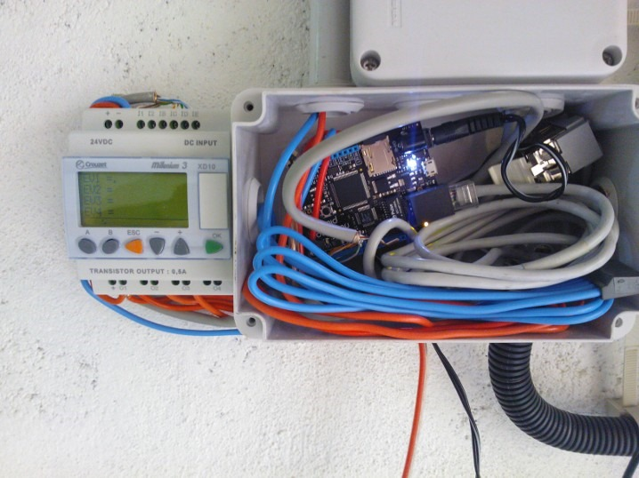
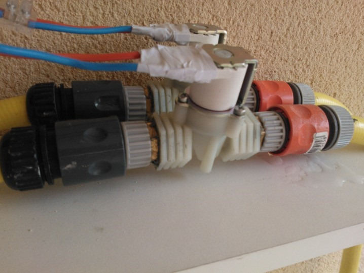
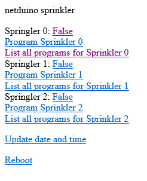

# 2012-05-06 Managing my Sprinklers from the Cloud

I've started a project to pilot my sprinklers remotely and make them smart almost [9 months ago](./2011-09-09-netduino-board-geek-tool-for-.NET-Microframework.md). The idea is to be able to remotely open and close my sprinklers but also be able to launch automatic sprinkling cycles.

 After some software and hardware development, I now have a fully working solution:

 

 You can see the netduino .NET Microframework board where all the smart is happening. I wrote couple of articles already to show [how to implement a web server](./2011-09-12-Implementing-a-simple-HTTP-server-in-.NET-Microframework.md), [get the date and time](./2011-09-13-Setup-a-time-and-date-using-.NET-Microframework.md). I've also wrote couple of articles on hardware.

 Recently, I've met with Alain, a Lego fan like me and I show him the way I can control any Lego Power Function element using .NET Microframework. And we discussed about my sprinkler project. I was about to implement the final solution with my existing 9V Gardena electro valves. And he challenged ma on this telling me that I will never know the status of the electro valve if I hacked the Gardena system. And he tell me to go for a 24V DC electro valve. The big advantage is that when you switch on the current, it open the valve, when it's off, it close. So no unknown state like with the bistable  valve from Gardena. So I bought 3 24V DC electro valve for 22€ each plus couple of cents for the diode (never forget to add a return current diode on a solenoid ).

 

 And the display screen with the button you see is a Crouzet automate. It's a gift from Alain and it's really cool to have it. For my project, it can be replaced by 3 buttons, 3 leds and 3 transistors but it's just more cool  The netduino enter in the DC input section and when the voltage is higher than 2V (normal high level is 3.3V), it just switch on an electro valve. So nothing complicated there.

 What has been long is to bring electricity when I wanted this box to be plus networking plus bring cables to all the places where I have electro valves. And as I have in front and rear of the house, I have lots of cables to install nicely in the basement. And just this took 1 full day with a friend who helped me. Thanks Thomas by the way 

 And now from my Windows Phone or a PC or any other device which support HTML, I can open, close and program my sprinklers:

 

 I'm an happy geek  And as there are always some improvement to do, next step is to add a [I2C temperature sensor](./2012-02-21-Using-one-temperature-sensor-with-I2C-protocol-and-.NET-Micro-framework-on-netduino-board.md) to get information on the temperature outside and implement automatic rules.

 Stay tune!
