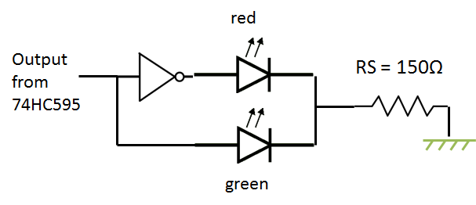

# 2012-05-22 Using a SPI device with netduino and .NET micro framework

After playing with I2C, with various IO, I've decided to play a bit with SPI  The real project behind using a SPI device is to be able to use it a a multiplexer/demultipler of IO.

I want to pilot lights for my Lego train. The idea is to have the ability to switch a signal light to green or red. I want to be able to have 16 lights. The netduino board have only 14 digital IO and 6 analogic. And I'm already using some to pilot the Lego train thru infrared. [See previous article](./2012-04-07-Using-netduino-and-.NET-Microframework-to-pilot-any-Lego-Power-Function-thru-Infrared-(part-1).md).

So I have to find a multiplexing solution. And one is used by most of the netduino fan: SPI. In terms of electronic it's simple, it is a serial to parallel (and vice versa as you can read also). The component the most used for this is [74HC595](https://www.nxp.com/documents/data_sheet/74HC_HCT595.pdf). There are couple of basics explanations on the [netduino wiki](https://wiki.netduino.com/SPI-Configuration-Example-74HC595.ashx) and also good examples as always on [Mario Vernari blog](https://highfieldtales.wordpress.com/).

Each 74HC595 can have 8 output and they can be chained. Which mean that you can use 2 component to have 16 output. And you basically put them in series. One output of one 74HC595 to the input of the others.

I spend quite a bit of time to understand how to plug the 74HC595 to the netduino. So here is what to do:

* Pin 8 is ground
* Pin 16 is VCC (+5V recommended)
* Pin 14 to netduino pin D11 (called MOSI) for the first 74HC595 of the chain. For the next one it has to be linked to the Pin 9 of the previous 74HC595
* Pin 13 to ground (used to activate or not the 8 output)
* Pin 12 to one output port you'll choose on the netduino. Let say pin D10. This one is used to select the 74HC595 when you have multiple 74HC595 used in parallel for different purposes (called SS)
* Pin 11 to netduino pin D13 (called SCLK)
* Pin 10 to +VSS (this one is used to reset if needed)
* Pin 15, 1, 2, 3, 4, 5, 6, 7 are the output pin
* Pin 9 has to be linked to the next 74HC595 of the chain if there are more than 1.  And that's it for the basics! Now what I want to do with the output is to be able to light one led green or switch it to red. So I'll use the output of the 74HC595. When it will be 1, I'll light the green one, when it will be 0, I'll light the red one. Here is the hardware to schematic:



When the signal will be 1, the current will go thru the green light light. And when it will be 0, the inverter will switch to 1 and the red light will light. It just need 3 cables per light and the current can be transported on long distance. The RS resistor can be adapted with a lower resistor to 100 or something like this in order to send a more intense current in the cable as there will be some loss if it is very long. by the way I recommend to read the excellent article on the length of cable and impact on signal noise from [Mario](https://highfieldtales.wordpress.com/2012/04/25/effect-of-long-wiring-on-digital-signals/).

Now, in terms of software, It's not so difficult. In my project, I'm using the SPI for multiple purpose. So I need to use it in a smart way. SPI can be shared and the only thing to do is to change the configuration and write (and read) right after. So I'm using the MultiSPI class from the [NETMF Toolbox](https://www.netmftoolbox.com/). It's an impressive toolbox containing lots of helpers. It goes from hardware to HTTP web client. There is a 74HC595 also but I found it more complex to use that just directly using the MultiSPI class.

Here the example of class to switch to green (1) or red (0) a specific output of the 2 74HC595:

```csharp
public class Signal {
    private byte mNumberSignal; 
    private bool[] mSignalStatus; 
    public const byte NUMBER_SIGNAL_MAX = 16; 
    private MultiSPI MySignal; 
    public Signal(byte NumberOfSignal) { 
        mNumberSignal = NumberOfSignal; 
        if ((mNumberSignal <= 0) && (mNumberSignal > NUMBER_SIGNAL_MAX)) 
            new Exception("Not correct number of Signals"); 
        mSignalStatus = new bool[mNumberSignal]; 
        // open a SPI 
        MySignal = new MultiSPI(new SPI.Configuration( 
            Pins.GPIO_PIN_D10, // SS-pin 
            false, // SS-pin active state 
            0, // The setup time for the SS port 
            0, // The hold time for the SS port 
            false, // The idle state of the clock 
            true, // The sampling clock edge 
            1000, // The SPI clock rate in KHz 
            SPI_Devices.SPI1)); // The used SPI bus (refers to a MOSI MISO and SCLK pinset) 
            //initialise all signals to "false" 
            for (byte i = 0; i < mNumberSignal; i++) 
                ChangeSignal(i, true); 
    } 
    public byte NumberOfSignals { get { return mNumberSignal; } } 
    public void ChangeSignal(byte NumSignal, bool value) { 
        if ((NumSignal <= 0) && (NumSignal > mNumberSignal)) 
            new Exception("Not correct number of Signals"); 
            //need to convert to select the right 
            Signal mSignalStatus[NumSignal] = value; 
            // fill the buffer to be sent 
            ushort[] mySign = new ushort[1] { 0 }; 
            for (ushort i = 0; i < mNumberSignal; i++) 
                if (mSignalStatus[i]) 
                    mySign[0] = (ushort)(mySign[0] | (ushort)(1 << i)); 
            //send the bytes 
            MySignal.Write(mySign); 
    } 
    public bool GetSignal(byte NumSignal) { 
        if ((NumSignal <= 0) && (NumSignal > mNumberSignal)) 
            new Exception("Not correct number of Signals");  
        return mSignalStatus[NumSignal]; 
    } 
} 
```

I just need to declare a MultiSPI. The SPI Configuration contains the necessary information to setup the 74HC595. The SS pin is set to D10. So I can use the SPI for other purposed to pilot my Lego infrared modules. And in the Lego module, I'll have also to declare the SPI as MultiSPI.

What the MultiSPI class is doing is very simple. It has a static SPI in its private variables. And a SPI.Configuration which is not static.

```csharp
/// <summary>Reference to the SPI Device. All MultiSPI   
/// devices use the same SPI class from the NETMF, so this reference is static
/// </summary> 
private static SPI _SPIDevice; 
/// <summary>SPI Configuration. Different for each device, so not a static reference</summary> 
private SPI.Configuration _Configuration; 
// Store the configuration file for each MultiSPI instance  
// Sets the configuration in a local value 
this._Configuration = config; 
// If no SPI Device exists yet, we create it's first instance 
if (_SPIDevice == null) { 
    // Creates the SPI Device only 1 time as it is a static! 
    _SPIDevice = new SPI(this._Configuration); 
} 
public void Write(byte[] WriteBuffer) { 
    _SPIDevice.Config = this._Configuration; 
    _SPIDevice.Write(WriteBuffer); 
} 
```

So each time a program want to write in a SPI, the right configuration is selected and the write command is send. It's working like this to read. The full class is a bit more complex but the main principle is there.

The rest of my code is very simple and I'm sure I would have been to write it in a better way. I'm just storing the state of a signal and then output all the buffer to the SPI.

So bottom line, it is very easy to use SPI as a multiplexer/demultipler for IO. That was what I needed. I did not tested yet how to read the data but it should be as simple!
