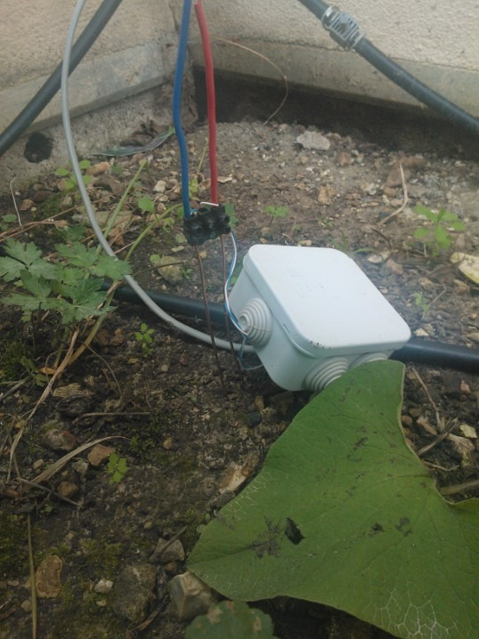
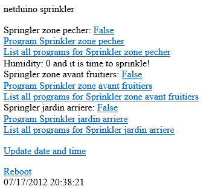
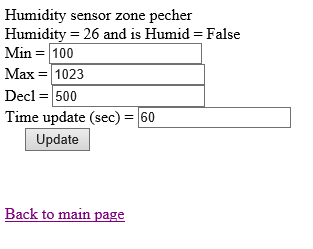
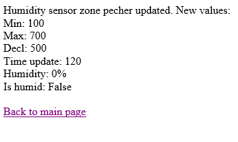

# 2012-07-17 A soil low cost humidity sensor (moisture) and .NET Micro Framework (NETMF)

I'm working on my [own sprinkler system](./2012-05-06-Managing-my-Sprinklers-from-the-Cloud.md) which I can pilot thru Internet wherever I am. I can add programs and also open and close sprinklers when I want. I recently build a [prototype of a humidity sensor](./2012-06-24-A-low-cost-humidity-sensor-for-my-sprinkler-system.md). Now it's time to implement this humidity sensor in pre production and see how it is working for real. Next phase will be an automatic piloting based on this humidity sensor. Thanks also to all the feedback I get which encourage me to continue those posts. I'm just a marketing guy doing hardware and software development 

Based on the work of the prototype, I've build a normal size sensor and put it for real in my garden:



It is the same principle as the prototype, there are 2 coppers cables put in the soil (approx. 10 centimeters) and current arriving to those 2 cables. The potential is measured and interpreted to see how humid it is. To summarize, the more humid it is the lower the resistance of the soil is. So I need 3 cables only: one for ground, one for +3.3V and one for the measurement. I can chain sensors and will only need 1 additional cable per sensor. This solution is very simple and very easy to implement. There are smartest way to do this with a real serial bus self powered. But for the moment, I'm fine with this solution. I will explore the other solution when I will want to add temperature, luminosity and others like wind.

Now, looking at the code, I wanted to make part of the code reusable and I've define a humidity sensor with simple Properties and a class to initialize the analogic input.

```csharp
public struct HumiditySenrorParam { 
    public int MinValue; 
    public int MaxValue; 
    public int DeclValue; 
    public int UpdateTime; 
} 
public class HumiditySensor { 
    private SecretLabs.NETMF.Hardware.AnalogInput HumSensor; 
    private Timer MyTimer; 
    private int myDeclUpdate;
    private int myHumidity; 
    private bool bhumid = false; 
    public HumiditySensor(Cpu.Pin HumidityPin, HumiditySenrorParam MyHumidityStruct) { 
        if (!Microsoft.SPOT.Hardware.SystemInfo.IsEmulator) 
            HumSensor = new SecretLabs.NETMF.Hardware.AnalogInput(HumidityPin); 
            MyTimer = new Timer(new TimerCallback(ClockTimer_Tick), this, MyHumidityStruct.UpdateTime * 1000, 0); 
            MinValue = MyHumidityStruct.MinValue; 
            MaxValue = MyHumidityStruct.MaxValue; 
            DeclValue = MyHumidityStruct.DeclValue; 
            UpdateTime = MyHumidityStruct.UpdateTime; 
    }
} 
```

The HumiditySensorParam class is used to pass the initialization value to the HumiditySensor class. Each class is using an analogic input on a specific Pin from the CPU. This value is also passed in the constructor.

An analogic input on the netduino has 1024 points from 0 to 3.3V starting from 0 to 1023. But as explained in the previous article on the prototype, only part of this range is used. So I'm using 3 parameters: a minimum value, a maximum value and a value to determine the limit between dry and humid. All should be from 0 to 1023. It is not checked in the class but a good programmer will do 

Also, the analogic input has to be read in a regular timeframe. This is done by the UpdateTime value in seconds. A timer is raised every period to update the value of the humidity sensor.

```csharp
public int MinValue { get; set; } 
public int MaxValue { get; set; } 
public int DeclValue { get; set; } 
public int UpdateTime { 
    get { return myDeclUpdate; } 
    set { 
        MyTimer.Change(0, value * 1000); 
        myDeclUpdate = value; 
    } 
} 
```

All 4 parameters are stored into Properties. The min, max and decl value are stored in normal Properties. The UpdateTime is a bit different. It has to change the value of the timer. Again, here, I do things in a simple way, but all those values should be checked before setting them.

Now let have a look at the timer

```csharp
static void ClockTimer_Tick(object sender) { 
    HumiditySensor mSensor = (HumiditySensor)sender; 
    mSensor.Update(); 
    //Debug.Print(DateTime.Now.ToString("MM/dd/yyyy HH:mm:ss") + " Humidity: " + mSensor.Humidity + " IsHumid: " + mSensor.IsHumid); 
} 
```

The code is quite simple, it first get the object. This function must be a static one as it is called by .NETMF when it is time. The sender object is the humidity sensor itself as setup in the constructor. After the cast, it is possible to call the update method.

```csharp
public void Update() { 
    if (!Microsoft.SPOT.Hardware.SystemInfo.IsEmulator) 
        Humidity = HumSensor.Read(); 
    else 
        Humidity = new Random().Next(MaxValue); 
} 
```

I first check if we are in the emulator or on a real Platform. In the case I'm in the emulator, I just return a random number. This allow to test the software when I do development in planes like now on my way to Atlanta 

In the other case, I read the analogic input and put the value into the Humidity property.

```csharp
public int Humidity { 
    get { return myHumidity; } 
    internal set { 
        if (value < MinValue) 
            value = MinValue; 
        if (value > MaxValue) 
            value = MaxValue; 
        if (value >= DeclValue) 
            bhumid = true; 
        else 
            bhumid = false; 
        myHumidity = 100 * (value - MinValue)/(MaxValue - MinValue);
    } 
} 
```

I allow to update this property only internally. I do the math with the Min, Max values to compute a percentage. And check if it is dry or humid.

And I've also created 2 other Properties I can use later in the code:

```csharp
public bool IsHumid { get { return bhumid; } } 
public int DeclHumidity { 
    get { 
        return (100 * (DeclValue - MinValue) / (MaxValue - MinValue)) ; 
    } 
} 
```

The IsHumid return true if it is humid compare to the level and the DeclHumidity return this level in percentage.

Here it is, you have a humidity sensor and the code to read the values  Now we will look at how to use it. For this, I display the humidity level in the main web page with the information regarding the sprinklers. And I've also build a page to be able to change dynamically the values of the Humidity sensor. This is useful when you need to calibrate it.

```csharp
HumiditySenrorParam MyHumidityStruc = new HumiditySenrorParam(); 
MyHumidityStruc.MinValue = 0; 
MyHumidityStruc.MaxValue = 1023; 
MyHumidityStruc.DeclValue = 500; 
MyHumidityStruc.UpdateTime = 60; 
Sprinklers[0].HumiditySensor = new HumiditySensor(Pins.GPIO_PIN_A0, MyHumidityStruc); 
```

Nothing complex in this initialization phase. I've already explained in previous posts the Sprinkler class. I just added a HumiditySensor member. So I can have 1 humidity sensor per sprinkling zone. Looking at how it's working in the industry. And I want to be flexible. So I can have a humidity sensor wherever I want. I'm using a parameter file which I read and interpret at boot time.

The final result looks like this with 1 humidity sensor:



And the code to build the page is easy:

```csharp
strResp = "<HTML><BODY>netduino sprinkler<p>";  
strResp = WebServer.OutPutStream(response, strResp); 
for (int i = 0; i < NUMBER_SPRINKLERS; i++) { 
    strResp += "Springler " + Sprinklers[i].Name + ": <a href='/"   
        + paramPageSprinkler + ParamStart + securityKey + ParamSeparator   
        + paramSpr + i + ParamEqual + !Sprinklers[i].Open + "'>"   
        + Sprinklers[i].Open + "</a><br>"; 
    strResp += "<a href='/" + paramPageCalendar + ParamStart   
        + securityKey + ParamSeparator + paramYear + ParamEqual + DateTime.Now.Year   
        + ParamSeparator + paramMonth + ParamEqual + DateTime.Now.Month   
        + ParamSeparator + paramSpr + ParamEqual + i + "'>Program Sprinkler "   
        + Sprinklers[i].Name + "</a><br>"; 
    strResp += "<a href='/" + paramPageListPrgm + ParamStart   
        + securityKey + ParamSeparator + paramSpr + ParamEqual + i   
        + "'>List all programs for Sprinkler " + Sprinklers[i].Name + "</a><br>"; 
    if (Sprinklers[i].HumiditySensor != null) { 
        strResp += "Humidity: " + Sprinklers[i].HumiditySensor.Humidity; 
        if (Sprinklers[i].HumiditySensor.IsHumid) 
            strResp += " and it is humid<br>"; 
        else 
            strResp += " and it is time to sprinkle!<br>"; 
    } 
    strResp = WebServer.OutPutStream(response, strResp); 
} 
strResp += "<p><a href='/" + paramPageUtil + ParamStart   
    + securityKey + ParamSeparator + paramClk + ParamEqual   
    + "1'>Update date and time</a><br>"; 
strResp += "<p><a href='/" + paramPageUtil + ParamStart   
    + securityKey + ParamSeparator + paramReboot + ParamEqual   
    + "1'>Reboot</a><br>"; 
strResp += DateTime.Now.ToString(); 
strResp += "</BODY></HTML>"; 
strResp = WebServer.OutPutStream(response, strResp); 
```

ParamStart = ‘?', ParamSeparator = ‘&', ParamEqual = ‘=', the various paramPage are the name of the page (like "spr.aspx" for paramPageSprinkler). It is mainly about building and URL like spr.aspx?sec=seckey&spr0=True

I display only the information regarding a humidity sensor if one has been setup. If not, I don't display anything. And as you can see, it is really simple, the Humidity property return the humidity in percentage. and IsHumid allow to check if it is dry or humid so if it time to sprinkle or not 

You've read this blog post up to this point. So I'm sure you still have energy! I've build a page to be able to update the various parameters. The page look like this with one humidity sensor. With multiple humidity sensor, it will just display more forms on the same page:



When updates, the result is the following:



My code allow also to get this information without and UI, just with the data. It allow also to just change one sensor and not all. I will not show all the code, I will just explain the core part with the forms:

```csharp
for (int i = 0; i < NUMBER_SPRINKLERS; i++) 
    if (Sprinklers[i].HumiditySensor != null) { 
        //display a form with all params to be modified 
        strResp += "<form method=\"get\" action=\""   
            + paramPageHumidity + "\"><p>Humidity sensor "   
            + Sprinklers[i].Name; 
        strResp += "<br />Humidity = "   
            + Sprinklers[i].HumiditySensor.Humidity + " and is Humid = "   
            + Sprinklers[i].HumiditySensor.IsHumid + "<br />"; 
        strResp += "Min = <input type=\"text\" name=\""  
            + paramHumidityMinValue +"\" value=\"" + Sprinklers[i].HumiditySensor.MinValue   
            + "\" /><br />"; 
        strResp += "Max = <input type=\"text\" name=\""  
            + paramHumidityMaxValue +"\" value=\"" + Sprinklers[i].HumiditySensor.MaxValue   
            + "\" /><br />"; 
        strResp += "Decl = <input type=\"text\" name=\""  
            + paramHumidityDeclValue +"\" value=\"" + Sprinklers[i].HumiditySensor.DeclValue   
            + "\" /><br />"; 
        strResp += "Time update (sec) = <input type=\"text\" name=\""  
            + paramHumidityTimeUpdate +"\" value=\""   
            + Sprinklers[i].HumiditySensor.UpdateTime + "\" /><br />"; 
        strResp += "&nbsp;&nbsp;&nbsp;&nbsp;&nbsp;<input id=\"Submit\" type=\"submit\" value=\"Update\" /></p>"; 
        strResp += "<input type=\"hidden\" name=\""   
            + paramSpr + "\" value=\"" + i + "\">"; 
        strResp += "<input type=\"hidden\" name=\""   
            + paramSecurityKey + "\" value=\"" + MySecurityKey + "\"></form>"; 
        strResp += "<br />"; 
        strResp = WebServer.OutPutStream(response, strResp); 
    } 
```

Nothing really complicated here, it's just building a HTML page by hands  The form will be posted with the GET method. So all parameters will be passed thru the URL. I've used this method for all the development I've done and you'll find examples in my previous posts. Including the web server itself.

So enjoy this humidity sensor  And I hope the weather will get dryer in Paris this summer so I'll be able to calibrate it correctly, find the right level Under which it is interesting to sprinkle. And of course, next step is to automate all this! And let the system manage itself based on the soil humidity. And I will add other sensors like temperature! Stay tune  and feedback welcome as usual.
