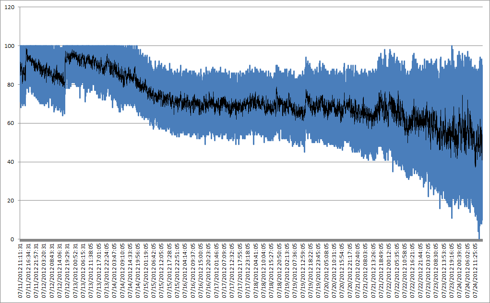

# 2012-07-30 How software can solve hardware problems

I've developed my own sprinkler system and my own humidity sensor. This sensor is extremely simple as you can read in my [article](./2012-07-17-A-soil-low-cost-humidity-sensor-(moisture)-and-.NET-Micro-Framework-(NETMF).md). The main problem of this sensor is that the data to be read is an analogic data and the length of the cable is very long. There are lots of problems implied with long cables. You can read an excellent article from Mario Vernari [here](https://highfieldtales.wordpress.com/2012/04/25/effect-of-long-wiring-on-digital-signals/). In his article, you can clearly see the impact of an alimentation, of other signals into a long distance cable.

Of course my humidity sensor will follow the same problem. And I've logged couple of days of data every minute to have enough data to see how the data looks like.


As you can visually see the bleu line represents the data and with 19000 data, you can feel like it is very random. In fact those data are not random, they are just noisy. There are couple of solutions to avoid this problem. First solution is of course hardware, changing the hardware to remove a maximum of noise and clear the signal. But I will not do this for my example.

I will use a pure software solution to remove this noise. As explained in Mario's blog, most of the noise is kid of high frequency compare to the normal signal. And this apply to any scale. So in my scale, I will also have this issue. What I know is that my signal do not change much. Remember I'm measuring the soil humidity or moisture and this is not changing so quickly. It can change very quickly in less than couple of minutes in case of huge rain.

So one of the solution is to do a mobile average. By doing this, you can remove the high frequency. The principle is simple, it's about doing an average of N values that "moves" with the signal. And the effect is to mathematically remove the high frequencies. Let use an example with a period of 15 points. In my graph, that would say an average of a moving quarter. Applied to the previous graph, the black line does represent it:



and visually, you can see that it does remove lots of the randomness. Of course, if you do an average on more points, you'll remove even more of the noise. The orange one does represent an average on 60 points so a mobile average of 1h:


The period you have to choose depend on the quality of the signal and of course the change of data you still want to measure. The longest the period is and the less changes you can evaluate. So let use this last example with a 1 hour filter and let see if we can read anything on it. I know what was the weather and when I did sprinkler. Logically, each time it has rain, the signal should increase and decrease with no rain and high temperatures. And it should also increase if I did sprinkler. On this graph, I've put in red when it did rain and in green when I did sprinkler.


So even if we have this 60 points mobile filter and this remove rapid change in the measurement, it is still possible to see the impact of a rain or of a sprinkler. Now, I've added a 600 points mobile average and I let the pic where they were, here is the result:


it is still readable but the impact of an event can be read later. And the pic are lower. I don't want to enter in the theory but to be simple, it's just because, you are using more data, so as explain, the average will lower the result as it is there to remove high frequencies. And you'll need more "higher" data to see an impact. It's like if you had a field of green grass and add couple of red flowers. Take a picture and do an average of the color. It will be green. Add couple of other red flours, take a picture again, do the average and continue like this. And you'll need to have lots of red flours added to see a change while you've started adding flowers some time ago. This is exactly what is happening there. You will detect the phenomenon much later than it happened.

So if you want to use those kind of filters, make sure you use them wisely and not with a too long period. In my case, I will probably use for production something between 15 and 60 points. I need to have an idea of the humidity, not a very precise value. And as shown in the previous graph, it is visible when there's been some rain or if the sprinkler was on.

And of course, I'll need also to work on the isolation of the cable to try to remove some of the noise.

You may Wonder how I was able to log 19000 points? Well, it is very simple and the code is there:

```csharp
class LogToFile { static public bool Print(string StrFileName, string strToLog) { 
    try { 
        FileStream fileToWrite = new FileStream(StrFileName, FileMode.OpenOrCreate, FileAccess.Write); 
        byte[] buff = Encoding.UTF8.GetBytes(strToLog); 
        fileToWrite.Seek(fileToWrite.Length, 0); fileToWrite.Write(buff, 0, buff.Length); 
        fileToWrite.Close(); 
        return true; 
    } catch (Exception e) {
         return false; 
    } 
} 
```

It takes a simple file name as an input and something to write. The code is straight forward, it first create or open a file. Then encode the string to write in the buff variable. Seek to the end of the file, write the buff and close the file. So extremely simple code!

```csharp
LogToFile.Print("WINFS\\out.txt", DateTime.Now.ToString("MM/dd/yyyy HH:mm:ss") + ";" + mSensor.Humidity + "\r\n"); 
```

And the usage is as simple as the code, one line to log data like in this example. and as a result, you get data like this in the text file:

07/29/2012 13:34:46;86
07/29/2012 13:34:47;93
07/29/2012 13:34:48;91
07/29/2012 13:34:49;93

For the next article, we will see how to implement the filter in the real code.
