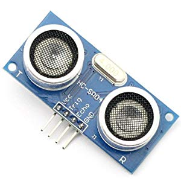
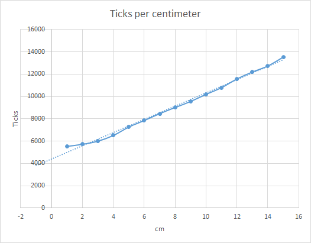

# 2013-05-27 Ultrasound sensor and .NET Microframework (NETMF)

I recently bought a cheap ultrasound sensor because I want to build a robot. Yes, after the [sprinkler management system](./2012-05-06-Managing-my-Sprinklers-from-the-Cloud.md) and the [automation of my Lego city](./2012-06-20-Using-XMLHttpRequest-to-pilot-a-Lego-train-dynamically-in-HTML-5.md), it's time to play with a robot . This sensor can measure the distance from 2 cm to approximately 50 cm. Cost is about 5$.

There are 4 pins:

* VCC = 5V
* Trig = send an impulsion and you'll get a signal back in the Echo pin
* Echo = the signal back from the impulsion
* Gnd = ground  



So the usage is very simple, just use 2 pins in the [Netduino](https://www.netduino.com/) board, 1 for Trig and 1 for Echo. In terms of code, it will be simple: output the value 1 (high) on the trig pin, then put it back to 0 (low), wait for an answer on Echo pin. Then you measure the time between the value sent and the way back. It will give you the distance. Best is to use the Ticks generated by DateTime. The difference will give 2 times the distance which you'll have to divide by the celerity of the air (so approx 340 m per second). And that's for the theory 

When you look at the reality, it's always very different . I've done measurement and he is the graph with points and ticks every centimeter:



What we can clearly see is a distortion when the object is close, the distance is not very well evaluated and it's a pretty much linear curve for the rest. I've removed the 1cm point and made a linear regression. The initial point is at 4000 ticks.

Then the step is about 636 per centimeter. And with those 2 values I can now easily calculate a distance.

I've look at the web to search some existing code and there are existing classes. I pick one which was well written by John E. Wilson and posted in the [Netduino forum](https://forums.netduino.com/). I've simplified a bit the code and change values for calibration. The simplify code looks like:

```csharp
public class HC_SR04 { 
    private OutputPort portOut; 
    private InterruptPort interIn; 
    private long beginTick; 
    private long endTick; 
    private long minTicks = 0; // System latency, subtracted off ticks to find actual sound travel time 
    /// <summary> 
    /// Constructor 
    /// </summary> 
    /// <param name="pinTrig">Netduino pin connected to the HC-SR04 Trig pin</param> 
    /// <param name="pinEcho">Netduino pin connected to the HC-SR04 Echo pin</param> 
    public HC_SR04(Cpu.Pin pinTrig, Cpu.Pin pinEcho) { 
        portOut = new OutputPort(pinTrig, false); 
        interIn = new InterruptPort(pinEcho, false, Port.ResistorMode.Disabled, Port.InterruptMode.InterruptEdgeLow); 
        interIn.OnInterrupt += new NativeEventHandler(interIn_OnInterrupt); 
        minTicks = 4000L; 
    } 
    /// <summary> 
    /// Trigger a sensor reading 
    /// </summary> 
    /// <returns>Number of mm to the object</returns> 
    public long Ping() { 
        // Reset Sensor portOut.Write(true); 
        Thread.Sleep(1); 
        // Start Clock 
        endTick = 0L; 
        beginTick = System.DateTime.Now.Ticks; 
        // Trigger Sonic Pulse 
        portOut.Write(false);
         // Wait 1/20 second (this could be set as a variable instead of constant)
        Thread.Sleep(50); 
        if (endTick > 0L) { 
            // Calculate Difference 
            long elapsed = endTick - beginTick; 
            // Subtract out fixed overhead (interrupt lag, etc.) 
            elapsed -= minTicks; 
            if (elapsed < 0L) { 
                elapsed = 0L; 
            } 
            // Return elapsed ticks 
            return elapsed * 10 / 636; ; 
        } 
        // Sonic pulse wasn't detected within 1/20 second 
        return -1L; 
    } 
    /// <summary> 
    /// This interrupt will trigger when detector receives back reflected sonic pulse 
    /// </summary> 
    /// <param name="data1">Not used</param> 
    /// <param name="data2">Not used</param> 
    /// <param name="time">Transfer to endTick to calculated sound pulse travel time</param> 
    void interIn_OnInterrupt(uint data1, uint data2, DateTime time) { 
        // Save the ticks when pulse was received back 
        endTick = time.Ticks; 
    } 
}
```

The value returned is in milimeter. Usage of the class is extremely simple:

```csharp
public static void Main() { 
    HC_SR04.HC_SR04 mUS = new HC_SR04.HC_SR04(Pins.GPIO_PIN_D4, Pins.GPIO_PIN_D5);  
    while (true) { 
        Debug.Print(mUS.Ping().ToString());
        Thread.Sleep(500); 
    } 
}
```

That's it for the Ultra Sound sensor. Next sensor will probably be a presence sensor.

Enjoy!
