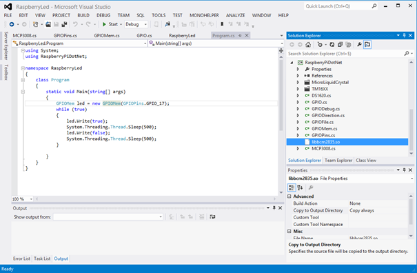
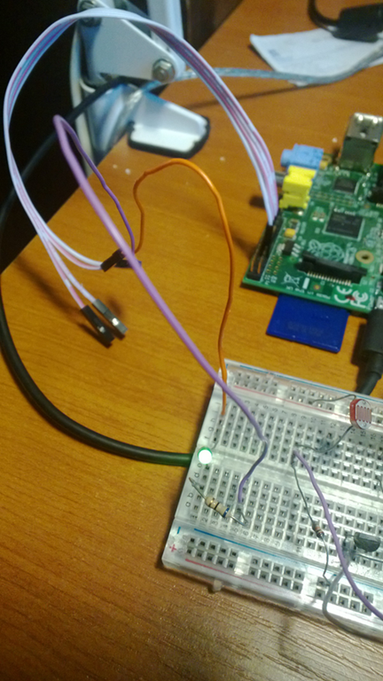
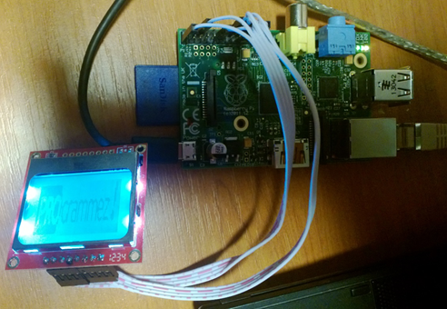

# 2013-06-21 .NET Microframework on RaspberryPi (Part 1)

I'm a bit fan of .NET Microframework (NETMF). NETMF is an open source technology originally developed by Microsoft based on .NET. It directly run on metal, without any OS. All sources and portability kit are freely available On Codeplex: [https://netmf.codeplex.com/](https://netmf.codeplex.com/).

And as a fan of Embedded devices I had to buy this inexpensive RaspberryPi [https://www.raspberrypi.org/](https://www.raspberrypi.org/). I bought the version second revision with the network adaptor. Advantage is clearly the price and having access to couple of GPIO like SPI,k i2c, PWM, serial and couple of other digital IO. Now it's a slow device when using the user interface, there is no analog input or output, PWM is limited to only 1 hardware PWM and not really flexible for setting the frequencies. But overall, for the price, it's Worth playing a bit with it.

In term of environment, it runs under Linux, it was a very long time I did not had to setup and make a Linux working. I was just reminding couple of commands. And I'm far to be a Linux developer… so I've started to look at what to put that looks like C# or .NET on this board and more specifically .NET Microframework.

I was disappointed to see that NETMF is not on the platform. But happy to see a good implementation of Mono [https://www.mono-project.com/Main_Page](https://www.mono-project.com/Main_Page). So at least I was able to run some .NET code on the Raspberry and take the advantage of the display if needed with Windows forms.

So what for access like we do in NETMF to the GPIO? I started to search on the web for what is possible to do. And I found a first project RaspberryPi.Net: [https://github.com/cypherkey/RaspberryPi.Net/](https://github.com/cypherkey/RaspberryPi.Net/). This project is using one library to access the BCM2835 chipset where the GPIO are managed. I found the last version of the library here: [https://www.airspayce.com/mikem/bcm2835/](https://www.airspayce.com/mikem/bcm2835/)

And I just followed the steps explained on the RaspberryPi.Net project page. Here are the steps. Open an LXTerminal and type:

```bash
sudo apt-get update
sudo apt-get install xrdp
```

this second one will allow you to access your Raspberry thru RDP  So you can do remote desktop on your Raspberry as you do with any other Windows machine.

```bash
sudo apt-get install mono-runtime
```

this will install Mono and all what is needed to run a .NET program.

```bash
sudo apt-get install git
```

Very useful if you need to download Git projects. I'll explain how to use it in the next part of this article as I've used it.

Now we go thru the download of the BCM2835 library, the compilation, the installation:

```bash
wget https://www.airspayce.com/mikem/bcm2835/bcm2835-1.25.tar.gz
tar -zxvf bcm2835-1.25.tar.gz
cd bcm2835-1.25
./configure
make
sudo make install
cd src
cc -shared bcm2835.o -o libbcm2835.so
cd
rm bcm2835-1.25.tar.gz
```

Now, you have to copy the libbcm2835.so library with the executable you'll produce at the end. And for the moment you're done with the RaspberryPi.

Go on Windows, download the code from [https://github.com/cypherkey/RaspberryPi.Net/](https://github.com/cypherkey/RaspberryPi.Net/), open the project in Visual Studio, if like me you're using the 2012 version, you may have to change the target to .Net Framework 4.0, change the pin you want to use to put a led, compile the project, put the exe and the so on a USB stick for example, or use any other way to copy it on your Rapsberry.



I've used GPIO 7 (pin 11 on the board), ground on pin 9, I put a Led and a 60 ohms resistor.

Use this site as a reference to know which pin does what: [https://elinux.org/Rpi_Low-level_peripherals](https://elinux.org/Rpi_Low-level_peripherals). Very well done, with all the details.



On the Raspberry, run the following command line from the directory you've copied the exe and the so file:

```bash
Sudo mono yourprogramm.exe
```

of course, yourprogramm here represent the name of the program you've done. And in my case I made the link blinking.

The way it's working is quite simple. Like in a normal .Net program, you can import external DLL like the system ones. Here, you import the same way but of course not DLL but object. See the following example:

```csharp
[DllImport("libbcm2835.so", EntryPoint = "bcm2835_spi_transfernb")] 
    static extern void bcm2835_spi_transfernb(
        [MarshalAs(UnmanagedType.LPArray)]byte[] tbuf, 
        [MarshalAs(UnmanagedType.LPArray)]byte[] rbuf, 
        UInt32 len); 
```

In this case, it's interesting as you'll have to use the Marshaling. And you'll have to do in a similar way for all the array, strings, pointers and anything what is not a very simple as byte, uint or other. Be also very careful on the length of the parameters, make sure you match them correctly.

And I've quickly implemented a compatible class for Cpu.Pin, SPI, OutputPort and PWM by importing the various functions from the BCM2835 library.

My main goal was to reuse the maximum of code from an SPI example piloting a 3.5$ Nokia 5110 LCD screen. I reused the code found on the [Netduino](https://www.netduino.com/) wiki page: [https://wiki.netduino.com/Nokia-5110-LCD.ashx?HL=nokia](https://wiki.netduino.com/Nokia-5110-LCD.ashx?HL=nokia).

I did it in couple of hours, exporting the definition from the NETMF code to a new project. As a result, I manage to make it work perfectly on my RaspberryPi!! Cool 



Now, I quickly found lots of limitation in the BCM2835 library I've used. PWM was not implemented, I found bugs in the SPI part, no support of interruptions, and others.

So I've looked at another library and I found the WiringPi [https://wiringpi.com/](https://wiringpi.com/). This library was a bit more complete. Still not the perfect one but more complete. It does implement SPI, i2c, soft and hard PWM and interruption support for the digital IO. It does support also advanced implementations like the helpers we can find in NETMF.

And from this points, I've used the NETMF portability kit with all the definitions, all the sources to make it as much compatible as possible with NETMF. See my next posts to find more about it and find the Codeplex project associated.

Ultimately, I'd love to port the full NETMF on RaspberryPi but for this, I'll need much more time than I have or other very motivated persons.
