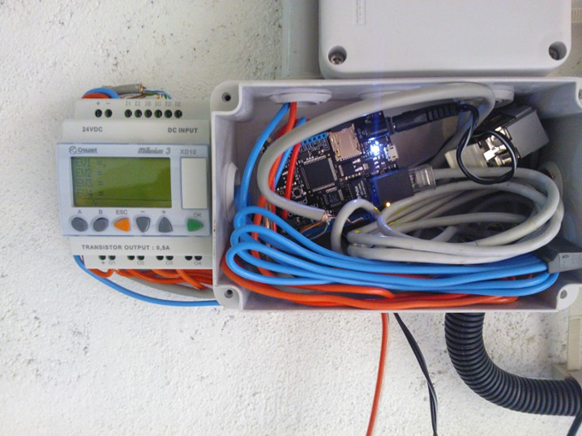
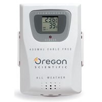

# 2014-11-08 Connect your Arduino, Spark.IO, Netduino (.Net Microframework), Galileo to Microsoft Azure (Part 1)

Internet of Things (IoT) is exploding. Cost of processors and cost of electronic components is falling, electrical consumption is also getting lower and lower for more and more power. It's now more than ever becoming to be super easy to create our own objects with some intelligence. Add to this technologies like Bluetooth Low Energy (BLE), some Wifi or GPRS low cost and low consumption, you can also add some connectivity, between each others and/or with Internet.

 What is the Internet of Things? **_"The network of physical objects that contain embedded technology to communicate and interact with their internal states or the external environment."_**Gartner

 Being connected is nice but does not bring any value if the generate data are not used or if the object don't take any action. For few years, the Cloud infrastructure like Microsoft Azure makes it easy to store and analyze those produced data or make it easy to consume data exposed by those infrastructures. So our objects can publish data in the Cloud as well as consume data that the Cloud host.

 IoT is more complex than most people thing about. And there as lots of questions that must be answered: create a brand new object or just add connectivity to an existing one? How to manage the object remotely? How to deploy new firmware to those new objects? How to secure access to those objects both physically as well as thru their communications and software? How to manage the generated data? How to analyze them? What to analyze? How to send back the data generated to some smartest objects? How to make an object adapt to data generated by others? What kind of hardware? What tools to use to develop on those new platforms?

 And those are just few examples of questions, there are many more that come in an IoT project.

 

 To help answering those questions, we will separate the problem in multiple layers. Even if IoT is a fashion word those days, the full process behind and the way projects are managed is quite old and working for years. We will use the framework above in order to segment the problem. The first part will be related to the devices and objects we have. How to architecture them, why, how to connected them to the next layer which is the storage and cloud. We will then move to the data analytics, try to understand the data and get insights. With this, we will then go back the chain up to the objects themselves.

 In order to make it concrete, I will use a real example: my home and my sprinkler system.

 **What I need:** automate my sprinkler system based on elements like the temperature, the air and soil humidity, the sun light, the wind, the pluviometer.

 **What I already have**: I have my sprinkler system using .NET Microframework (NETMF), you'll find previous article on how it is build in my blog [here](https://blogs.msdn.com/b/laurelle/archive/2012/05/07/managing-my-sprinklers-from-the-cloud.aspx) and [here](https://blogs.msdn.com/b/laurelle/archive/2011/12/07/creating-dynamically-a-web-page-using-net-micro-framework.aspx) for example, you'll find more in the full blog. This is already a big part of the system as it allows me to control manually and in a programmatically way my sprinkler. but it's not fully automated based on external conditions. This sprinkler is based on Netduino Plus board using an ATMEL AT91SAM7X512 processor. NETMF is fully open source and as the name said, it's mini .NET running directly on the metal without any OS. It can be develop with C# using Visual Studio.

 

 I do also have existing Oregon Scientific sensors. My idea is to reuse them for the temperature and air humidity. I will make them communicating with the Internet. We will see how to do it in a next article.

 

 **What I've decided to do**: I've decided to reuse the Oregon Scientific sensors, make them connected to the Internet. For this, I've decided to use [Arduino](https://www.arduino.cc) and [Spark.IO](https://spark.io). Both are based on the cheap ATMEL ATmega328 processor. Both implement the open source [Wiring.org](https://www.wiring.org.co/) framework. This framework is easy to use based on C/C++ and it does make easy to build simple devices. You'll find tons of do it yourself (DIY) projects based on Arduino. I also wanted to show that it is super easy to connect those objects to Microsoft Azure Cloud infrastructure. Keep in mind that a simple ATMEL ATmega328 cost 1€. So it's a very cheap solution. The good news with the [Wiring.org](https://wiring.org) framework is that it can also run on top of an OS like Linux or Windows. As an example, it's the case for the Arduino YÚN or Galileo. Galileo boards can run Linux or Windows and have the Wiring.org layer on top. See [https://dev.windows.com/en-us/featured/Windows-Developer-Program-for-IoT](https://dev.windows.com/en-us/featured/Windows-Developer-Program-for-IoT) for more info as well as the sources [https://github.com/ms-iot](https://github.com/ms-iot) for the Windows version. The Windows version is free to run on those boards.

 Having an OS below those frameworks allow to have more security, capacity to encrypt data, do authentication and more. But at the same time, you are increasing the cost of your solution. We will discuss a bit the security further as it's an important point. But it's like in any project: it has a cost. So up to you to place the cursor where you think it must be. The more security you'll need, the more costly it will be.

 So my final architecture will look like this:

 

 I will have sensors, my Oregon Scientific existing sensors, new ones I will create using the same wireless 433MHHz protocol as the existing Oregon Scientific sensors. A Spark.IO will be decrypting the data and posting them on Microsoft Azure using the Azure Mobile Services. The data will be stored in a SQL Azure database. I've build a full Azure Website using ASP.NET + MVC + Entity Framework + jquery. And my Sprinkler will connect also to the Azure Mobile Services to consume the data produced and take decision to sprinkler or not.

 I will go step by step to describe the full architecture in the next parts. This was just the intro to explain the full architecture. Stay tune!
