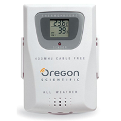
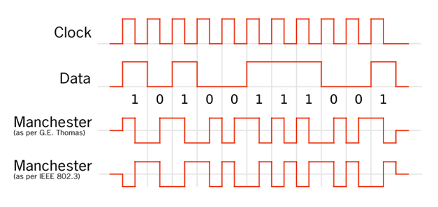
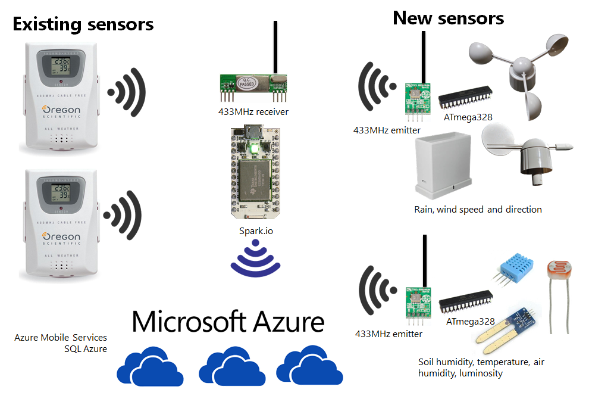
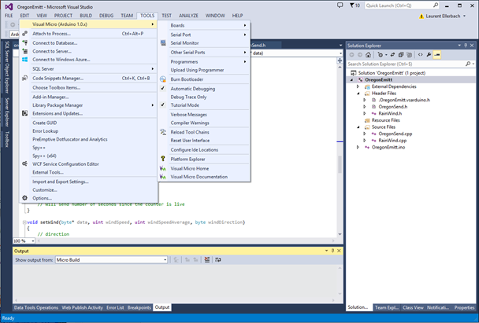
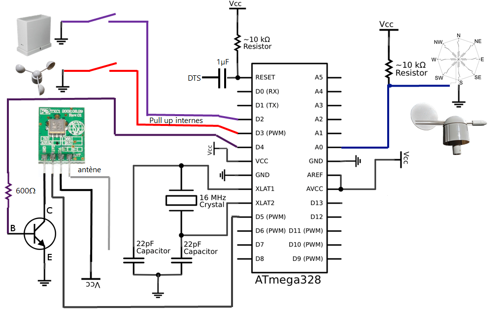
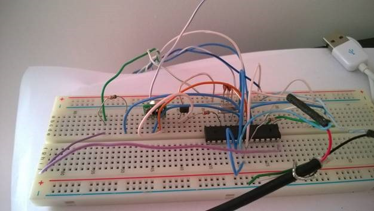
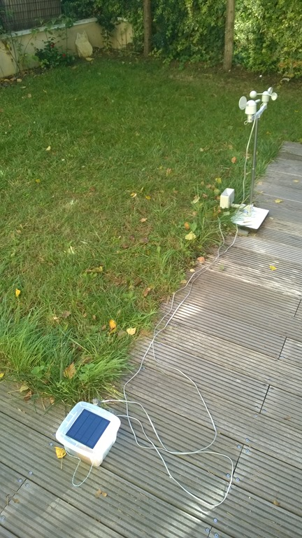
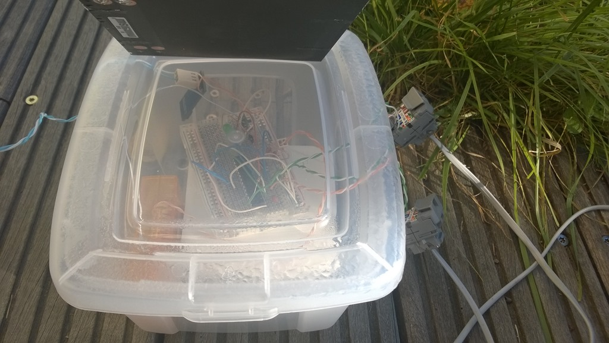
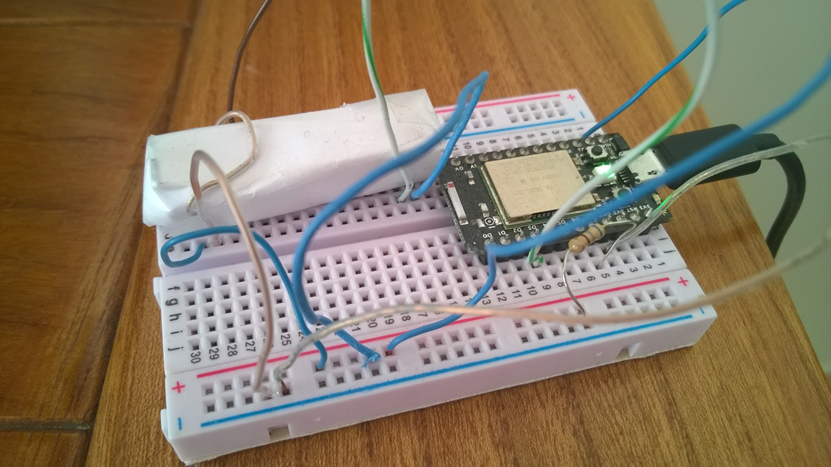

# 2014-11-14 Connect your Arduino, Spark.IO, Netduino (NETMF .Net Microframework), Galileo to Microsoft Azure (Part 2) to create an Internet of Things (IoT)

In the [previous article](./2014-11-08-Connect-your-Arduino,-Spark.IO,-Netduino-(.Net-Microframework),-Galileo-to-Microsoft-Azure-(Part-1).md), I've explained that I'll build an Internet of Things (IoT) infrastructure to pilot automatically with sensors and a Microsoft Azure backend my Sprinkler system at home. I've also explained a bit the [full architecture](../assets/2146.image_8.png). In this post, I will explain how I have connected existing objects and make them communicating with the rest of the world as well as how I've created my own objects.

I have decided to connect the existing Oregon Scientific sensors to the Cloud and Microsoft Azure  In order to do that, without doing any modification on the existing sensors, I had to analyze how they're build and how to be able to interface with them.



Those sensors are using a 433MHz band to communicate wireless to a base which can gather the information. Some are even connectable with a serial port. In my case, I didn't had such a base. So I needed to basically decode the protocol and decrypt it. After a quick search on the internet, I found and excellent article from Olivier Lebrun in French (yes I'm French ) here: [https://connectingstuff.net/blog/decodage-protocole-oregon-arduino-1/](https://connectingstuff.net/blog/decodage-protocole-oregon-arduino-1/). Olivier is using another article which is this time in English and which you can find here: [https://jeelabs.net/projects/cafe/wiki/Decoding_the_Oregon_Scientific_V2_protocol](https://jeelabs.net/projects/cafe/wiki/Decoding_the_Oregon_Scientific_V2_protocol)

The good news for me is that it's easy and cheap to find a 433MHz demodulator and that the protocol used is simple and non crypted. In order to decode the protocol, I've decided to use an [Arduino](https://www.arduino.cc) based processor. the reason is the very low cost and the fact that the existing code to decode is existing for Arduino. When searching a bit more, I found an Arduino compatible based processor which has an embedded wifi chip: [Spark.IO](https://spark.io). Good news is that it is still cheap and can be connected to the Internet. So with the Spark.IO, I can decode the protocol as well as posting information in Azure cloud.

The wireless protocol use [Manchester encoding](https://en.wikipedia.org/wiki/Manchester_encoding). It's a very common protocol used when doing wireless communications.



Source Wikipedia [https://en.wikipedia.org/wiki/Manchester_encoding](https://en.wikipedia.org/wiki/Manchester_encoding)

When a message is sent, it is transformed using the Manchester encoding and modulated at 433MHz. The graphic explains vey well how the information is sent. So in order to decode the signal, you can do it with the states changes and the timing between 2 changes. All this is very well explained in the 2 articles I4ve pointed.

And as I can decode the protocol, I can also do the opposite and use a transmitter to send a signal. By doing this, I can have my own sensors. I'll post an example of code later.

The architecture I will use for my sensors and to connect them to Internet is a quite common one. It is used for years in alarms for example. Most sensors are only one direction, they use a close wireless protocol and send them information to a smart base. All what the open door detection sensor has to do is send time to time that he is alive and in case the door open send the signal it is open. It does not need to know if his signal has arrived or not and who did listen to him. And most sensors in the world are like that. But the smart base has to know all the sensors and has to monitor them. It has to make sure that they are all alive, or it will raise an alert. It aslo has to make sure that when the open door signal is raised it will also raise an alert. Today the only thing which is really connected to the internet and a another central point in an alarm system is the smart base.

So I'll use the same architecture for my project. Only the Spark.IO is connected to Internet thru its wifi. The other sensors are using the 433MHz wireless protocol to send their information. And they have no idea is it will arrive or not.



So the role of the Spark.IO is crucial. It will have the task to decode the messages send over the air as well as posting the information in Azure.

The sensors I've developed are using ATmega 328 which is the processor used in the basic Arduino. it is very cheap, 1€, consume very low energy as well as possibility to sleep it to even more reduce the energy used. I wanted my sensors to be outside and fully autonomous. So I had to take case of this.

Another great news is the possibility to use Visual Studio with the [Visual Micro](https://www.visualmicro.com/) complement to develop for Arduino. [Visual Studio Community](https://www.visualstudio.com/products/visual-studio-community-vs) Edition is free and have much more feature than the Arduino tools. Writing code is then super easy, it does support all the Ardunio flavor as well as a great debugger.



Here is the example of the wind speed, wind direction and pluviometer. It is quite simple electronic. I bought the anemometer, wind vane and rain gauge sensors [here](https://www.sparkfun.com/products/8942). This was what cost me the most in the all project (70$)!



this is how it does look like as a prototype:



and integrated as a beta version fully autonomous in the garden



inside the transparent box, there is [Li-ion battery](https://www.dx.com/p/ultrafire-brc-18650-3000mah-3-7v-li-ion-rechargeable-batteries-red-2-pcs-160132) (3$), a [Li-ion charger](https://www.dx.com/p/tp4056-1a-li-ion-battery-charging-module-blue-4v-8v-215797) (2$) and a [solar panel](https://www.dx.com/p/miniisw-sw-015-1-5w-polysilicon-solar-panel-black-223292) (6$) on top of what you have in the prototype picture.



The power consumption is quite low, it can run in the dark on the battery for multiple days and few hours of a direct and intense sun is enough to fully recharge the battery.

Here is a part of the code needed for the anemometer. It is quite straight forward:

```c
#define PIN_ANEMOMETER  2     // Digital 2
#define PIN_ALIMRF   5      //Digital 5
// How often we want to calculate wind speed or direction
#define MSECS_CALC_WIND_SPEED 10

volatile int numRevsAnemometer = 0; // Incremented in the interrupt
ulong nextCalcSpeed;                // When we next calc the wind speed
ulong time;                         // Millis() at each start of loop().

// Buffer for Oregon message max size
byte OregonMessageBuffer[12];
byte numByteToSend = 12;
Wind *myWind = new Wind();
unsigned long lastSensorCheck = now();
const unsigned int interval = 5; // every 3 minutes = 3*60 sec

void setup()
{
    pinMode(PIN_ALIMRF, OUTPUT);
    pinMode(PIN_ANEMOMETER, INPUT);
    // set internal pull up
    digitalWrite(PIN_ANEMOMETER, HIGH);
    //set interuption
    attachInterrupt(0, countAnemometer, FALLING);
    nextCalcSpeed = now() + MSECS_CALC_WIND_SPEED;
    //other initis
}

void setWinMessage(){
    // Create the Oregon message for an Anemometer (WTGR800)
    byte ID[] = { 0x1A, 0x99 };
    setType(OregonMessageBuffer, ID);
    setChannel(OregonMessageBuffer, 0x20);
    setId(OregonMessageBuffer, 0x12);
    setBatteryLevel(OregonMessageBuffer, 1); // 0 : low, 1 : high
    setWind(OregonMessageBuffer, myWind->getInstantSpeed(), myWind->getAverageSpeed(), myWind->getDirection());
    byte numByteToSend = 10;
    csWind(OregonMessageBuffer);
    Serial.print("inst speed: ");
    Serial.print(myWind->getInstantSpeed());
    Serial.print(" aver speed: ");
    Serial.print(myWind->getAverageSpeed());
    Serial.print(" dir :");
    Serial.println(strVals[myWind->getDirection()]);
}

void sendMessage()
{
    // Show the Oregon Message
    digitalWrite(PIN_ALIMRF, HIGH);
    // wait 1 second that RF switch on
    delay(1000);
    for (byte i = 0; i < numByteToSend; ++i)
    {
        Serial.print(OregonMessageBuffer[i] >> 4, HEX);
        Serial.print(OregonMessageBuffer[i] & 0x0F, HEX);
    }
    // Send the Message over RF
    sendOregon(OregonMessageBuffer, numByteToSend);
    // Send a "pause"
    SEND_LOW();
    delayMicroseconds(TWOTIME * 8);
    // Send a copie of the first message. The v2.1 protocol send the
    // message two time 
    sendOregon(OregonMessageBuffer, numByteToSend);
    // Wait for 30 seconds before send a new message 
    SEND_LOW();
    digitalWrite(PIN_ALIMRF, LOW);
}

void loop()
{
    time = now();
    if (time >= nextCalcSpeed) {
        calcWindSpeed();
        setWinMessage();
        sendMessage();
        nextCalcSpeed = time + MSECS_CALC_WIND_SPEED;
    }
    // other treatment and other time related check
}

void countAnemometer() {
    numRevsAnemometer++;
}
```

And there are also functions used to send the message. Here, idea is to build few macros and then use them to send the low or high message:

```c
#define TX_PIN       4      //Digital 4
const unsigned long TIME = 512;
const unsigned long TWOTIME = TIME * 2;
#define SEND_HIGH() digitalWrite(TX_PIN, HIGH)
#define SEND_LOW() digitalWrite(TX_PIN, LOW)

inline void sendZero(void)
{
    SEND_HIGH();
    delayMicroseconds(TIME);
    SEND_LOW();
    delayMicroseconds(TWOTIME);
    SEND_HIGH();
    delayMicroseconds(TIME);
}
inline void sendOne(void)
{
    SEND_LOW();
    delayMicroseconds(TIME);
    SEND_HIGH();
    delayMicroseconds(TWOTIME);
    SEND_LOW();
    delayMicroseconds(TIME);
}
inline void sendQuarterMSB(const byte data)
{
    (bitRead(data, 4)) ? sendOne() : sendZero();
    (bitRead(data, 5)) ? sendOne() : sendZero();
    (bitRead(data, 6)) ? sendOne() : sendZero();
    (bitRead(data, 7)) ? sendOne() : sendZero();
}
inline void sendQuarterLSB(const byte data)
{
    (bitRead(data, 0)) ? sendOne() : sendZero();
    (bitRead(data, 1)) ? sendOne() : sendZero();
    (bitRead(data, 2)) ? sendOne() : sendZero();
    (bitRead(data, 3)) ? sendOne() : sendZero();
}
```

It is quite straight forward to then send an information thru the 433MHz emitter. It's just then about sending the bits one by one.

I'm using a Spark.IO for the decoding part. The Spark.IO can be programmed over the air (OTA) and you need to use the development tools in a browser provided by the Spark.IO. The tools are ok to use, clearly much more limited than Visual Studio. It is still possible to use Visual Studio as for the Arduino but then you'll need to be plugged in to program the chip. What I4m doing is I'm using Visual Studio for the code, the syntax and then copy/paste my code into the online editor to program the chip.

It comes also with what they call a cloud. In reality, it's just a server which provide access to information you can publish. But it is very limited and can't be control in a smart way. So I will use Microsoft Azure instead. And I will explain it in the next part.

Now on the Spark.IO, the way the decoding is working is this way:

* First disconnect Spark.IO from it's own server. If you don't do it, you will never be able to decode correctly anything, the servers are taking lots of resources and interrupt the processes not in a needed time. So use Spark.disconnect(); in the main void setup() function. I am allowing e to reconnect it to make my life easier when I want to reprogram it over the air by using one of the entry. When I change the state of the entry, the server is reconnected so I can reprogram it over the air  
* A length is calculated between 2 state changes on the 433MHz receptor  
* if this length is between 200 and 700 milliseconds, then it's a short, if it's between 700 and 1200 it's a long. Others are not valid and reinit the decoder
* As soon as the impulsions are still valid:  

  * The Manchester decoding is done for every new impulsion
  * The message is decoded on the flight
  * When the synchro is found (32 impulsions of 1 so 0xFF 0xFF received after the first 32 impulsions has been decoded), the sensor type is checked and what kind of data are expected.
  * if at some point data are not valid the decoder is reinitialyzed  

* When all the message is decoded, it is stored and it's ready for the next one to be decoded  
    This decoding part is well documented in the 2 articles I was referring before.

This is how look like the Spark.IO with the receptor. The 433MHz demodulator is under the paper. In fact it's a layer of paper plus few layers of aluminum and a layer of paper so like an aluminum sandwich. And the aluminum is then put to the ground. This simple method allow to isolate a bit the very cheap receptor I bought and increase drastically the decoding performances 



There is a key question that can be raised here: the security one. In fact the data that are send by the sensors are not crypted and they are not secured. The initial temperature and humidity sensors are not protected. This is for a cost/sensibility reason. Those are not considered as sensitive. Of course, if you have to deal with sensitive data and send them with those kind of short range wireless protocols, do crypt them. This will increase of course the cost of your solution. But it's the price to pay for security. And some of my neighbor is using also Oregon Scientific sensors and I can decode them and have access to them.

So that's it for this article. It did cover the sensor part, how to make existing sensor connected, how to create your own sensor, what kind of architecture to use and how to build a simple solution to decode everything. We will see next time how to post the data on Azure.
