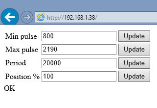
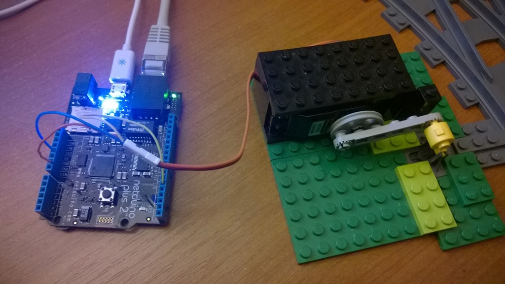

# 2015-01-09 Servo motor tester in NETMF (.NET Micro Framework) with Netduino

I rencently bought new servo motor as I needed some to pilot new switches in [my Lego train](./2012-04-26-Using-netduino-and-.NET-Microframework-to-pilot-any-Lego-Power-Function-thru-Infrared-(part-3).md). The problem is I didn't found the same as the previous one. Another problem is that I needed to replace one which didn't worked properly.

And here came the main issue: find the boundaries of those servo motors. There are databases online but my servo was not existing (or I didn't found it). My new servo is a Motorcraft MC-410 sold by Connard. So I had to found the boundaries myself. Rather than testing fully blind, I've decided to make it in a flexible way. I have a Netduino Plus 2 available for my dev. I also developed a light [WebServer](./2013-04-07-.NET-Microframework-(NETMF)-Web-Server-source-code-available.md). So why not build a simple webpage where I'll be able to change the key settings of the servo and see the impact for real.

In order to pilot correctly  servo motors, we need to use PWM. It's quite straight forward to use for servo motors. It's about having a period and a duration. This duration is from a minimum pulse to a maximum pulse. this will make move the servo motor from its base angle to its maximum angle.

Usually servo are using a 20000 period and then the minimum pulse vary a lot around 800 microseconds and the maximum one around 2000, sometimes more. But it's get quite complicated to find the right numbers especially because most of the time, the makers are not providing them as they are usually calibrated with a bit of analogic.

I build a solution where I have a simple web page and I can change the settings of the servo motor and test them right away. The web page is super simple:



The way it's working is quite simple, I start with some default settings, put the position at 50% and then try to change the min pulse to 700, then put 0 in the Position and see if it's moving. If it's moving, then the boundary is lower, if not, the boundary is higher. and the other way for the higher boundary. The period is usually 20K but some may be lower or higher. This allow also to test up to which value the servo still operate.

And as a bonus, when the lower and higher boundaries are found, it does allow to measure the full angle the servo can give. In my case, close to 200° which does correspond to the spec.

On the hardware side, it's super simple, I'm using the pin D5 for the pilot cable to the servo, it's a PWM on the Netduino. And then I use 5V and ground for the two other pins. The middle one in most servo is the +5V, the brown/black is the ground, the other one (can be yellow, white, orange, etc) is then the pilot one.

Here is how it does looks like on my Lego test switch.



In terms of software, I'm using my micro Web Server which I've developed. I'm using it because it's light and I don't need anything complicated. You can find [the source code here](./2013-04-07-.NET-Microframework-(NETMF)-Web-Server-source-code-available.md) and more explanation [here](./2012-05-29-Creating-an-efficient-HTTP-Web-Server-for-.NET-Microframework-(NETMF).md).

The full code source is here:

```csharp
using System;
using System.Net;
using System.Net.Sockets;
using System.Threading;
using Microsoft.SPOT;
using Microsoft.SPOT.Hardware;
using SecretLabs.NETMF.Hardware;
using SecretLabs.NETMF.Hardware.Netduino;
using NetduinoLibrary.Toolbox;

namespace Servo_test
{
public class Program
{
    static private SecretLabs.NETMF.Hardware.PWM pwm = new SecretLabs.NETMF.Hardware.PWM(Pins.GPIO_PIN_D5);
    private static WebServer server;
    //string constant
    private const string strOK = "OK";
    private const string strProblem = "Problem";
    private const string pageReq = "req.aspx";
    private const string paramMinPulse = "mi";
    private const string paramMaxPulse = "ma";
    private const string paramPeriod = "pe";
    private const string paramPosition = "po";
    //servo info
    static private uint MinPulse = 800;
    static private uint MaxPulse = 2200;
    static private uint Period = 20000;
    static private uint Position = 0;

    public static void Main()
    {
        server = new WebServer(80, 10000);
        server.CommandReceived += new WebServer.GetRequestHandler(ProcessClientGetRequest);
        server.Start();
        Thread.Sleep(Timeout.Infinite);
    }

    private static bool DecryptRequest(string strDecrypt)
    {
        // decode params
        WebServer.Param[] Params = WebServer.decryptParam(strDecrypt);
        int mMin = -1;
        int mMax = -1;
        int mPeriod = -1;
        int mPosition = -1;
        bool isvalid = true;
        if (Params != null)
        {
        for (int i = 0; i < Params.Length; i++)
        {
            //on cherche le paramètre strMonth
            int j = Params[i].Name.ToLower().IndexOf(paramMinPulse);
            if (j == 0)
            {
                mMin = Convert.ToInt32(Params[i].Value);
                if (mMin<0)
                    isvalid = false;
            }
            j = Params[i].Name.ToLower().IndexOf(paramMaxPulse);
            if (j == 0)
            {
                mMax = Convert.ToInt32(Params[i].Value);
                if (mMax<0)
                    isvalid = false;
            }
            j = Params[i].Name.ToLower().IndexOf(paramPeriod);
            if (j == 0)
            {
                mPeriod = Convert.ToInt32(Params[i].Value);
                if (mPeriod<0)
                    isvalid = false;
            }
            j = Params[i].Name.ToLower().IndexOf(paramPosition);
            if (j == 0)
            {
                mPosition = Convert.ToInt32(Params[i].Value);
                if (mPosition<0)
                    mPosition = 0;
                if (mPosition > 100)
                    mPosition = 100;
            }   
        }
        }
        // check if all params are correct
        if (isvalid)
        {
            if (!Microsoft.SPOT.Hardware.SystemInfo.IsEmulator)
            { 
                if(mMin > 0)
                {
                    MinPulse = (uint)mMin;
                }
                if (mMax > 0)
                {
                    MaxPulse = (uint)mMax;
                }
                if(mPeriod>0)
                {
                    Period = (uint)mPeriod;
                }
                if(mPosition>=0)
                {
                    Position = (uint)mPosition;
                }
                uint duration = (uint)(MinPulse + (MaxPulse - MinPulse)/100.0f*Position);                 
                //pwm.SetDutyCycle(duration);
                pwm.SetPulse(Period, duration);
            }  
            else
                Debug.Print("MinPulse " + mMin.ToString() + " MaxPulse " + mMax.ToString() + " Period " + mPeriod.ToString() + " Position " + mPosition.ToString());
        }
        else
            isvalid = false;
        return isvalid;
    }

    private static void ProcessRequest(Socket response, string rawURL)
    {
        string strResp = "";
        if (DecryptRequest(rawURL))
            strResp = strOK;
        else
            strResp = strProblem;
        WebServer.OutPutStream(response, strResp);
    }

    private static void ProcessClientGetRequest(object obj, WebServer.WebServerEventArgs e)
    {
        Socket response = e.response;
        string strResp = "";
        string strFilePath = e.rawURL;
        //HTP header
        strResp = "HTTP/1.1 200 OK\r\nContent-Type: text/html; charset=utf-8\r\nCache-Control: no-cache\r\nConnection: close\r\n\r\n";
        strResp = WebServer.OutPutStream(response, strResp);
        if (strFilePath.Length >= pageReq.Length)
        {
            if (strFilePath.Substring(0, pageReq.Length).ToLower() == pageReq)
            {
                ProcessRequest(response, strFilePath);
                return;
            }
        }
        strResp += "<!DOCTYPE html PUBLIC \"-//W3C//DTD XHTML 1.0 Transitional//EN\" \"http://www.w3.org/TR/xhtml1/DTD/xhtml1-transitional.dtd\">";
        strResp += "<html xmlns=\"http://www.w3.org/1999/xhtml\"><head><title>Servo Motor Discover</title>";
        strResp += "<meta http-equiv=\"Content-Type\" content=\"text/html; charset=utf-8\"/></head><body>";
        strResp += "<meta http-equiv=\"Cache-control\" content=\"no-cache\"/>";
        //create the script part
        strResp += "<script language=\"JavaScript\">var xhr = new XMLHttpRequest();function btnclicked(boxMSG, cmdSend) {";
        strResp += "document.getElementById('status').innerHTML=\"waiting\";";
        strResp += "xhr.open('GET', cmdSend + boxMSG.value);";
        strResp += "xhr.send(null); xhr.onreadystatechange = function() {if (xhr.readyState == 4) {document.getElementById('status').innerHTML=xhr.responseText;}};}";
        strResp += "</script>";
        strResp = WebServer.OutPutStream(response, strResp);
        //body
        strResp += "</head><body><table >";
        strResp += "<tr><td>Min pulse</td><td><input id=\"MinPulse\" type=\"text\" value=\""+MinPulse.ToString()+"\" /></td><td><input id=\"MinPulseBtn\" type=\"button\" value=\"Update\" onclick=\"btnclicked(document.getElementById ('MinPulse'),'req.aspx?mi=')\"  /></td></tr>";
        strResp += "<tr><td>Max pulse</td><td><input id=\"MaxPulse\" type=\"text\" value=\""+MaxPulse.ToString()+"\" /></td><td><input id=\"MaxPulseBtn\" type=\"button\" value=\"Update\" onclick=\"btnclicked(document.getElementById('MaxPulse'),'req.aspx?ma=')\" /></td></tr>";
        strResp += "<tr><td>Period</td><td><input id=\"Period\" type=\"text\" value=\"" + Period.ToString() + "\" /></td><td><input id=\"PeriodBtn\" type=\"button\" value=\"Update\" onclick=\"btnclicked(document.getElementById('Period'),'req.aspx?pe=')\" /></td></tr>";
        strResp += "<tr><td>Position %</td><td><input id=\"Position\" type=\"text\" value=\"" + Position.ToString() + "\" /></td><td><input id=\"PositionBtn\" type=\"button\" value=\"Update\" onclick=\"btnclicked(document.getElementById('Position'),'req.aspx?po=')\" /></td></tr>";
        strResp += "</table><div id=\"status\"></div></body></html>";
        strResp = WebServer.OutPutStream(response, strResp);
        }
    }
}
```

The Main function just create the Web Server.

ProcessClientGetRequest received all the Get requests from the Web Server. I do analyze the path. If the called page is "req.aspx" I do then call a sub function which will change the servo motor settings. If not, then the main page.

Let start with the main page source code, I'm using background http requests to change the servo settings. This avoid reloading the page and make it light in terms of discussions with the board, only a light header is sent with a simple status. This is a very simple a typical script that all web dev knows.

```javascript
<script language="JavaScript">
var xhr = new XMLHttpRequest();
function btnclicked(boxMSG, cmdSend) { 
    document.getElementById('status').innerHTML="waiting";
    xhr.open('GET', cmdSend + boxMSG.value);
    xhr.send(null); 
    xhr.onreadystatechange = function() {
        if (xhr.readyState == 4) { 
    document.getElementById('status').innerHTML=xhr.responseText;}};}
</script>
```

Then it's a simple tables which does contains the various settings and a button which does call the req.aspx page to update the settings.

```html
<tr><td>Min pulse</td>
<td><input id="MinPulse" type="text" value="800" /></td>
<td><input id="MinPulseBtn" type="button" value="Update" 
onclick="btnclicked(document.getElementById('MinPulse'),'req.aspx?mi=')" />
</td></tr>
```

I pass the object so in the code I can read the value. I can do it also in the call but this allow to do other modification if needed from the script. At the end, there is status div to pub the status sent back by the req.aspx page.

The code to build the page has nothing complicated. The code of the page is build dynamically with predefined values for the text box.

The function DecryptRequest decrypt the request and the settings. It's rest API based with parameters in the URL. I would even be able to build a Windows Phone, Windows 8, Android or iOS App if I want  Well, let say this test page is enough for me 

In the function, after analyzing the parameters and validating few of them, in a very basic, it's time to change the settings of the servo. The pulse is then calculated and the order to make the PWM work sent with the period.

```csharp
uint duration = (uint)(MinPulse + (MaxPulse - MinPulse)/100.0f*Position);
pwm.SetPulse(Period, duration);
```

So all up, it's a good reuse of my Web Server code. And good use of basic javascript in a page. It's already something I've [used in various projects](./2012-06-20-Using-XMLHttpRequest-to-pilot-a-Lego-train-dynamically-in-HTML-5.md) and it's really saving some time. So all up, it took me 5 minutes to find the right settings of the servo and will save me time in the future.
