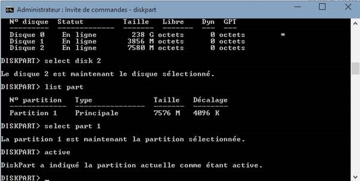

# 2015-02-26 Internet of Things: installing Mono/Linux and Windows Embedded on a BeagleBone Black board (BBB)

The [BeagleBone Black](https://beagleboard.org/black), also called Beagle Bone Black or BBB is an interesting board. It's an AM335x 1GHz ARM Cortex-A8 with 512M of DDR3, 4GB of flash and does have an HDMI, USB client and host interface. But what I prefer are the 2 times 46 pins to have tons of IO available. It does reduce a bit the number if you are using HDMI. But still, it's an interesting board. On the not as good aspect the analogic entries are only 1.8V max and not protected (so you need to add a 1.8V Zener diode to protect all analogic entries.


The board does natively run Linux on it on the embedded Flash. And you can flash it with another Linux or even Windows Embedded see [here](https://beaglebonebsp.codeplex.com/).

I'm a C# guy (ok, sometimes I do some C++ too) so I like anything running C#. And I always try to find a way to develop using C# on any board. Sometimes it's possible like for the RaspberyPi first version, see my blog post [here](./2013-06-21-.NET-Microframework-on-RaspberryPi-(Part-1).md). C" with either the full Microsoft .Net framework or the open source Mono one is a great way to be super productive in terms of development. Even in the embedded world if you don't need hard code real time. And in the case you need some, then switch to C++ and create your own dll which you'll be able to use later with C# for the rest.

In this article, I'll explain how to install a new Linux compatible to install Mono as well as a Windows Embedded image.

## The Linux way

I'm not a Linux guy and I have to admit, I had to spend quite a lot of time for this step. I realized not all SD cards were compatible and I had no real way to check this on Linux before really booting on the SD. So make sure you have recent SD card and looks like it will work fine.

### Step 1: find a version that is BBB compatible

After researches using Bing, I found a link explaining almost everything. The project was about developing using Mono including classes to access the GPIO. You'll find the full site [here](https://www.ofitselfso.com/Beagle/InstallingArmhfKernelBeagleboneBlack.php). So I learned I need to install on the board an armhf version of Linux. The one present is just arm and Mono does not work on it.

So after spending time figuring out that some of my SD card were not compatible while booting but compatible for flashing under Linux, I've finally found one recent compatible one. And to make sure the image was correct, I went for the Windows way of flashing. So I've downloaded an img file from [here](https://elinux.org/BeagleBoardUbuntu). The [BB-ubuntu-14.04.2-console-armhf-2015-02_19-2gb.img.xz](https://rcn-ee.net/rootfs/2015-02-19/microsd/bb-ubuntu-14.04.2-console-armhf-2015-02-19-2gb.img.xz) is working perfectly. And as recommended, I used the [Win32DiskImager](https://wiki.ubuntu.com/Win32DiskImager) to flash the image. Other equivalent tools are also working perfectly.

Once flashed, put the SD card into the SD card reader, press the button which is up to the SD card, plug the power and release the button. This will make the BBB boot on the SD card. If none of the blue led is flashing, then you've most likely have the same issue as me with none compatible SD card. Try with another one! If it's blinking, then everything should be all good.

You can easily test but using PuTTY or equivalent to connect to the board using SSH on port 22 with the IP address the board will get. If you don't know or if you are not sure, just plug the board with the USB cable on your PC, use the address 192.168.7.2 to connect.

If everything goes correctly, you'll be able to log with "ubuntu" as username and "temppwd" as the password.


At this point, you can go to the next step. If you don't have this screen, it does mean you've most likely miss something or your SD is not compatible.

### Step 2: installation Mono

As explained in the [RaspberyyPi first version article](./2013-06-21-.NET-Microframework-on-RaspberryPi-(Part-1).md), steps are the same. Conect with PuTTY or equivalent, make sure this time, you're plug to a network cable and have internet access.

```bash
sudo apt-get update
```

The password is the same as for the login so "temppwd". Now, you are downloading all updates, it can take few minutes._

```bash
sudo apt-get install mono-runtime
```

This will get the mono runtime and will allow you to further develop using Visual Studio and C#. Careful as this image is just a console one. If you want to add a desktop, you need to install one. You can for example install Gnome like this:

```bash
sudo apt-get install ubuntu-desktop
```

### Step 3: accessing the GPIO thru C\#

That's where the first project I found is super useful as it's a great, efficient implementation of OutpuPort and other well know classes from .Net Microrfamework (NETMF). You can download it directly from [here](https://www.ofitselfso.com/BBBCSIO/BBBCSIOSource_0101.zip). From this point, you can extract the source and directly use them in your project.

You're now ready to do a C# development using the BBB and some common NETMF classes J For the deployment, either copy your build, or use a network deployment or anything equivalent. I may write as well how to setup the debugger and environment to include a full debugger.

## The Windows Embedded way

### Step 1: prepare an SD Card with Windows Embedded

Download the Windows image from Codeplex [here](https://beaglebonebsp.codeplex.com/). The download contains an example image.

You'll need to prepare your SD card. For this, use diskpart with an admin command prompt:


Then find your SD card, it should be easy to find with the size. Here it's a 8Gb one, so it's the Disk 2. Select it by typing

```bash
Select disk 2
```

You can then list the partitions with "_List part"_ make sure there is just one partition, if it's not the case, you may have done a mistake with your disk. If you are not sure, it's better to exit the tool, format your SD card with Windows the normal way and make sure you just have one partition. Make sure the original partition is formatted in FAT32 or exFAT.

Then select the particition with

```bash
Select part 1
```

Now the partition is selected, you need to make it active. This will allow the boot loader on the board to find the SD card and boot from there. This is done by using the command

```bash
active
```



Exit from diskpart now. Now you need to copy the Windows Embedded files to the bootable SD card you've prepared. Launch the TI SDCard boot utility from the tools directory from the downloaded files. Select the MLO file. It will be copied first on the SDCard, then select the other elements so the EBOOTSD.nb0, the logo.bmp and NK.bin files.


Click proceed, skip the formatting of the SD card (should have been done previously and the partition is now active). One done, you're ready!


Place the SD card in the SD card reader on the board, press the button which is up the SD card reader, plug the power and release the button.

If everything went correctly, you are now running Windows Embedded Compact version on the BeagleBone Black.

You can test by trying to find your board on the network. I'm using Advanced IP Scanner. If you've used the board previously, the IP address your DHCP server will give will be the same.


You can now access the board with Telnet or thru FTP. If you've done everything correctly, then you'll be able to see this from the ftp address:


And from Telnet:


From here, you can now play a bit and try to connect remotely to the device with a tool called "Remote Display Control for Windows CE". You'll find the tool in the tools directory. Just type in the telnet session

```bash
Cerdisp -c
```

And launch the Host version on your desktop. You will see the board and you can now play with it.


### Step 2: installing .NET and using GPIO

OK, for this step, it's a bit more complicated as it does require to rebuild totally a Windows CE image for this board. The platform elements are included in the BeagleBone WEC7 SDK file. Once you've installed the full Windows Embedded Compact 7, you then install the SDK. And you can create a project to include the .NET framework.

I haven't done it yet but I used Windows CE quite a long time ago and there is a lot of fun building your own OS with component. The god news is that Windows EC is free for individuals:

**Individual Non-Commercial Use.** If you are an individual (that is, a natural person, and not an organization, business entity, or unit of government), then you may flash or download the Runtime Image to your device for your own Non-Commercial use.

From full license [here](https://msdn.microsoft.com/en-us/library/dn269455.aspx).

Access to GPIO is then a bit of development as you'll need to build a DLL to be able to do it or see if there is an existing one in the PAL.

If you do an image, please let me know! Enjoy and have fun.
