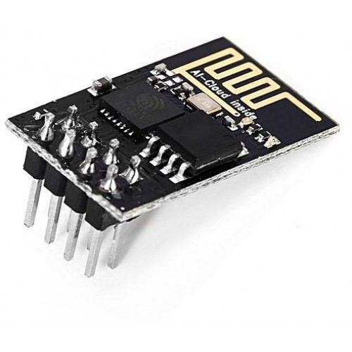

# 2015-06-18 ESP8266 and Posting on Windows Azure using Mobile Services

The [ESP8266](https://nurdspace.nl/File:ESP8266_Specifications_English.pdf) is a nice, cheap wifi board which does include multiple GPIO, SPI, I2C. It is usually integrated in small boards which does contains 2 GPIO + 1 UART for the basic 01 version.

 

 You can find them for few $, usually around 3$. It's a low consumption board which can be powered by a battery and charged with a solar panel without draining the battery too fast when not connected tot eh wifi. So it makes it an interesting element for Internet of Things (IoT).

 As there is an UART, you can as well use it as a super cheap wifi board for Arduino, Netduino and other boards like this. Full documentation for AT commands is [here](https://www.pighixxx.com/test/wp-content/uploads/2014/12/ESP8266Ref.pdf).

 The other great news is that the Arduino community has been working on making a compatible version so you can use the wiring framework to program those boards. You can follow the steps here to install the components in the Arduino IDE. More info [here](https://www.esp8266.com/viewtopic.php?f=26&amp;t=3094).

 And as good news are not coming alone, if like me, you're a use fan of Visual Studio, you can even use the excellent [Visual Micro](https://www.visualmicro.com/) complement to program it. And more info on Visual Micro and ESP8266 support [here](https://www.visualmicro.com/page/esp8266.aspx).

 The most complicated part with this board is that it is only 3.3V, so be careful when alimenting it. I did a mistake and used 5V for couple of hours, the module is still alive but made the board reboot any time I wanted to drive a bit of current out of a GPIO. And that's how when controlling I figured it out! To flash the board, you must put the GPIO0 to ground and reset the board. The UART is 5V tolerant so if you have an FTDI cable or equivalent which you can use to upload the code, make sure you will use only the Ground, RX and TX from the FTDI. Alimentation have to be 3.3V for the board. And once flashed, don't forget to remove the GPIO0 from the ground.

 And as I explained in this [previous post](./2014-11-30-Connect-Arduino,-Spark.IO,-Netduino-(NETMF-.Net-Microframework),-to-Microsoft-Azure-Mobile-Services,-create-IoT-(Part-3).md) with the Spark.io (renamed Particle.io), you can then directly post to Azure Mobile Services with this 3$ chip! I'm planning to use it to measure temperature and humidity plus level of water from my cellar (I have to manually empty a bucket of water from my cooling system). And this 3$ chip plus 1 DHT11/22 plus a water level sensor (using the digital output only as no analog input) will be perfect! And I'll still need to see if I can use the UART as something else.

 Enjoy :-)
