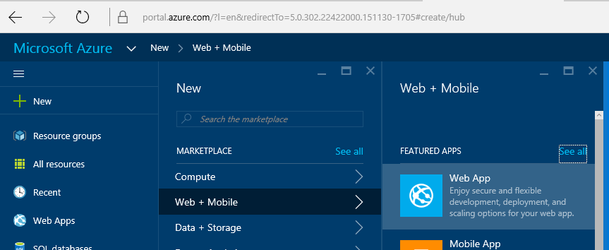

# 2015-12-01 How to deploy a node.js site into Azure Web App to create a Website

There is quite a good documentation on the Azure website on how to deploy an Azure WebApp when using node.js and Git repository from a Mac. Documentation is [here](https://azure.microsoft.com/en-us/documentation/articles/web-sites-nodejs-develop-deploy-mac/).

I wanted to deploy the code thru FTP and deploy selected part of my project. My idea is to deploy the Device Explorer site I've build in my [previous post](./2015-11-24-Creating-an-Azure-IoT-Device-Explorer-in-node.js,-express-and-jade.md). So for the rest of the article, I will assume you've already created a node.js website using either the simple http listener, either an express, jade template like in my example.

## Step 1: create an Azure WebApp

I'll assume you already have an Azure subscription. If you don't, [just open a trial account](https://azure.microsoft.com/en-us/pricing/free-trial/), it's quite fast and easy. You'll need your credit card but it won't be used. It's just in case you'll go over the free costs. And in my example, as I don't need this website to be all the time online and I will only use it sporadically, I'll use free hosting.

In the [Azure portal](https://portal.azure.com), select _New_, then _Web + Mobile_, then _Web App_



Then create the site, the App Service Name is the name of your site.


Allow couple of minutes for it to be created.

## Step 2: allow FTP uploads in the WebApp

Now, you need to allow FTP deployment.

In the portal, select your newly created site, go into _All Settings_then _deployment credentials_, add a username and a password.


Once done, you'll get this in the summary view. The blue boxes include information to connect to the ftp deployment with the user name to use.


Now, you can check that you have access using any FTP tool like the Explorer in Windows or anything else.

## Step 3: creating the web.config file

Now, we have to go into the project and add a web.config file. This is necessary to be able to have the node.js project running correctly.

Right click on your project, select _Add_then _New Item_


Just write web.config and click on OK


Then place this XML code into the web.config file:

```xml
<?xml version="1.0" encoding="utf-8"?>
<configuration>
    <system.webServer> 
        <handlers>
            <add name="iisnode" path="app.js" verb="*" modules="iisnode"/>
        </handlers>
        <rewrite>
            <rules>
                <rule name="DynamicContent">
                    <match url="/*" />
                    <action type="Rewrite" url="app.js"/>
                </rule>
            </rules>
        </rewrite>
    </system.webServer>
</configuration>
```

Important part is on the `<handlers>` as it tells Azure Web App that it's a node.js app and need to use the node engine. The path="app.js" tells which js file to use as startup.

The other important part is the `<rewrite>` section as it will make sure the app.js page will be called as default page. If you don't do that, you'll have to access your site like [http://mysite.net/app.js](http://mysite.net/app.js) and you just want to access it like [http://mysite.net/](http://mysite.net/)

## Step 4: deploying the files to the Web App

To deploy, I'm simply using the Windows Explorer as an FTP client. For copying files, it's just working perfectly. Connect to the FTP host, you'll be ask for login and password, that's the one you've created at step 2.


Once connected, you can go to the /site/wwroot directory for example. but it can be any directory, you'll just need to set it up in the Web App properties. In order to make it simple and as it's the default directly, I'll use this one.

Now, very important, copy all the files and directories that do contains the code you've produced. Make sure you deploy the newly created web.config, your package.json. **Do not deploy**the node_modules directory.

Once compiled with Visual Studio, if you're creating your site using TypeScript, it will create the js file. You don't need to deploy the ts file, you just need the JavaScript generated js files.


## Step 5: making sure all node modules are installed

Now you've copy all the right files, you can make sure the node.js packages are deployed. In theory, when you'll run for the first time your app, packages will be downloaded and installed. It is better to do it manually by connecting to the Kudu console.

So connect to [https://**nameofsite**.scm.azurewebsites.net](https://nameofsite.scm.azurewebsites.net) where nameofsite is the name of the site you've created, use the login and password you've created.

Navigate to your main directory, select _Debug console_and _CMD_


In the console type "_npm install_", this will install al your packages.

This will create the node_modules directory and deploy all the packages in it:


## Step 6: you're good to go

Now you can connect to your web site and test it! It will just work 

And big thanks to [Julien Corioliand](https://www.juliencorioland.net/) for his help.
