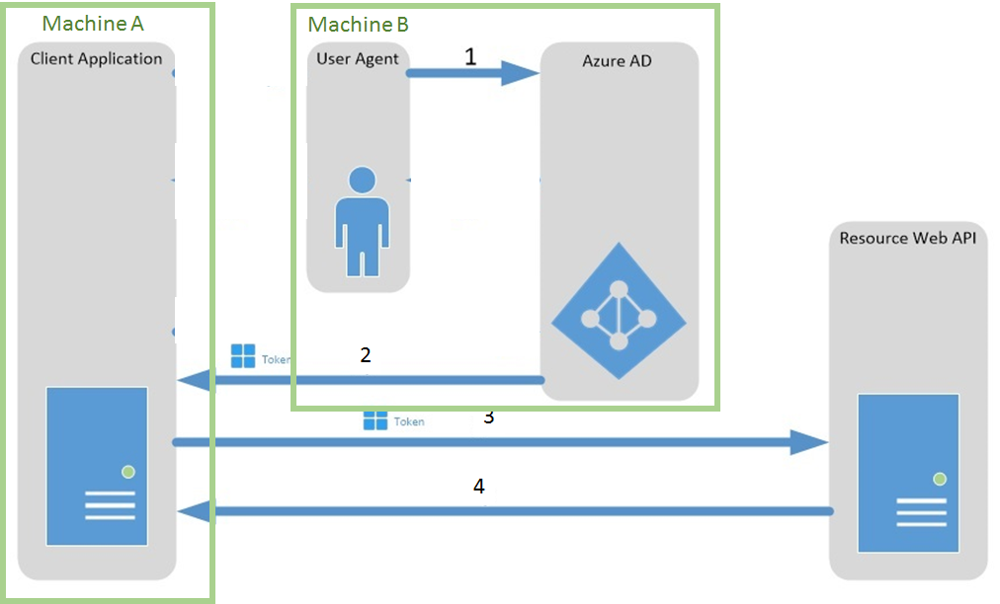
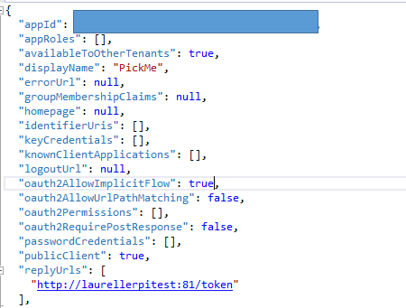
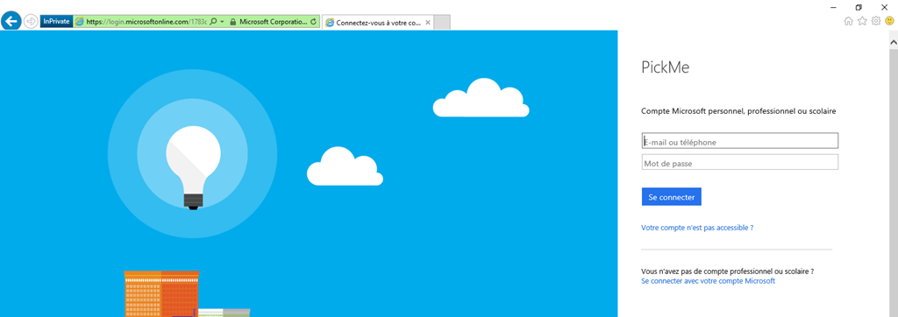

# 2016-02-12 How to use Microsoft Graph and Office 365 API in a Service or in a Windows App/UWP without a graphical interface

Office 365 Graph is just a great way to add Office 365 integration into your application. You'll find many great information in the [Office Dev Center](https://dev.office.com/) to explain more all what is available. I was interested in adding Office 365 integration in a normal Windows .NET Service on my serveur as well as on a RaspberryPi running Windows IoT Core in a Universal Windows Platform (UWP) application. I want to have a user which can automatically receive emails, do action based on those emails, send calendar items.

## The concepts

In both cases, I don't have any user interface. And it's an issue as Microsoft Graph/Office 365 API are fully REST and are using OAuth2. And in this case, the mechanism used for authentication require the user to have a user interface to log into. User and passwords are not stored in the client application but an authorization token is sent to the application. The application then have to use this token for authentication. The token is valid for a certain period and need to be refreshed. You'll find all the documentation on how OAuth 2.0 is working and how it is implemented with Azure Active Directory [here](https://msdn.microsoft.com/en-us/library/azure/dn645542.aspx). The graph below explain the full mechanism:  And this does require the user to enter his credentials on a user interface. When you run a service you just can't on the service itself. From here, there are 2 ways to solve this issue:  

* Provide your application a special access that will give full right to the entire directory, Office 365 information with some granularity. Granularity is Read, or Read/Write, for mail, calendar…
* Do the authentication somewhere else and provide the token to the application. This allow much more granularity vs the previous solution and allow to have a normal user with normal privileges connected.  I do not want to go for the first solution because I just want to have one user and just the minimum rights. So I've decided to go for the second solution. So far I haven't found another place where it is document. So my basic idea is to use the following authentication mechanism:  Basic idea is to have the user authentication on 1 machine and then pass the authorization token to the other machine. Se let see the solution I used. For the following steps, I'll use Microsoft Graph but the process is similar if you're using Office 365 API or any other API using Azure Active Directory with OAuth 2.0.

## Preparing Office 365 tenant and Azure Active Directory

As very well describe in the documentation, you need:  
2. Prepare your Azure Active Directory tenant. Follow the steps [here](https://msdn.microsoft.com/en-us/office/office365/howto/add-common-consent-manually). You will need an Office 365 business account, the rights to add an app into the Azure portal
4. When following the steps add a "Native client application"
6. When specifying the App permission, add Microsoft Graph and select what you need
8. You'll need to add return URIs. Those are the address that are allow to be redirected on to pass the token/codes after authentication. In the example, I'll use a Raspberry in a UWP. Name will be "laurellerpitest" and will return on port 81 on page token. So [http://laurellerpitest:81/token](http://laurellerpitest:81/token)
10. Then download the Manifest, save it and open it with Visual Studio for example 
12. Change "oauth2AllowImplicitFlow" to true and save the file 
14. Upload the saved manifest. This specific modification in the manifest will allow this manipulation of doing the authentication on a machine which is not the one which will use the token. It will just allow to pass the token to a different place in a flow. This is needed only in cases like this one where the authentification has to follow a flow from one place to another. If you are doing the authentication on the same machine you'll use the token, this is not needed.  You're now ready and have accomplished all the preparation steps.

## Creating the authorization URL

This is where it starts to be interesting. To get the access token which will authorize your app to access the resources, when you read the documentation, you need a code and then send this code to get the access token. But there is a shortcut to directly get the token. You can use an URL like this to get the access token directly: [https://login.microsoftonline.com/12345678-9abc-def1-234567890abcdef12/oauth2/authorize?response_type=token&redirect_uri=http%3a%2f%2flaurellerpitest:81/token&client_id=01234567-89ab-cdef-1234-567890abcdef&resource=https%3A%2F%2Fgraph.microsoft.com%2F](https://login.microsoftonline.com/12345678-9abc-def1-234567890abcdef12/oauth2/authorize?response_type=token&amp;redirect_uri=http%3a%2f%2flaurellerpitest:81/token&amp;client_id=01234567-89ab-cdef-1234-567890abcdef&amp;resource=https%3A%2F%2Fgraph.microsoft.com%2F) You'll get the first endpoint in your Azure Portal. It's the connection endpoint to Microsoft Graph. So you'll replace this string "12345678-9abc-def1-234567890abcdef12" by your tenant ID. The params:  

* response_type=token: this is where you're asking for the access token. You may ask for other types of token depending on what you need to do later on. You will find more information on supported token type [here](https://azure.microsoft.com/en-us/documentation/articles/active-directory-v2-tokens/). Authentication will happen on a webpage and the token will be returned to the return URI.
* redirect_uri=<http://laurellerpi:81/token> (encoded to be compatible with uri parameters): this is the return URI you've setup into your portal.
* client_id=01234567-89ab-cdef-1234-567890abcdef: this is the unique ID of your app that you'll find as well un the Azure portal.
* resource=<https://graph.microsoft.com/>: request access to Microsoft Graph. Can be as well other services suing the same endpoint for which you gave autorisation  If you click on this link, you'll get an error message on the bottom right of the page:  those error messages are really useful to help you find out if you've done a mistake somewhere. If you've setup everything correctly, you'll be able to arrive on a page like this:  Authentication with user name and password happens on this page. Depending on the rights you've allowed for your app, you may need to have the user agreement to use the app. In this case, it will ask you for your agreement. And finally, you're redirected to the redirect URL. And you'll note that the token is present in the parameter "access_token".  And at this point, there is a "but". And it's quite a bit "but". The parameter is passed following a hash tag (#). This means that the parameter won't be passed to the server! It is a client only parameter like the other passed as well. So let see how to get this param passed to the server.

## Getting the access token

The return URI look like this with a much longer token than the one represented here: [http://laurellerpitest:81/token#access_token=abc.def.ghi-jkl-mno-pqrstuvwxyz&token_type=Bearer&expires_in=3600&session_state=12345678-1234-1234-1234-1234567890ab](http://laurellerpitest:81/token#access_token=abc.def.ghi-jkl-mno-pqrstuvwxyz&amp;token_type=Bearer&amp;expires_in=3600&amp;session_state=12345678-1234-1234-1234-1234567890ab) This token is type of Bearer. More [info on Bearer token in the RFC](https://www.rfc-editor.org/rfc/rfc6750.txt). There are multiple type of token but the one used to get access is the Bearer one. You can get other types by requesting other tokens like to refresh your token but you'll need to have a Bearer on to access the resources. Se at the end of the article, more links and resources to go deeper on this topic. As it is returned only on the client side, we will need a javascript on the page to gather it and return it to the device. So I'll need to implement a very simple web server into my UWP app on my RaspberryPi to get this token back. Here is the full code and I'll explain it right after. Note: I have produced this code during an internal hackathon. It is a very simple, very striaght forward code. It can of course be done in a much more complete way. But it is demonstrating the core part of the process.

```csharp
private readonly HttpServer httpServer; httpServer = newHttpServer(81);
httpServer.StartServer();
public sealed partial class HttpServer : IDisposable
{
  private const uint BufferSize = 8192;
  private int port = 80;
  private readonly StreamSocketListener listener;
  private string token;
  public string Token
  {
    get
    {
      return token;
    }
    internal set
    {
      token = value;
    }
  }

  public HttpServer(int serverPort)
  {
    listener = new StreamSocketListener();
    port = serverPort;
    listener.ConnectionReceived += (s, e) => ProcessRequestAsync(e.Socket);
  }

  publicasyncvoid StartServer()
  {
  #pragmawarningdisable CS4014
    await listener.BindServiceNameAsync(port.ToString());
  #pragmawarningrestore CS4014
  }

  publicvoid StopServer()
  {
    ((IDisposable)this).Dispose();
  }

  publicvoid Dispose()
  {
    listener.Dispose();
  }

privateasyncvoid ProcessRequestAsync(StreamSocket socket)
  {
  awaitTask.Run(async () =>
  {
    try
    {
      // this works for text only
      StringBuilder request = new StringBuilder();
      using (IInputStream input = socket.InputStream)
      {
        byte[] data = newbyte[BufferSize];
        IBuffer buffer = data.AsBuffer();
        uint dataRead = BufferSize;
        while (dataRead == BufferSize)
        {
          await input.ReadAsync(buffer, BufferSize, InputStreamOptions.Partial);
          request.Append(Encoding.UTF8.GetString(data, 0, data.Length));
          dataRead = buffer.Length;
        }
        Debug.WriteLine("Request received: {0}", request.ToString());
      }
      using (IOutputStream output = socket.OutputStream)
      {
        string requestMethod = request.ToString().Split('\n')[0];
        string[] requestParts = requestMethod.Split(' ');
        if (requestParts[0] == "GET")
          await WriteResponseAsync(requestParts[1], output);
        else
          return;
        Debug.WriteLine("Request processed from WebServer");
      }
    }
    catch (Exception e)
    {
      Debug.WriteLine("Exception in Socket: {0}", e.ToString());
    }
    finally
    {
      try
      {
        socket.Dispose();
      }
      catch (Exception e)
      {
        Debug.WriteLine("Exception in cleaning exception Socket: {0}", e.ToString());
      }
    }
  });
  }

private async Task WriteResponseAsync(string request, IOutputStream response)
{
  string pageUtil = "token";
  string strFilePath = request;
  string strResp = "";
  if (strFilePath.Length >= pageUtil.Length)
  {
    if (strFilePath.Substring(1, pageUtil.Length).ToLower() == pageUtil)
    {
      ProcessResponsePage(response, strFilePath);
      return;
    }
  }
  // send blank text
  await OutPutStream(response, strResp);
}

private async void ProcessResponsePage(IOutputStream response, string rawURL)
{
  string strResp = ""; ;
  if (DecryptProcessResponsePage(rawURL))
    strResp = "OK";
  else
    strResp = BuildScript();
  await OutPutStream(response, strResp);
}

private string BuildScript()
{
  string strResp = "";
  strResp += "<!DOCTYPE html PUBLIC \"-//W3C//DTD XHTML 1.0 Transitional//EN\" \"http://www.w3.org/TR/xhtml1/DTD/xhtml1-transitional.dtd\">";
  strResp += "<html xmlns=\"http://www.w3.org/1999/xhtml\"><head><title></title>";
  strResp += "<SCRIPT language=\"JavaScript\">";
  strResp += "if (window.location.href.indexOf(\"#access_token\") > 0)";
  strResp += "{var token = window.location.href.substring(window.location.href.indexOf(\"#access_token=\") + 14);";
  strResp += "token = token.substr(0, token.indexOf(\"&\"));";
  strResp += "var xhr = new XMLHttpRequest(); ";
  strResp += "xhr.open('GET', '/token?access_token=' + token);";
  strResp += "xhr.onreadystatechange = function() {if (xhr.readyState == 4) {boxMSG.innerHTML=xhr.responseText;}}; xhr.send();}";
  strResp += "";
  strResp += "</Script>";
  strResp += "</head><body><span id='boxMSG'></span></body></html>";
  return strResp;
}

private bool DecryptProcessResponsePage(string strDecrypt)
{
  // decode params
  Param[] Params = Param.decryptParam(strDecrypt);
  bool isvalid = false;
  try
  {
    if (Params != null)
    {
      for (int i = 0; i < Params.Length; i++)
      {
        //on cherche le paramètre strMonth
        int j = Params[i].Name.ToLower().IndexOf("access_token");
        if (j == 0)
        {
          token = Params[i].Value;
          isvalid = true;
        }
      }
    }
  }
  catch (Exception)
  {
    isvalid = false;
  }
  return isvalid;
}

private async Task OutPutStream(IOutputStream response, string strResp)
{
  try
  {
    using (Stream resp = response.AsStreamForWrite())
    {
      byte[] bodyArray = Encoding.UTF8.GetBytes(strResp);
      resp.Write(bodyArray, 0, bodyArray.Length);
      //Flush need to be SYNC. If async, then it goes closed before!
      //resp.Flush();
      Debug.WriteLine("OutputStream sent");
    }
  }
  catch (Exception e)
  {
    Debug.WriteLine("Exception in outputstream: {0}", e.ToString());
  }
  return;
  }
}

public sealed class Param
{
  public string Name { get; set; }
  public string Value { get; set; }
  public static char ParamStart { get { return'?'; } }
  public static char ParamEqual { get { return'='; } }
  public static char ParamSeparator { get { return'&'; } }
  public static Param[] decryptParam(string Parameters, char start = '?')
  {
    Param[] retParams = null;
    int i = Parameters.IndexOf(start);
    String strtocut = Parameters;
    if (i >= 0)
      strtocut = Parameters.Substring(i + 1);
    var strcut = strtocut.Split(ParamSeparator);
    if (strcut != null)
    {
      retParams = newParam[strcut.Length];
      for (int inc = 0; inc < strcut.Length; inc++)
      {
        var strgood = strcut[inc].Split(ParamEqual);
        retParams[inc] = newParam();
        if (strgood.Length == 2)
        {
          retParams[inc].Name = strgood[0];
          retParams[inc].Value = strgood[1];
        }
        else
        {
          retParams[inc].Name = "";
          retParams[inc].Value = "";
        }
      }
    }
    else {
      retParams = newParam[1];
      retParams[0].Name = "";
      retParams[1].Value = "";
    }
    return retParams;
  }
}
```

The code shows a very simple implementation of an HTTP server supporting only GET. Whenever a request arrives on the specified port, it is processed by the _ProcessRequestAsync_ function. This function get the headers and body of the request and extract the raw URL. Then it calls the _WriteResponseAsync_ to process the request. The _WriteResponseAsync_ function is just looking at the raw URL from the HTTP request and check if it's "token". If it's token then it calls the function _ProcessResponsePage_. This function then call the _DecryptProcessResponsePage_. The _DecryptProcessResponsePage_ check if there is a param named "access_token" passed in the URL. If yes, then it does extract it and store it and return true. If not, then it returns false. if it's true, the _ProcessResponsePage_ will return OK and if it's false, it will return the_BuildScript _content which create a javascript. This javascript is very simple as well and minimal, here is how it does looks like once on the client:

```javascript
if (window.location.href.indexOf("#access_token") > 0)
{
var token = window.location.href.substring(window.location.href.indexOf("#access_token=") + 14);
token = token.substr(0, token.indexOf("&"));
var xhr = new XMLHttpRequest();
xhr.open('GET', '/token?access_token=' + token);
xhr.onreadystatechange = function () {
if (xhr.readyState == 4) { boxMSG.innerHTML = xhr.responseText; }
};
xhr.send();
}
```

The script is looking for the #access_token string. And then extract it and pass it to the /token page as a parameter. this call is done thru the XMLHttpRequest class. The result is then put into the boxMSG span. If all goes correctly, then you'll see an OK on the page. Here, I'm passing only the access token, not the other elements. But it's very easy to adapt the code to pass the others. Important one is the expiriaton session to be able to renew it on time. I'm not explaining how to renew the token here but it is explained in the [step by step authentication page](https://msdn.microsoft.com/en-us/library/azure/dn645542.aspx).

## Using the Microsoft Graph REST API

Now, it's the very easy part. The REST API is simple and straight forward to use.

```csharp
HttpClient client = new HttpClient();
client.DefaultRequestHeaders.Add("Authorization", "Bearer " + token);
HttpResponseMessage response = await client.GetAsync("https://graph.microsoft.com/v1.0/users/");
string retResp =await response.Content.ReadAsStringAsync();
```

You just need to create an HttpClient, then add the Baerer token in the header and call the Graph API you want. This one will get all the users in the Azure Directory. It is returned as a JSON and then you can play with it.

## Next steps

As next steps, you can extend the code to ask for refreshed access token. This is using what is available with the current app model. The app model v2 is much simpler, requires less steps. Some details in these links with the excellent [KurveJS](https://github.com/MicrosoftDX/kurvejs/blob/master/docs/appModelV2/intro.md) framework from [Mat Velloso](https://twitter.com/matvelloso). You have a good [comparison of both models here](https://azure.microsoft.com/en-us/documentation/articles/active-directory-v2-compare/), the [protocols](https://azure.microsoft.com/en-us/documentation/articles/active-directory-v2-protocols-implicit/) and [scopes](https://azure.microsoft.com/en-us/documentation/articles/active-directory-v2-scopes/). And I want to thanks Mat as well for his help on this project and putting all this together. The all up Microsoft Graph API documentation, including the v1.0 and the beta version, is [available are here](https://graph.microsoft.io/en-us/docs/overview/overview). The API is rich and well get even richer. A good start is [https://graph.microsoft.io/](http://graph.microsoft.io/). And as authentication, authorization and token access are key point to understand, read as well [this article](https://graph.microsoft.io/docs/authorization/converged_auth) on Microsoft Graph endpoints using converged authentication. There's a lot to do and now, you can use it in an embedded device with no UI.
