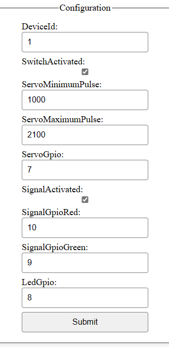

# 2024-01-28 New Lego train experience with nanoFramework: device configuration and discovery

So, for like more than a decade, I've been messing around with my Lego train using the [.NET Microframework](2012-04-07-Using-netduino-and-.NET-Microframework-to-pilot-any-Lego-Power-Function-thru-Infrared-(part-1).md). Then I moved on to trying out [Windows IoT on a Raspberry PI](https://github.com/Ellerbach/LegoTrain/tree/v1.0). But let's face it, those days are kinda ancient now. So, I decided to ditch the boring stuff and spend some chill vacation time creating a whole new vibe.

Picture this: an ASP.NET application doing its thing in a Docker container on a Raspberry PI, with a squad of .NET nanoFramework devices calling the shots for switches, signals, and, of course, the trains being piloted with an infrared .NET nanoFramework board.

Now, in my quest for the ultimate small device, I stumbled upon the cool-kid-on-the-block: the [ESP32-C3 super mini](../assets/esp32-C3-super-mini.png). It's tiny, like 2.5 cm x 1.8 cm. But don't be fooled by its size; it's packing 13 GPIO (11 that actually matter), running on a 32-bit RISC-V at 160MHz, and it can connect to WiFi with its own antenna. Plus, it's a budget-friendly buddy, coming in at less than 3€/$ each. Oh, and the best part? It plays nice with .NET nanoFramework, so we get to roll with C# on this bad boy! Get ready for some serious fun with this pint-sized powerhouse. 🚂💻

## Scavenging the old to make new

Alright, so my ancient train was already rocking a C# setup to handle the [Lego Infrared RC Functions](2012-04-07-Using-netduino-and-.NET-Microframework-to-pilot-any-Lego-Power-Function-thru-Infrared-(part-1).md). Just gave the old code a makeover, shifted it to .NET nanoFramework, and to top it off, made a neat nuget package since the API vibes with .NET IoT. If you're into bossing around [LEGO©️ Power Functions RC](https://github.com/Ellerbach/LegoInfrared) using SPI and a dash of electronic wizardry, it's a piece of cake.

Now, the electronic part hasn't really morphed much. It's all about whipping up a waveform with Master Out Slave In (MOSI) using Serial to Parallel Interface (SPI) for that sweet signal. Simple, speedy, takes a nibble of memory 'cause you gotta build the full signal in there, but trust me, it works like a charm on both a .NET nanoFramework device and a .NET IoT one.

Peep this snapshot of the setup – just crafting a vibe with the 74HC08, or if you're feeling fancy, swap it out for a BC337 or some other transistor du jour. Here's what the modern prototype with all the electronic jazz looks like:


And, of course, a little sneak peek at the OG electronic setup:


Feel free to dive into the tech groove and give it a whirl! 🚀🔧

## A WiFi based architecture

The original setup was cool and all, but handling up to 16 signals, 16 switches, and 1 infrared gadget came with its fair share of headaches. Picture this: tons of electronics, endless cables (some really stretching the limits of patience), all converging at a central hub. And don't even get me started on the signal losses and train-induced interference. Not exactly the smoothest ride, if you catch my drift.

So, time for a shake-up! I put on my thinking cap and cooked up a fresh design. Enter the superhero: a single compact device that plays nice with batteries or just sips on 0 and +5V. No more cable mayhem: just two lines to rule them all. Share those two cables among all your devices, and voilà! No more hardware roadblocks (or limited to the bare minimum), only software ones. The new mantra is simple: add as many devices as your heart desires. Although, I'm playing it safe with just one infrared device: it covers a large area if you position it right.

Behold, the streamlined architecture:


In this perfect setup, everything's grooving through WiFi and chatting it up via a slick REST API. Thanks to .NET nanoFramework's handy [WebServer](https://github.com/nanoframework/nanoFramework.WebServer), crafting top-notch REST APIs and configuration pages is a breeze. It's all about keeping it simple and letting the WiFi do the talking! 🚂💻🌐

## Solving the initial setup challenge

Hold up, tackling these challenges head-on! Imagine you're on the move, changing locations in different expos or people just buy your product, and the last thing you want is to reflash all your boards: no one's got time for that! Well, guess what? We've got you covered!

The ESP32 family comes to the rescue with a nifty feature: the embedded WiFi access point mode. Flip that switch, and your device turns into an access point. Whip out your phone or PC, connect, and bam! You're in the driver's seat. And since we've got that slick WebServer onboard, we can create a sweet settings page where you stash your WiFi credentials. At boot time, a smart mechanism checks if the credentials are good to go. If not, or if there's a hiccup connecting, you can seamlessly switch to this access point mode.


Check out this cool pattern in the [.NET nanoFramework samples](https://github.com/nanoframework/Samples/tree/main/samples/WiFiAP): it's practically plug-and-play. And just for kicks, I've improved it up a bit. Added an embedded LED to blink fast if it's in Access Point mode and do a slow dance if it's happily connected to WiFi. It's not just for looks; it's your visual cue that everything's running smooth. If the LED taps out and stops blinking, well, that's your sign something's up. But fear not, the code's got your back with safety nets to reboot the device if things go south. Smooth sailing all the way! 🌐💡

## Solving the discovery problem

Once your WiFi device is up and running, the next quest is making it a breeze for your main application to sniff out its IP address and figure out what capabilities it brings to the table. Is it the infrared maestro, a switch virtuoso, or a signal, or both? You want your setup to be as smooth as butter, with devices popping up automatically. I've got you covered, and I explained the pattern using UDP broadcast in a previous article: [check it out here](./2024-01-22-solving-device-discovery-and-capabilities.md). his does come without couple of challenges, but that's for later in the article.

Imagine this kind of magic happening:


The lower section shows devices that just arrived into the network: their capabilities, their status, and even links to create specific elements if needed. Take the Infrared device, for instance. It has an ID of 0 (I like conventions), and you might have a bunch of them, but only one gets the spotlight.

Now, let's shine a light on device ID 2. This one's flexing Signal and Switch capabilities. Check out the rest of the page, and you'll see those capabilities, associated up with the physical element. Contrast that with the cool kid, device ID 1, who's flying solo without a signal buddy. No worries, I threw in a `Create Signal` link so you can easily fix that by adding one. Plus, each device has its own link for a quick configuration tweak.

It's all about that seamless discovery and effortless configuration.🕵️‍♂️💻

## Device configuration

We've just dived into the realm of devices flaunting their capabilities, but there's another layer: their individual configurations. To handle this, I've crafted straightforward HTML pages adorned with user-friendly forms. Take a gander at the Signal/Switch configuration page:



And then there's the page for the infrared maestro:


Now, let's unveil a couple of nifty tricks. Firstly, notice the style: it's sleek and phone-friendly, courtesy of a well-crafted style sheet (I hate CSS, so I just ask for help of Copilot). Secondly, and this might not jump out immediately, the magic behind the scenes is that the code rendering these pages and handling submissions is the **exact same**. Yes, you read that right. Clicking that submit button triggers the same code to update settings, irrespective of the vastly different configuration elements.

How does this sorcery work with such diverse configurations, you ask? Enter the wizardry of .NET: reflection. It allows us to dynamically navigate and manipulate objects, adapting seamlessly to the diverse configuration elements. It's like having a programming magic wand: one codebase, endless possibilities. 🧙‍♂️📱💾

The full code of the controller in [charge of it is here](https://github.com/Ellerbach/LegoTrain/blob/main/SharedServices/Controllers/ConfigurationController.cs).

Let's have a look first at the code creating the page:

```csharp
public static IAppConfiguration AppConfiguration { get; set; }

[Route("config")]
public void Config(WebServerEventArgs e)
{
    // We need to clean things to get some memory
    //nanoFramework.Runtime.Native.GC.Run(true);

    // TODO: check the basic authentication
    string route = "<!DOCTYPE html><html><head><title>Configuration</title><link rel=\"stylesheet\" href=\"style.css\"></head><body><fieldset><legend>Configuration</legend><form action=\"/process\" method=\"post\">";
    e.Context.Response.ContentType = "text/html";

    string hiddenBool = "<input type=\"hidden\" name=\"bool\" value=\"";
    var methods = AppConfiguration.GetType().GetMethods();
    foreach (MethodInfo method in methods)
    {
        if (method.Name.StartsWith("get_"))
        {
            string name = method.Name.Substring(4);
            var paramType = method.ReturnType;
            string type;
            switch (paramType.FullName)
            {
                case "System.Int32":
                    type = $"number\" value=\"{method.Invoke(AppConfiguration, null)}";
                    break;
                case "System.Boolean":
                    var ret = method.Invoke(AppConfiguration, null);
                    type = $"checkbox\" {((bool)ret ? $"checked=\"" : string.Empty)}";
                    hiddenBool += $"{name}={ret};";
                    break;
                default:                    
                    if (name.Contains("Password"))
                    {
                        type = $"password\" value=\"{method.Invoke(AppConfiguration, null)}";
                    }
                    else
                    {
                        type = $"input\" value=\"{method.Invoke(AppConfiguration, null)}";
                    }

                    break;
            }

            route += $"<label for=\"{name}\">{name}:</label><input name=\"{name}\" type=\"{type}\"/><br>";
        }
    }

    // We need to clean things to get some memory
    //methods = null;
    //nanoFramework.Runtime.Native.GC.Run(true);

    hiddenBool += hiddenBool.TrimEnd(';') + "\"/>";
    route += hiddenBool;
    route += "<input type=\"submit\" value=\"Submit\"></form></fieldset><br>Device ID should start at 1.</body></html>";
    WebServer.OutPutStream(e.Context.Response, route);
}
```

The enchantment lies within the `AppConfiguration` class, where a bit of inspection reveals all the functions starting with `get_`. In the realm of .NET, a property like `public int MyProperty { get; set; }` spawns two functions: `get_MyProperty` and `set_MyProperty`. Reflection comes into play, allowing us to discern the return type: in this case, an int translates to `System.Int32` as it's full name. While I'm using strings for speed in this code, a more thorough approach would involve `typeof` comparisons in a cascade of `if` statements. My configuration plays it simple, covering only int, bool, and string types. The initial value is effortlessly extracted by invoking the corresponding method.

Now, let's unravel a couple of neat tricks. Thanks to conventions (yes, I'm a fan), any property name containing `Password` gets a sleek password display, while booleans gracefully converts into a checkbox. Peek into the code, and you'll spot a clandestine element tailored for booleans. Why, you ask? Well, when you submit an HTML form, only the checked checkboxes make the journey. If you want to uncheck something, you need to keep tabs on it. Enter the hidden element, ensuring checkboxes are always accounted for.

Now, let's dive into the function that works its magic on the results:

```csharp
[Route("process")]
[Method("POST")]
public void Process(WebServerEventArgs e)
{
    byte[] buff = new byte[e.Context.Request.ContentLength64];
    e.Context.Request.InputStream.Read(buff, 0, buff.Length);
    string paramString = Encoding.UTF8.GetString(buff, 0, buff.Length);

    // We're adding back the question mark as it's not present when posting
    var parameters = WebServer.DecodeParam($"{WebServer.ParamStart}{paramString}");
    // Let's keep track of our bools
    string[] bools = new string[0];
    foreach (UrlParameter param in parameters)
    {
        if (param.Name == "bool")
        {
            bools = HttpUtility.UrlDecode(param.Value).Split(';');
        }
    }

    foreach (string elem in bools)
    {
        var keyVal = elem.Split('=');
        if (keyVal[1].ToLower() == "true")
        {
            bool found = false;
            foreach (UrlParameter param in parameters)
            {
                if (keyVal[0] == param.Name)
                {
                    found = true;
                }
            }

            if (!found)
            {
                var memberPropSetMethod = AppConfiguration.GetType().GetMethod("set_" + keyVal[0]);
                if (memberPropSetMethod != null)
                {
                    memberPropSetMethod.Invoke(AppConfiguration, new object[] { false });
                }
            }
        }
    }

    foreach (UrlParameter param in parameters)
    {
        var memberPropSetMethod = AppConfiguration.GetType().GetMethod("set_" + param.Name);
        if (memberPropSetMethod != null)
        {
            var setter = memberPropSetMethod.GetParameters()[0];
            switch (setter.ParameterType.FullName)
            {
                case "System.Int32":
                    if (int.TryParse(param.Value, out int val))
                    {
                        memberPropSetMethod.Invoke(AppConfiguration, new object[] { val });
                    }
                    break;
                case "System.String":
                    memberPropSetMethod.Invoke(AppConfiguration, new object[] { HttpUtility.UrlDecode(param.Value) });
                    break;
                case "System.Boolean":
                    // The value is only sent when the checkbox is checked!
                    memberPropSetMethod.Invoke(AppConfiguration, new object[] { true });
                    break;
                default:
                    break;
            }
        }
    }

    AppConfiguration.Save();
    string route = $"<!DOCTYPE html><html><head><title>Configuration Page</title><link rel=\"stylesheet\" href=\"style.css\"></head><body>Configuration saved and updated. Return to the <a href=\"http://{Wireless80211.GetCurrentIPAddress()}\">home page</a>.</body></html>";
    WebServer.OutPutStream(e.Context.Response, route);
}
```

Let's be honest, this function steps up the complexity a notch, and the main culprit is none other than the quest for gracefully handling booleans with checkboxes. The initial half of the function is a dance with booleans, meticulously processing them, and adjusting their values as needed. The latter half takes a more straightforward route, invoking the `set_` method with the appropriate type. We already know it expects a single mandatory argument, representing the type of the element. In our previous example, this would be an `int` or `System.Int32` as its full name. The sent value arrives as a string, undergoes conversion at its final type. Since HTML posts convert strings into URL-encoded strings, decoding is necessary before use. A similar tactic is applied to booleans, leveraging a sequence of key values.

Embracing reflection for diverse scenarios is a versatile approach, seen in practices like the [.NET nanoFramework JSON serializer/deserializer](https://github.com/nanoframework/nanoFramework.Json). Even on a Microcontroller Unit (MCU) as petite as the ESP32-C3 super mini, reflection remains a viable tool. While it may incur a slight performance hit compared to handcrafting code for each property, it still beats the alternative of an extensive custom codebase. The reflection approach also accommodates the creation of the hidden boolean input, a task that would otherwise require considerable manual coding.

Another savvy move is the use of descriptions. While I've opted for explicit names here, reflection can take you a step further by incorporating attributes with descriptions. Extracting and displaying these attributes allows for a more refined presentation, akin to what's accomplished in full ASP.NET.

Adding to the arsenal of tricks is the subtle but effective technique of signaling when a property undergoes a change. This practice, reminiscent of strategies employed in WPF, introduces an extra layer of awareness into the system.

```csharp
private int _deviceId = -1;

public delegate void ConfigurationUpdated(object sender, ConfigurationEventArgs e);
public event ConfigurationUpdated OnConfigurationUpdated;

public int DeviceId
{
    get => _deviceId;
    set
    {
        if (value == _deviceId)
        {
            return;
        }

        _deviceId = value;
        OnConfigurationUpdated?.Invoke(this, new ConfigurationEventArgs(nameof(DeviceId)));
    }
}
```

And you would consume it like this:

```csharp
 if (e.ParamName.StartsWith("Signal"))
{
    SetSignal();
}
else if (e.ParamName.StartsWith("Servo") || e.ParamName.StartsWith("Switch"))
{
    SetSwitch();
}

if (e.ParamName.StartsWith("Device") || e.ParamName.EndsWith("Activated"))
{
    SetDiscovery();
}
```

Absolutely, conventions play a pivotal role in streamlining the code and making it highly reusable across projects. Leveraging property names to trigger various configurations adds a layer of simplicity and elegance to the codebase. This not only reduces the amount of code that needs to be written but also fosters a consistent and intuitive approach. The magic lies in the power of conventions: a compact, versatile solution that transcends individual projects. It's a testament to how thoughtful design choices can yield efficiency and maintainability. 🌐💡

## Going further

That sounds like an exciting journey ahead with the Lego Train project! There's always more to explore and enhance, I'll be sharing more insights through additional articles. The blend of .NET love and magic, especially on the ASP.NET side, adds another layer of intrigue. Configuration of the Docker container for supporting UDP broadcast is bound to unravel some interesting facets.

Looking forward to diving into the intricacies of REST API calls and the seamless integration of all these components. Happy coding, and may the Lego Train project continue to evolve into an even more impressive and delightful experience! 🚂💻 Ho, and did I say I'll soon add the [LegoDimensions](https://github.com/ellerbach/legodimensions) project in all this? 😉
