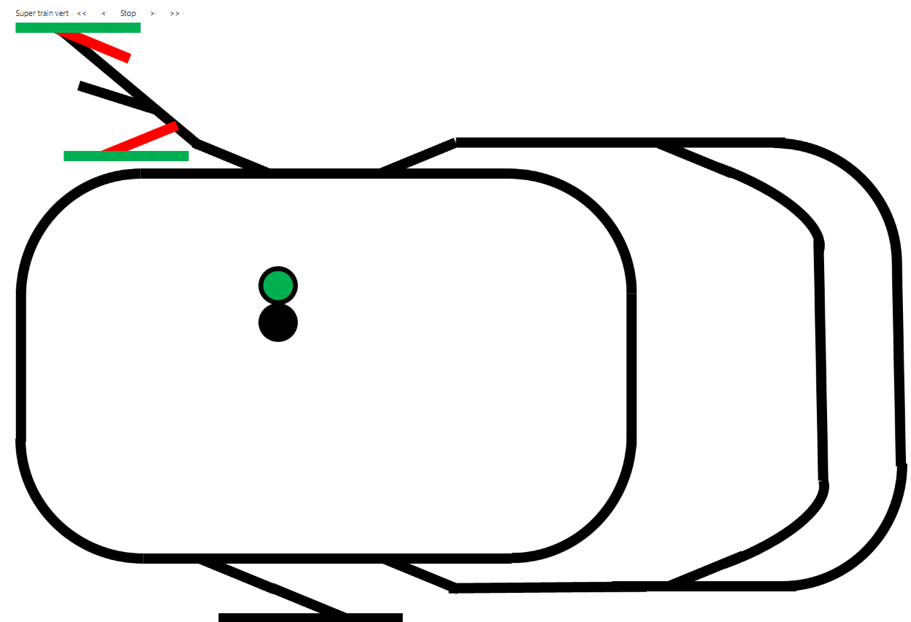

# 2024-02-01 New Lego train experience: REST API on device and ASP.NET application

Get ready to embark on the next wagon of our Lego Train adventure! In our previous escapades, we discussed the art of [device discovery, configurations, and even threw in a dash of reflection magic](./2024-01-28-New-Lego-train-experience-with-nanoFramework.md). Now, it's time to crank up the excitement as we delve into the world of REST APIs: the invisible strings that weave our devices and ASP.NET application into a symphony of seamless communication. Is this style a bit too much? Well, no, it's the mood of adventure!

Picture this: our devices, armed with their unique capabilities and configurations, harmonizing with the ASP.NET application through the rhythmic dance of REST API calls. It's the glue that binds our technological orchestra, allowing us to pull the strings and make our Lego Train project whistle.

In this article, we'll focus on setting up REST APIs on both ends of the spectrum: from the microcontroller (MCU) devices wielding the power of .NET nanoFramework to the ASP.NET application orchestrating the grand symphony. Buckle up, because we're about to embark on a journey where every API call is a note in the melody of innovation. 💻🌐

f you have more trains, switches and signals, and the goal is to create an interactive experience where clicking on one dynamically changes its state, you're on track for a compelling embedded web application.



Ready? Let's dive in!

## Why using REST API?

REST API are not the ultimate solution to all problems. They have their own advantages and inconveniences. We will look at couple of specific ones. First, REST API is text based, using HTTP protocol and over TCP. A request looks like this:

```text
GET /combo?rd=5&bl=1&ch=2 HTTP/1.1
Host: 192.168.1.89
Accept: */*
```

In this example:

* `GET /combo?rd=5&bl=1&ch=2 HTTP/1.1` is the request line, indicating the HTTP method, resource path, query parameters, and HTTP version.
* Host: `192.168.1.89` is the required header specifying the host domain, it is usually a full qualify domain name.
Accept: `*/*` is the header indicating that the client is willing to accept any response format (wildcard */*). It's not necessary, just to show that you can get more elements in the header.

### Advantages

REST APIs keep things simple and straightforward, making them easy to use. They are easy to text and just text based.

Every request from a client to a server in REST contains everything needed, creating a clean slate for each interaction.

Whether you prefer pure text, JSON or XML, REST is flexible with data formats, allowing you to choose what suits your application best. We will see later on that I made a very simple and light choice.

REST speaks the universal language of HTTP, making it easy to integrate with existing web infrastructure. And as we already have a WebServer on the .NET nanoFramework device, why not reusing it?

REST has become the go-to standard for web APIs, ensuring a wealth of resources, documentation, and community support.

### Inconveniences

REST, while simple, might feel limited when you need more complex operations beyond the usual CRUD (Create, Read, Update, Delete). In our case, we want to simply send order like switch on the red light, turn the switch, send a specific infrared signal. So that will be largely enough.

There's a chance you might get more data than you actually need (over-fetching) or not enough data, leading to additional requests (under-fetching). But for us, it's very very small requests, so we should be all covered.

While REST can be secured with HTTPS and authentication methods, it might not be inherently secure against certain types of attacks. Well, we're using it to control a small Lego train, in a private network. And even if .NET nanoFramework supports authentication with the WebServer and certificates, we will keep all this simple and just raw HTTP.

As applications evolve, versioning REST APIs can become a bit tricky, potentially impacting existing clients. And while patterns exists for this with version API, so far, we will go without. The client, so the main ASP.NET application will have to evolve with the devices, so that, they will have to be reflashed for any change in the API.

While REST can handle asynchronous operations, it may not be as efficient as other protocols designed explicitly for asynchronous communication, such as WebSockets. And we would also have been able to use WebSockets on our .NET nanoFramework boards as we also have the [support for it](https://github.com/nanoframework/System.Net.WebSockets)!

Another last one on constraints devices, REST API is all text based and very verbose especially when you add JSON or XML. Things get quickly very heavy, very verbose and intense processing resource wise. So we will limit things and API will directly return a simple value, a key pair or an error code.

Let's create a simple example for a hypothetical REST API endpoint `/signalstatus` that follows the rules:

```http
GET /signalstatus HTTP/1.1
Host: 192.168.1.61
Accept: */*
```

Response 1: Success - Signals Status

```http
HTTP/1.1 200 OK
Content-Type: text/plain

1=0;2=1;3=2
```

Scenario 2: Failure - Something Went Wrong, a Bad Request (400) is returned

```http
HTTP/1.1 400 Bad Request
```

And for an API where nothing will have to be returned and success:

```http
HTTP/1.1 200 OK
```

The associated code looks like this (in ASP.NET and code will be quite similar with .NET nanoFramework):

```csharp
[HttpGet(nameof(SignalStatus))]
public IActionResult SignalStatus()
{
    if (_config.SignalManagement == null)
    {
        return BadRequest();
    }

    string strResp = string.Empty;
    foreach (var device in _config.Discovery.DeviceDetails)
    {
        if (device.DeviceCapacity.HasFlag(DeviceCapability.Signal))
        {
            strResp += $"{device.Id}={(int)_config.SignalManagement.GetSignal((byte)device.Id)};";
        }
    }

    return Ok(strResp.TrimEnd(';'));
}
```

This designs allows to keep things as small and as simple to handle as possible.

In summary, REST APIs offer simplicity, universality, and flexibility but may face challenges in certain scenarios like real-time applications or when dealing with complex data-fetching requirements. Choosing the right API architecture depends on the specific needs and constraints of your project.

## Simple REST API on the .NET nanoFramework side

As we've laid it out before, simplicity is the name of the game. Our REST API handshake is all about quick nods: either "OK" or a polite "Bad Request." No room for small talk. And hey, we've got a shorthand policy for parameters: 2 or 3 letters max. No long-winded discussions here; we're on a mission to save precious MCU resources!

Now, diving into the nitty-gritty of our REST API on the device side to pull the strings on that switch, here it is:

```csharp
[Route("switch")]
public void Switch(WebServerEventArgs e)
{
    var parameters = WebServer.DecodeParam(e.Context.Request.RawUrl);
    //check if Params contains anything and is valid
    if ((parameters == null) || (parameters.Length == 0) || Application.Switch == null)
    {
        WebServer.OutputHttpCode(e.Context.Response, HttpStatusCode.BadRequest);
        return;
    }

    int sig = -1;
    foreach (UrlParameter param in parameters)
    {
        if (ParamSignal == param.Name)
        {
            if (!TryConvertInt32(param.Value, out sig, 0, 1))
            {
                WebServer.OutputHttpCode(e.Context.Response, HttpStatusCode.BadRequest);
                return;
            }
        }
    }

    if (sig == -1)
    {
        WebServer.OutputHttpCode(e.Context.Response, HttpStatusCode.BadRequest);
        return;
    }
    else if (sig == 0)
    {
        Application.Switch.SetStraight();
    }
    else
    {
        Application.Switch.SetTurn();
    }

    WebServer.OutputHttpCode(e.Context.Response, HttpStatusCode.OK);
}


[Route("switchstatus")]
public void SwitchStatus(WebServerEventArgs e)
{
    if (Application.Switch == null)
    {
        WebServer.OutputHttpCode(e.Context.Response, HttpStatusCode.BadRequest);
        return;
    }
    
    WebServer.OutPutStream(e.Context.Response, Application.Switch.IsStraight ? "0" : "1");
}
```

Alright, let me explain on the route magic! The `Route` attribute is the superhero here, defining where the action goes down. So, if someone knocks on the door of `/switch` or even `/SWitch`, our trusty `Switch` function steps up. And guess what? We're not sweating the small stuff: the route is cool with upper or lower case.

Now, the default method is `GET`. Picture it like this: anything like `/switch?something&somethingelse=1234` gets redirected to this function.

The function's first line? It's like the bouncer at the club: making sure everything's clear. If the vibe is off, we wave a Bad Request and keep the party exclusive. Check the parameters, and voilà, a slick route like `/switch?md=1` gets you flipping that switch.

Now, the `switchstatus` route? Piece of cake. No arguments, just a quick check for existence, and boom: it dishes out a 0 or 1. Efficient, no-nonsense, and we keep the text overhead on a diet.

```http
HTTP/1.1 200 OK
Content-Type: text/plain

1
```

Forget the unnecessary text: we're all about efficiency in the embedded world. No bloated JSON or XML, just straight-up answers. Optimize, baby! 🚀👾 (Are aliens optimized?)

## Consuming REST API from an HTML page

The experience lies in the ability to command the LEGO train effortlessly from a phone, PC, or tablet. With just a click on an element, the corresponding remote device works its magic, orchestrating the desired actions seamlessly. This enchanting feat is made possible through the simplicity and power of light REST APIs, as showcased in the previous section.

In an HTML page, you need some javascript to glue things together. I'm using ASP.NET at the core and I still need to add my own javascript. So, let me first put all this script here and then comment later with more elements:

```js
//request switch change
function swclicked(boxMSG, cmdSend) {
    var xhr = new XMLHttpRequest();
    var mycmd = cmdSend + '&md=';
    if (boxMSG.src.indexOf('trn.png') >= 0)
        mycmd += 'false';
    else
        mycmd += 'true';
    xhr.open('GET', 'api/switch?' + mycmd + '&_=' + Math.random());
    xhr.send(null); xhr.onreadystatechange = function () {
        if (xhr.readyState == 4) {
            if (xhr.status == 200)
                if (boxMSG.src.indexOf('trn') >= 0)
                    boxMSG.src = 'config/switch-' + boxMSG.getAttribute("data-type") + '-str.png';
                else
                    boxMSG.src = 'config/switch-' + boxMSG.getAttribute("data-type") + '-trn.png';
        }
    };
}
function buildSwitch(boxMSG, num) {
    var obj = document.getElementById(boxMSG);
    if (obj != null)
        if (num == 0) obj.src = 'config/switch-' + obj.getAttribute("data-type") + '-str.png'; else obj.src = 'config/switch-' + obj.getAttribute("data-type") + '-trn.png';
}
function getswitches() {
    var xhr = new XMLHttpRequest(); xhr.open('GET', 'api/switchstatus?_=' + Math.random()); xhr.send(null); xhr.onreadystatechange = function () {
        if (xhr.readyState == 4)
            if (xhr.status == 200) {
                let responseText = xhr.responseText; // "0=1;2=2;5=1"
                let pairs = responseText.split(';'); // ["0=1", "2=2", "5=1"]
                pairs.forEach(pair => {
                    let [key, value] = pair.split('=');
                    buildSwitch('switch' + key, value);
                });
            }
    };
}
// More functions in this javascript file
//initialization
function InitAll() { getsignals(); getswitches(); }
document.onreadystatechange = function () {
    if (document.readyState == "complete") {
        InitAll();
    }
}
```

And I have 4 images called `switch-left-str.png`, `switch-left-trn.png`, `switch-right-str.png` and, `switch-right-trn.png`. I also have a bit more in the page built itself in razor:

```html
@for (int i = 0; i < Model.Switches.Count; i++)
{
    string top = Model.Switches[i].Y + "px";
    string left = Model.Switches[i].X + "px";
    string switchId = "switch" + Model.Switches[i].Id;
    string para = "si=" + Model.Switches[i].Id;
    string datatype = Model.Switches[i].IsLeft ? "left" : "right";
    <span style='position: absolute;margin-left:@left; margin-top:@top; top:findTop(document.all.MyImage); left:findLeft(document.all.MyImage);'>
        
    </span>
}
```

Let's dive into the wizardry of our REST API dance. Now, pay attention to the `img` tag: it's got the secrets! With a cocktail of attributes like `src`, `data-type`, `id`, and `onClick`, we're pulling off some magic tricks. Remember the `switchstatus` REST API? That's our oracle for switch states: either straight (0) or turned (1). But hold on, there's a twist: left and right switches have different visuals! That's where the `data-type` attribute swoops in, helping us craft the switch in the `buildSwitch` function. With just two states, toggling between turned and straight is a breeze. The result is sets in the `src` attribute.

Now, the `getswitches` function? It's a lean, mean text-parsing machine, handling those key-value pairs like a pro. Identifying a switch? Easy peasy, thanks to its unique ID: a combo of `switch` and the ID number.

And here's the star of the show: the `onClick` function, the glue binding everything together. It calls the function that taps into the REST API, passing the right parameters to the `swclicked` function. In a neat 10 lines of JavaScript, we dynamically dance with a REST API using our trusty old friend, `XMLHttpRequest`. It checks the result, flips the image based on the action, and voilà: switch status maintained in the image name. Just keep an eye out for that  `_=' + Math.random()`: it's there to keep things fresh. Without it, your REST API call might get cached and you won't get any change after 2 clicks.

Slick moves, minimal lines, that's how we roll in the world of embedded web wonders! 🌐✨ Well, even if here, we're in the world of CPU, why not optimizing things to get them using less resources?

## What's next?

There is still a lot to be done in the project. Train detection using the [Lego Dimensions portals](./2023-04-04-LegoDimensionsProtocol.md) and adding some engine rule is a big next step. In the mean time, improvements in the all up user experience is going to be what's next. Expect more articles anyway! 🌶️📄
