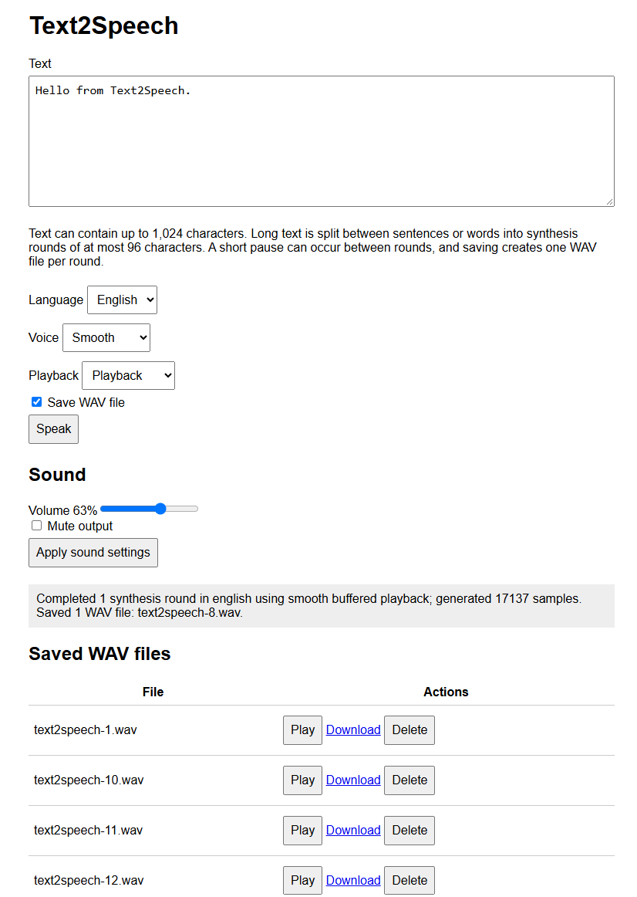

# 2026-10-08 Building a Small Speech Synthesizer in C# on .NET nanoFramework

I have wanted to write a speech synthesizer for a very long time.

When I was 16 or 17, I imagined doing it in Pascal on computers that came with one of the first graphics cards. I did not get very far. Producing speech from text looks simple until you try it. Reading characters is easy. Turning them into something that resembles language, with recognizable vowels, consonants, timing, and intonation, is not. I was fascinated byt those games which came with some voices in it. Even if it was very rudimental at that time.

The idea stayed with me, though: could I write a small synthesizer that would run on hardware comparable, at least in spirit, to what was available then?

.NET nanoFramework is not a 16-bit Pascal environment. It runs on 32-bit microcontrollers, and an ESP32 is vastly more capable than the machines I owned as a teenager. But many of the practical constraints feel familiar. RAM still matters. Flash still matters. Floating-point work is not free. Audio has to be produced on time. There is no desktop operating system quietly absorbing inefficient decisions.

There is another interesting constraint: the code is managed C#, executed by nanoFramework. It is not a native DSP routine compiled specifically for the processor. I wanted to see how far an integer speech engine could go in that environment.

## Starting with the license

The first non-technical requirement was a permissive license. I wanted something compatible with MIT licensing and suitable for the nanoFramework IoT.Device repository.

That led me to [PebbleTalk](https://github.com/neonfire42/pebbletalk), a small MIT-licensed formant synthesizer. Its design was close to what I needed: integer arithmetic, compact tables, simple English spelling rules, and no large recorded voice database. It was also small enough to understand. That matters when the target is a microcontroller and every abstraction eventually turns into bytes, allocations, and execution time.

I used PebbleTalk as the foundation, ported C to C#, thanks Copilot for the heavy lifting, then gradually reshaped it into a managed nanoFramework library called Text2Speech.

The result is not a neural voice and does not try to be one. It is a compact formant synthesizer. It generates speech by exciting a few resonances that approximate the human vocal tract. The sound is synthetic, sometimes obviously so, but the whole engine can run locally without a network connection, a model file, or native code. It's compact, small and really efficient.

## First goal: make a WAV file

The earliest useful milestone was modest: give the engine some text and get a WAV file back.

[Text2Speech](https://github.com/nanoframework/nanoFramework.IoT.Device/tree/main/devices/Text2Speech) produces unsigned 8-bit mono PCM at 8 kHz. That is only about 8,000 bytes per second of speech, plus a 44-byte WAV header. Byte value 128 is silence. Values below and above it represent negative and positive signal excursions.

8 kHz is not high fidelity. The Nyquist limit is 4 kHz, so there is no point asking the renderer to represent frequencies above that. But the format is compact, easy to stream, and sufficient for intelligible synthetic speech.

Generating a file also gave me a clean boundary for testing. I could compare output lengths and hashes, inspect the waveform, download it from a device, and listen to exactly what the synthesizer produced. This later became important when tracking down clicks and metallic artifacts. If the problem was present in the downloaded WAV, it was in synthesis. If the WAV was clean but I2S playback was not, the problem was farther down the audio path.

## Getting sound out of the board

The main hardware target became the ESP32-S3-BOX-Lite. It has an [ES8156](https://github.com/nanoframework/nanoFramework.IoT.Device/tree/main/devices/Es8156) audio codec, an amplifier, I2C control, and I2S audio transport. Making it speak required more than writing PCM bytes to an API.

The board needs the correct pin routing for master clock, bit clock, word select, data, I2C, and amplifier enable. The I2S clocks must be running before the slave codec is configured. The amplifier has to remain disabled until the codec is ready, otherwise startup noise is unpleasant.

The compact WAV data is unsigned 8-bit mono, while the I2S path expects signed 16-bit stereo samples. Playback therefore converts each source byte using the equivalent of:

```text
(sample - 128) << 8
```

and writes the result to both channels.

I initially suspected this conversion several times when the output sounded rough. It is an obvious place to look. In practice, the signed/unsigned conversion was correct. The same defects were audible in WAV files played on a computer, which was a useful reminder not to blame hardware before checking the source signal 😄.

Two playback modes emerged. One sends samples at 8 kHz and is relatively cheap. The other inserts linear midpoints and sends 16 kHz I2S data. Interpolation softens some edges, but it doubles the number of output frames and adds managed work. On this sort of system, that trade-off is audible and measurable.

## Making interpreted C# keep up

The first implementation worked, but it was not far too slow for live synthesis.

Formant rendering is a hot loop. For every sample, the engine advances oscillator phases, reads waveform tables, applies envelopes, mixes resonances and noise, clamps the result, and writes PCM. Innocent-looking method calls and divisions become expensive when repeated thousands of times per second in interpreted managed code. From the initial implementation to the optimized one, I managed to do a nice x4!

The renderer changed in several steps:

- Oscillators use 24-bit fixed-point phase accumulators.
- Division was removed from per-sample paths.
- Pitch, formants, envelopes, and transitions update at a 2 kHz control rate while oscillators and noise still run at 8 kHz.
- Frequently used values and lookup tables are cached in local variables.
- Parser, renderer, and output workspaces are reused instead of allocated for every utterance.
- Silence is copied in blocks rather than emitted one byte at a time.
- PCM is streamed in 2,048-byte blocks to reduce call and storage overhead.

These changes roughly halved buffered synthesis time in device measurements. The important part was preserving behavior while optimizing. I kept deterministic tests and compared PCM hashes before and after hot-path changes. An optimization that makes speech faster but silently changes every waveform is not necessarily wrong, but it is a different experiment. I wanted to know when that happened.

This is the kind of optimisations done:

| Voice | First | Current | Time saved | Improvement |
| Smooth | 6,782 ms | 3,160 ms | 3,622 ms | 53.4% faster |
| Fast-bright | 2,969 ms | 1,506 ms | 1,463 ms | 49.3% faster |
| Deep | 5,516 ms | 2,758 ms | 2,758 ms | 50.0% faster |
| Combined | 15,267 ms | 7,424 ms | 7,843 ms | 51.4% faster |

And also flattening the function calls in the hot path had a drastic impact.

## Streaming was not just “write as you go”

Writing generated blocks directly to I2S sounds straightforward. The difficulty is that playback consumes samples at a fixed rate, while synthesis produces them at a variable rate.

If synthesis falls behind even briefly, the speaker runs out of data. A small queue absorbs short delays but cannot compensate for a producer that is consistently slower than real time.

I tried several versions of the pipeline:

- direct synchronous writes;
- a producer-consumer queue;
- pre-rendering the complete utterance;
- concurrent synthesis and playback;
- continuous playback across long-text segmentation boundaries;
- fast 8 kHz and interpolated 16 kHz output.

Diagnostics were more useful than guessing. I added counts and timings for producer waits, consumer waits, conversion, native I2S writes, queue depth, and samples produced while I2S was blocked. That showed, among other things, that native writes were not the main cost. Managed interpolation and stereo packing mattered much more.

The queue eventually grew to eight blocks. At first playback waited for seven 2,048-sample blocks, which provided about 1.792 seconds of source audio in reserve. It was reliable, but the delay before the first sound was very noticeable.

After listening to it in actual use, I made the startup threshold configurable and changed the default to four blocks. That is about 1.024 seconds of reserve and removes roughly 768 ms of initial waiting. It is still a compromise. A lower threshold starts sooner but makes underruns more likely.

A code review later caught a less audible but real problem: an invalid startup-block value was checked only when the PCM sink was constructed, after GPIO, I2C, and I2S resources had already been opened. If construction failed, those resources could remain allocated. The player now validates the range before touching the hardware, and both classes share the same bounds.

That is typical of this project. Some improvements came from profiling, some from listening, and some from reading an exception path carefully.

## A browser is a surprisingly useful test tool

I added a small web interface using the amazing nanoFramework WebServer (it's not just amazing because I wrote most of it, it's because it's really simple, efficient and working nicely). It can enter text, select English or French, choose a voice profile, use buffered or live playback, save WAV files, and list, download, replay, or delete stored recordings.



It is convenient as a sample, but it also changed how I tested the engine. Typing arbitrary phrases from a browser is much faster than rebuilding firmware for every listening experiment. Downloading the generated WAV separates synthesis defects from the codec and speaker. Long passages exercise segmentation and queue continuity in ways that a single hard-coded sentence does not.

The web sample also forced the library to become less monolithic. Text longer than one synthesis workspace has to be divided at sensible boundaries. [`TtsSegmenter`](https://github.com/nanoframework/nanoFramework.IoT.Device/blob/main/devices/Text2Speech/Synthesis/TtsSegmenter.cs) prefers sentence endings, then whitespace, and only splits inside a word as a last resort. Number expansion can make a short input much larger, so segments sometimes need to be retried after normalization.

## Splitting the engine from the languages

English rules were originally tied closely to synthesis. Adding French made that design uncomfortable.

The current structure has a language-neutral core and separate English and French assemblies. A language frontend normalizes text and fills a fixed-capacity phoneme buffer. The renderer only sees phonemes, pitch adjustments, and local duration changes. Applications install the core plus the language package they need, without paying the flash and static-initialization cost of every language.

This separation also made it possible to work on pronunciation without destabilizing the renderer. That became essential with French. And then with English when I made French quite good! I went back to optimize a bit English 🙂.

This also allows anyone to write something specific for their own language or for different voices. Making everything really flexible.

## French was much more than another table

The first French version was intentionally modest: intelligible rule-based speech, not a complete linguistic system.

The spelling-to-phoneme work drew on permissively licensed French rules, with number behavior adapted from Unicode CLDR. The frontend handles accented letters, oral and rounded vowels, approximate nasal vowels, common consonant combinations, punctuation, numbers, and a simple form of accentual-group prosody.

It spoke French, but it sounded strongly American.

The obvious reason was the acoustic inventory. Correct spelling rules can choose a French `/y/` or `/œ/`, but if the formant values are only rough approximations, the result still sounds foreign. I built a local host-side calibration tool to get better evidence.

The tool prepared a bounded French speech corpus, ran Montreal Forced Aligner, extracted vowel intervals from TextGrid files, estimated F1, F2, and F3 using linear predictive coding, selected stable windows, and generated JSON and CSV reports.

There were several false starts. My first LPC configuration often selected harmonics instead of the expected second formant for rounded vowels. The numbers looked precise but were wrong. Resampling analysis windows to 10 kHz, using LPC order 10, and rejecting roots with bandwidth above 700 Hz produced much more plausible results.

The final run used 1,000 French clips, generated 1,000 alignments, and accepted 28,093 vowel measurements from 16 speakers. I then selected one well-covered low-pitched speaker whose acoustic scale was reasonably close to the existing synthetic voice.

Some of the French calibration work used models and datasets available through Hugging Face. I ran the host-side processing on my Surface rather than on the embedded device as obviously large models won't run there. This included corpus preparation, phoneme alignment, acoustic analysis, and experiments with French prosody models.

Running those models on the Surface’s Intel Arc graphics card was not entirely straightforward. The software ecosystem is still less seamless than it is for CUDA hardware, and loading larger models into the available graphics memory required a mixture of Intel XPU execution and CPU offloading.

The Surface’s 64 GB of RAM made a real difference. Layers that did not fit comfortably on the Intel Arc GPU could remain in system memory, allowing the models to run without making the machine unusable. It was not always fast, but resource usage remained surprisingly smooth considering the size of the models and the amount of audio being processed.

None of this model inference runs on the nanoFramework device. The Surface was used as a development and calibration machine. Its output was reduced to small deterministic rules, phoneme parameters, and formant values that the embedded C# implementation can use without shipping a neural model or requiring a network connection.

Rather than replacing everything at once, I moved only oral-vowel F1 and F2 halfway toward the calculated targets. F3, amplitudes, pitch, duration, schwa, nasal vowels, and consonants stayed unchanged. That conservative change made French substantially better without turning every variable into a moving target.

Improvement can then be done focussing on those elements. French sound more French but not totally native French. I know where to focus next time if I want a real French native voice!

## Listening found bugs that tables did not

Even with better vowels, some words remained metallic. “Verre” (glass in French) was particularly bad.

Tracing the frontend showed that doubled consonants were being emitted twice. “Verre” effectively ended with two uvular R phonemes. The same class of problem affected words such as “comment,” “allez,” and “tasse.” Doubled `m` and `n` could also cause false nasalization of the previous vowel.

The fix was not “remove every double letter.” French spelling has context-sensitive cases. The frontend now collapses a safe set, preserves unvoiced `/s/` for `ss`, leaves `cc` and `gg` for their context rules, and prevents doubled nasals from changing the preceding vowel incorrectly.

Number normalization exposed other problems:

- “vingt” could pronounce the `g` because it was followed by a silent `t`;
- “cents” and “vingts” could pronounce consonants from a whole silent final group;
- “mille” could match the general `ill` glide rule and come out closer to `/mij/` than `/mil/`.

These are small rules, but they affect very common words. The silent-final check now understands groups rather than only the final character, and “mille,” “ville,” and “tranquille” are exceptions to the `ill` pattern.

French is really complex, much more than English. There are rules and probably more exceptions than rules. And when you come to embedded systems and optimization, you have to make choices. So, I tried to focus on very comment elements rather than trying to solve all problems. And, all this can be improved moving forward.

Another defect sounded like noise between phonemes. Every excitation path now fades its final four samples toward unsigned midpoint 128. The fade is short: full level, roughly two thirds, one third, then exactly silence. It is applied to vowels, fricatives, voiced fricatives, and stop components. This reduced boundary clicks without adding long audible fades. And all this is not affecting performances neither. And that's one of the great news!

## English needed linguistic fixes too

The same listening process helped English.

In the sentence:

> A rose by any other name would smell as sweet.

the phrase “any other name” was difficult to understand. The general spelling rules produced something close to `/ænaɪ/` for “any” and used unvoiced `/θ/` in “other.”

I added narrow irregular-word handling:

- “any” becomes approximately `/ɛni/`;
- “other” becomes approximately `/ʌðɝ/`;
- “name” continues to use the long-A diphthong.

That required a separate voiced `th` phoneme. It is a good example of why acoustic tables alone are not enough. Speech correctness comes from several layers: normalization, spelling rules, exceptions, phoneme selection, timing, and rendering.

I also used the local acoustic-analysis pipeline to calculate more plausible General American vowel targets. As with French, the embedded values were adjusted conservatively rather than copied wholesale from a table. The repository contains only the resulting constants, not source recordings or measurement rows, and the provenance is documented.

## Tests matter, even when the final judge is a human ear

Listening is essential for speech, but it is a poor regression suite by itself.

.NET nanoFramework has its own [test framework](https://github.com/nanoframework/nanoFramework.TestFramework) based on the Microsoft Test Framework. They share the same syntax, meaning, you can have a shared project running tests on traditional .NET and on .NET nanoFramework. Those testsz can run on a virutal device, what I've been using in this project or a real device.

The nanoFramework simulator tests cover deterministic synthesis, streaming versus buffered equivalence, WAV headers, truncated files, long-text segmentation, number expansion, fixed phoneme capacity, independent formant glides, Nyquist clamping, phoneme-tail fading, French pronunciation cases, and English irregular words.

At the time of writing, the complete simulator suite has 35 passing tests.

## Where it ended up

Text2Speech is now an integer-only managed synthesizer with:

- an allocation-conscious language-neutral core;
- separate English and French packages;
- unsigned 8-bit, 8 kHz PCM and canonical WAV support;
- buffered and streaming output;
- configurable pitch, speed, formant scale, intonation, noise, and smoothing;
- ESP32-S3-BOX-Lite playback through the ES8156;
- a browser interface and WAV management;
- deterministic nanoFramework simulator tests.

It still sounds synthetic. Nasal vowels are approximations. The French frontend does not have a complete lexicon or full grammatical liaison. English spelling has far more irregular words than the small exception set handles. An 8 kHz three-formant voice will not suddenly sound like a modern neural model.

That is fine. The interesting part, for me, is that it works within the original spirit of the idea. It runs locally on small hardware. It does not need a cloud service or a large model. The renderer is managed C#, interpreted by .NET nanoFramework, and still produces speech quickly enough to play on an embedded device.

I did not manage that in Pascal when I was 16 or 17. It turns out my younger self had underestimated the problem by quite a lot.

But the idea was not entirely unreasonable. It just took a few more decades, better tools, a lot of listening, and rather more attention to the last four samples of every phoneme than I would ever have guessed.
