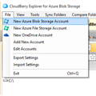

# Welcome to Laurent Ellerbach's (old) blog

This site is a collection of old blog posts, some are a bit more recent.

<bloglist>

[ 2006 08 06 J'ai hacké mon onduleur ou le reverse engineering de protocoles de communication part 1](./2006-08-06-J'ai-hacké-mon-onduleur-ou-le-reverse-engineering-de-protocoles-de-communication-(part-1).md)

[ 2006 08 07 J'ai hacké mon onduleur ou le reverse engineering de protocoles de communication part 2](./2006-08-07-J'ai-hacké-mon-onduleur-ou-le-reverse-engineering-de-protocoles-de-communication-(part-2).md)

[ 2006 08 08 J'ai hacké mon onduleur ou le reverse engineering de protocoles de communication part 3](./2006-08-08-J'ai-hacké-mon-onduleur-ou-le-reverse-engineering-de-protocoles-de-communication-(part-3).md)

[ 2006 08 09 J'ai hacké mon onduleur ou le reverse engineering de protocoles de communication part 4](./2006-08-09-J'ai-hacké-mon-onduleur-ou-le-reverse-engineering-de-protocoles-de-communication-(part-4).md)

[ 2006 08 12 J'ai hacké mon onduleur ou le reverse engineering de protocoles de communication part 5](./2006-08-12-J'ai-hacké-mon-onduleur-ou-le-reverse-engineering-de-protocoles-de-communication-(part-5).md)

[ 2006 08 15 J'ai hacké mon onduleur ou le reverse engineering de protocoles de communication part 6](./2006-08-15-J'ai-hacké-mon-onduleur-ou-le-reverse-engineering-de-protocoles-de-communication-(part-6).md)

[ 2016 08 17 J'ai hacké mon onduleur ou le reverse engineering de protocoles de communication part 7](./2006-08-17-J'ai-hacké-mon-onduleur-ou-le-reverse-engineering-de-protocoles-de-communication-(part-7).md)

[ 2006 09 01 J'ai hacké mon onduleur ou le reverse engineering de protocoles de communication part 8](./2006-09-01-J'ai-hacké-mon-onduleur-ou-le-reverse-engineering-de-protocoles-de-communication-(part-8).md)

[ 2006 09 14 J'ai hacké mon onduleur ou le reverse engineering de protocoles de communication part 9](./2006-09-14-J'ai-hacké-mon-onduleur-ou-le-reverse-engineering-de-protocoles-de-communication-(part-9).md)

[ 2006 10 18 J'ai hacké mon onduleur ou le reverse engineering de protocoles de communication part 10](./2006-10-18-J'ai-hacké-mon-onduleur-ou-le-reverse-engineering-de-protocoles-de-communication-(part-10).md)

[ 2011 09 09 netduino board geek tool for .NET Microframework](./2011-09-09-netduino-board-geek-tool-for-.NET-Microframework.md)

[ 2011 09 12 Implementing a simple HTTP server in .NET Microframework](./2011-09-12-Implementing-a-simple-HTTP-server-in-.NET-Microframework.md)

[ 2011 09 13 Setup a time and date using .NET Microframework](./2011-09-13-Setup-a-time-and-date-using-.NET-Microframework.md)

[ 2011 09 19 Displaying a calendar in a web page using .NET Microframework](./2011-09-19-Displaying-a-calendar-in-a-web-page-using-.NET-Microframework.md)

[ 2011 09 26 Program a date time and duration for a sprinkler in .NET Microframework and netduino](./2011-09-26-Program-a-date-time-and-duration-for-a-sprinkler-in-.NET-Microframework-and-netduino.md)

[ 2011 10 06 Creating and launching timer in .NET Microframework](./2011-10-06-Creating-and-launching-timer-in-.NET-Microframework.md)

[ 2011 10 11 Lighting my Lego city using .NET Microframework](./2011-10-11-Lighting-my-Lego-city-using-.NET-Microframework.md)

[ 2011 10 22 Display overlay images in HTML and javascript with .NET Microframework](./2011-10-22-Display-overlay-images-in-HTML-and-javascript-with-.NET-Microframework.md)

[ 2011 10 24 Reading file in .NET Microframework](./2011-10-24-Reading-file-in-.NET-Microframework.md)

[ 2011 11 04 Read a setup file in .NET Microframework](./2011-11-04-Read-a-setup-file-in-.NET-Microframework.md)

[ 2011 11 15 Writing a generic ASP.NET handler to return an image and control the image](./2011-11-15-Writing-a-generic-ASP.NET-handler-to-return-an-image-and-control-the-image.md)

[ 2011 11 24 Dynamically watermark a picture in a ASP.NET page](./2011-11-24-Dynamically-watermark-a-picture-in-a-ASP.NET-page.md)

[ 2011 12 07 Creating dynamically a web page using .NET Micro framework](./2011-12-07-Creating-dynamically-a-web-page-using-.NET-Micro-framework.md)

[ 2011 12 12 ASP.NET and .NET Microframework HTTP web server together part 1/2](./2011-12-12-ASP.NET-and-.NET-Microframework-HTTP-web-server-together-(part-12).md)

[ 2011 12 19 ASP.NET and .NET Microframework HTTP web server together part 2/2](./2011-12-19-ASP.NET-and-.NET-Microframework-HTTP-web-server-together-(part-22).md)

[ 2012 01 21 Using a light transistor sensor and a led to create a detector](./2012-01-21-Using-a-light-transistor-sensor-and-a-led-to-create-a-detector.md)

[ 2012 02 14 Securing web server with login and password on .NET Microframework](./2012-02-14-Securing-web-server-with-login-and-password-on-.NET-Microframework.md)

[ 2012 02 17 Using basic IO with .NET Microframework](./2012-02-17-Using-basic-IO-with-.NET-Microframework.md)

[ 2012 02 20 Some hard to pilot a Sprinkler with .NET Microframework](./2012-02-20-Some-hard-to-pilot-a-Sprinkler-with-.NET-Microframework.md)

[ 2012 02 21 Using one temperature sensor with I2C protocol and .NET Micro framework on netduino board](./2012-02-21-Using-one-temperature-sensor-with-I2C-protocol-and-.NET-Micro-framework-on-netduino-board.md)

[ 2012 02 24 Using 2 identical I2C device on the same I2C bus](./2012-02-24-Using-2-identical-I2C-device-on-the-same-I2C-bus.md)

[ 2012 03 03 Create your own mobile video recorder or animation stand](./2012-03-03-Create-your-own-mobile-video-recorder-or-animation-stand.md)

[ 2012 03 31 Using 2 identical I2C device on the same I2C bus solution working better](./2012-03-31-Using-2-identical-I2C-device-on-the-same-I2C-bus-(solution-working-better).md)

[ 2012 04 07 Using netduino and .NET Microframework to pilot any Lego Power Function thru Infrared part 1](./2012-04-07-Using-netduino-and-.NET-Microframework-to-pilot-any-Lego-Power-Function-thru-Infrared-(part-1).md)

[ 2012 04 17 Using netduino and .NET Microframework to pilot any Lego Power Function thru Infrared part 2](./2012-04-17-Using-netduino-and-.NET-Microframework-to-pilot-any-Lego-Power-Function-thru-Infrared-(part-2).md)

[ 2012 04 26 Using netduino and .NET Microframework to pilot any Lego Power Function thru Infrared part 3](./2012-04-26-Using-netduino-and-.NET-Microframework-to-pilot-any-Lego-Power-Function-thru-Infrared-(part-3).md)

[ 2012 05 06 Managing my Sprinklers from the Cloud](./2012-05-06-Managing-my-Sprinklers-from-the-Cloud.md)

[ 2012 05 22 Using a SPI device with netduino and .NET micro framework](./2012-05-22-Using-a-SPI-device-with-netduino-and-.NET-micro-framework.md)

[ 2012 05 29 Creating an efficient HTTP Web Server for .NET Microframework NETMF](./2012-05-29-Creating-an-efficient-HTTP-Web-Server-for-.NET-Microframework-(NETMF).md)

[ 2012 06 20 Using XMLHttpRequest to pilot a Lego train dynamically in HTML 5](./2012-06-20-Using-XMLHttpRequest-to-pilot-a-Lego-train-dynamically-in-HTML-5.md)

[ 2012 06 24 A low cost humidity sensor for my sprinkler system](./2012-06-24-A-low-cost-humidity-sensor-for-my-sprinkler-system.md)

[ 2012 07 17 A soil low cost humidity sensor moisture and .NET Micro Framework NETMF](./2012-07-17-A-soil-low-cost-humidity-sensor-(moisture)-and-.NET-Micro-Framework-(NETMF).md)

[ 2012 07 30 How software can solve hardware problems](./2012-07-30-How-software-can-solve-hardware-problems.md)

[ 2013 04 05 Web Server and CSS files in NETMF .NET Microframework](./2013-04-05-Web-Server-and-CSS-files-in-NETMF-(.NET-Microframework).md)

[ 2013 04 07 .NET Microframework NETMF Web Server source code available](./2013-04-07-.NET-Microframework-(NETMF)-Web-Server-source-code-available.md)

[ 2013 04 29 Adding Bluetooth support to a NETMF board .NET Microframework](./2013-04-29-Adding-Bluetooth-support-to-a-NETMF-board-(.NET-Microframework).md)

[ 2013 05 27 Ultrasound sensor and .NET Microframework NETMF](./2013-05-27-Ultrasound-sensor-and-.NET-Microframework-(NETMF).md)

[ 2013 06 21 .NET Microframework on RaspberryPi Part 1](./2013-06-21-.NET-Microframework-on-RaspberryPi-(Part-1).md)

[ 2014 10 25 .NET Microframework on RaspberryPi Part 2](./2014-10-25-.NET-Microframework-on-RaspberryPi-(Part-2).md)

[ 2014 11 08 Connect your Arduino, Spark.IO, Netduino .Net Microframework, Galileo to Microsoft Azure Part 1](./2014-11-08-Connect-your-Arduino,-Spark.IO,-Netduino-(.Net-Microframework),-Galileo-to-Microsoft-Azure-(Part-1).md)

[ 2014 11 14 Connect your Arduino, Spark.IO, Netduino NETMF .Net Microframework, Galileo to Microsoft Azure Part 2 to create an Internet of Things IoT](./2014-11-14-Connect-your-Arduino,-Spark.IO,-Netduino-(NETMF-.Net-Microframework),-Galileo-to-Microsoft-Azure-(Part-2)-to-create-an-Internet-of-Things-(IoT).md)

[ 2014 11 30 Connect Arduino, Spark.IO, Netduino NETMF .Net Microframework, to Microsoft Azure Mobile Services, create IoT Part 3](./2014-11-30-Connect-Arduino,-Spark.IO,-Netduino-(NETMF-.Net-Microframework),-to-Microsoft-Azure-Mobile-Services,-create-IoT-(Part-3).md)

[ 2014 12 26 Manage my wine cellar with QR codes and Microsoft Azure](./2014-12-26-Manage-my-wine-cellar-with-QR-codes-and-Microsoft-Azure.md)

[ 2015 01 09 Servo motor tester in NETMF .NET Micro Framework with Netduino](./2015-01-09-Servo-motor-tester-in-NETMF-(.NET-Micro-Framework)-with-Netduino.md)

[ 2015 02 26 Internet of Things installing Mono/Linux and Windows Embedded on a BeagleBone Black board BBB](./2015-02-26-Internet-of-Things-installing-MonoLinux-and-Windows-Embedded-on-a-BeagleBone-Black-board-(BBB).md)

[ 2015 04 11 Create a DHT11 C library using WiringPI on RaspberryPI and use it in Mono C](./2015-04-11-Create-a-DHT11-C-library-using-WiringPI-on-RaspberryPI-and-use-it-in-Mono-C.md)

[ 2015 06 18 ESP8266 and Posting on Windows Azure using Mobile Services](./2015-06-18-ESP8266-and-Posting-on-Windows-Azure-using-Mobile-Services.md)

[ 2015 10 01 How to move Azure VM between subscriptions](./2015-10-01-How-to-move-Azure-VM-between-subscriptions.md)

[ 2015 11 13 Azure IoT Hub uploading a Webcam picture in an Azure blob with node.js on Windows and Linux](./2015-11-13-Azure-IoT-Hub-uploading-a-Webcam-picture-in-an-Azure-blob-with-node.js-on-Windows-and-Linux.md)

[ 2015 11 24 Creating an Azure IoT Device Explorer in node.js, express and jade](./2015-11-24-Creating-an-Azure-IoT-Device-Explorer-in-node.js,-express-and-jade.md)

[ 2015 12 01 How to deploy a node.js site into Azure Web App to create a Website](./2015-12-01-How-to-deploy-a-node.js-site-into-Azure-Web-App-to-create-a-Website.md)

[ 2015 12 24 How to connect Lego Mindstorms NXT ev3 to Azure IoT Hub using node.js](./2015-12-24-How-to-connect-Lego-Mindstorms-NXT-ev3-to-Azure-IoT-Hub-using-node.js.md)

[ 2016 02 12 How to use Microsoft Graph and Office 365 API in a Service or in a Windows App/UWP without a graphical interface](./2016-02-12-How-to-use-Microsoft-Graph-and-Office-365-API-in-a-Service-or-in-a-Windows-AppUWP-without-a-graphical-interface.md)

[ 2017 07 04 Accessing embedded serial ports in .NET Core 2.0 on a Raspberry PI 3 running Linux](./2017-07-04-Accessing-embedded-serial-ports-in-.NET-Core-2.0-on-a-Raspberry-PI-3-running-Linux.md)

[ 2018 08 17 Azure IoT Edge support for Raspbian 8.0/Debian 8.0](./2018-08-17-Azure-IoT-Edge-support-for-Raspbian-8.0Debian-8.0.md)

[ 2021 03 26 Monorepo for Beginners](./2021-03-26-Monorepo-for-Beginners.md)

[ 2023 04 04 Lego Dimensions Communication Protocol](./2023-04-04-LegoDimensionsProtocol.md)

</bloglist>
